# 概要

* work1 は以下の Hashicorp のサンプルでリソースグループと仮想ネットワークを作成します。

  [Docs overview | hashicorp/azurerm | Terraform | Terraform Registry](https://registry.terraform.io/providers/hashicorp/azurerm/latest/docs#example-usage)

  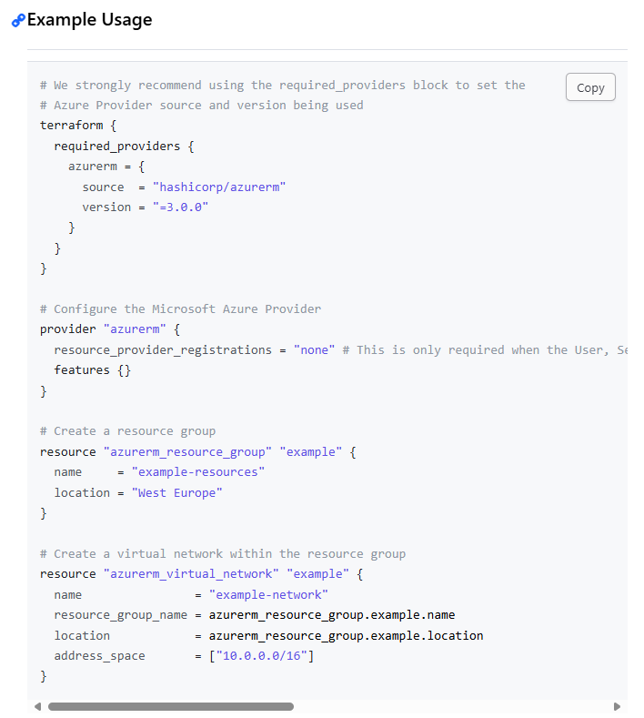

* ルートのフォルダ・ファイル構成

```text
terraform-work1
 ∟ .terrtaform - init 時に作成される Provider がダウンロードされるフォルダ
 ∟ image - readme の画像ファイルを格納するフォルダ
 ∟ .terraform.lock.hcl - init 時に作成される、Provider と .tf ファイルの依存関係等が記録されたファイル ⇒ [Dependency Lock File](https://developer.hashicorp.com/terraform/language/files/dependency-lock)
 ∟ main.tf - リソースを記述した tf ファイル
 ∟ provider.tf - プロバイダーを記述した tf ファイル
 ∟ terraform.tfstate - terraform apply 時に作成された tfstate ファイル
 ∟ work1-readme.html - Markdown を HTML 化したファイル
 ∟ README.md - この Markdown ファイル
```

---

* terraform ブロック
  * CSP を指定する。Azure なら azurerm、AWS なら aws。
  * version によりサポートされるリソースや使用可能な Terraform の機能が相違する。

    [Azure Resource Manager: 4.0 Upgrade Guide | Guides | hashicorp/azurerm | Terraform | Terraform Registry](https://registry.terraform.io/providers/hashicorp/azurerm/latest/docs/guides/4.0-upgrade-guide?product_intent=terraform#resource_provider_registrations)

    ```js
    terraform {
        required_providers {
            azurerm = {
            source  = "hashicorp/azurerm"
            version = "=4.4.0"
            }
        }
    }
    ```

---

* provider ブロック
  * CSP の設定を記述する。
    ```js
    provider "azurerm" {
        subscription_id = "xxxxxxxx-xxxx-xxxx-xxxx-xxxxxxxxxxxxx"

        # This is only required when the User, Service Principal,
            or Identity running Terraform lacks the permissions to register Azure Resource Providers.
        resource_provider_registrations = "none"
        features {}
    }
    ```

  * version 4.0 より、サブスクリプションの指定が必須となった。以下のように環境変数に設定しておくことも可能。

    [Azure Resource Manager: 4.0 Upgrade Guide | Guides | hashicorp/azurerm | Terraform | Terraform Registry](https://registry.terraform.io/providers/hashicorp/azurerm/latest/docs/guides/4.0-upgrade-guide?product_intent=terraform#specifying-subscription-id-is-now-mandatory)

    ```
    # Bash etc.
    export ARM_SUBSCRIPTION_ID=00000000-xxxx-xxxx-xxxx-xxxxxxxxxxxx

    # PowerShell
    [System.Environment]::SetEnvironmentVariable('ARM_SUBSCRIPTION_ID', '00000000-xxxx-xxxx-xxxx-xxxxxxxxxxxx', [System.EnvironmentVariableTarget]::User)
    ```
  * リソースプロバイダーを登録するか指定する。

    [Azure Resource Manager: 4.0 Upgrade Guide | Guides | hashicorp/azurerm | Terraform | Terraform Registry](https://registry.terraform.io/providers/hashicorp/azurerm/latest/docs/guides/4.0-upgrade-guide?product_intent=terraform#resource_provider_registrations)

    ```js
    # none はリソースプロバイダーを自動的に登録しない設定。
    resource_provider_registrations = "none"  
    ```

    ```js
    # サブスクリプションに必要と見なされる RP の最小セット。
    provider "azurerm" {
       resource_provider_registrations = "core"
    }
    ```

    ```js
    # サブスクリプションの RP に加えて、特定の RP のセットを登録する。
    provider "azurerm" {
        resource_provider_registrations = "core"

        resource_providers_to_register = [
            "Microsoft.ContainerService",
            "Microsoft.KeyVault",
        ]
    }
    ```

    ```js
    # サブスクリプションで定義された RP のカスタムセットのみを登録する。
    provider "azurerm" {
        resource_provider_registrations = "none"

        resource_providers_to_register = [
            "Microsoft.ApiManagement",
            "Microsoft.Compute",
            "Microsoft.KeyVault",
            "Microsoft.Network",
            "Microsoft.Storage",
        ]
    }
    ```

---

* resource ブロック
  * location でリージョンを指定する。Region Name または AZ CLI name で指定可能。Short notationは不可。

    [terraform-azurerm-regions/REGIONS.md at master · claranet/terraform-azurerm-regions · GitHub](https://github.com/claranet/terraform-azurerm-regions/blob/master/REGIONS.md)

    ```js
    # Create a resource group
    resource "azurerm_resource_group" "example" {
        name     = "rg-terraform-work1"
        location = "West Europe"
    }

    # Create a virtual network within the resource group
    resource "azurerm_virtual_network" "example" {
        name                = "terraform-work1"
        resource_group_name = azurerm_resource_group.example.name
        location            = azurerm_resource_group.example.location
        address_space       = ["10.0.0.0/16"]
    }
    ```

  * 「resource 規定リソース名 変数名」でリソースを指定し、{} 内でプロパティを指定する。
    下記ページの左部メニューから必要なリソースを参照し resource を記載する。

    [Docs overview | hashicorp/azurerm | Terraform | Terraform Registry](https://registry.terraform.io/providers/hashicorp/azurerm/latest/docs)

    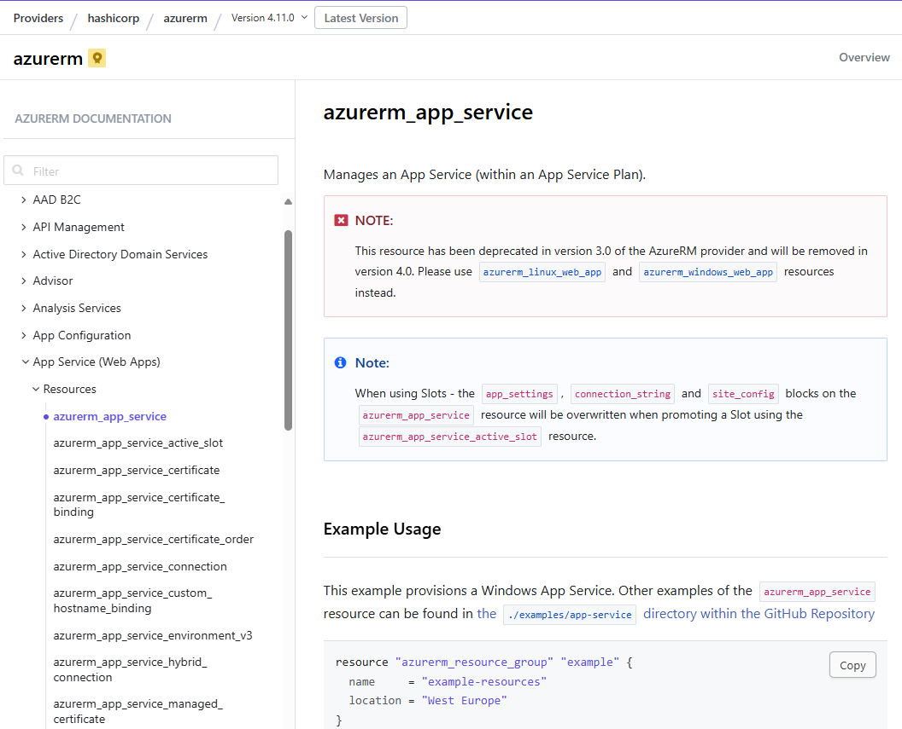]

  * VS Code ならスニペットあり。「res」まで打って TAB でリソース選択ダイアログが表示される。

  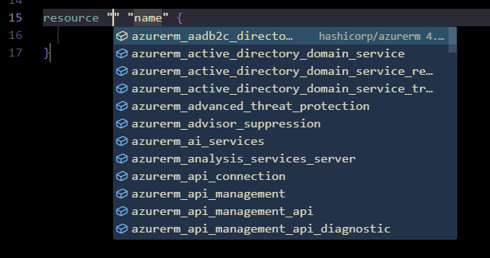

    * プロパティの入力候補も表示される。

    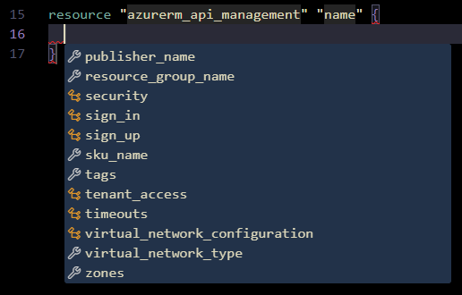

---

#### Azure リージョンリスト

[terraform-azurerm-regions/REGIONS.md at master · claranet/terraform-azurerm-regions · GitHub](https://github.com/claranet/terraform-azurerm-regions/blob/master/REGIONS.md)

| Region name          | AZ CLI name        | Short notation | Internal terraform notation | Paired region    | Suggested data location |
| -------------------- | ------------------ | -------------- | --------------------------- | ---------------- | ----------------------- |
| Asia                 | asia               | asia           | asia                        | N/A              | Asia Pacific            |
| East Asia            | eastasia           | asea           | asia-east                   | asia-south-east  | Asia Pacific            |
| Asia Pacific         | asiapacific        | apac           | asia-pa                     | N/A              | Asia Pacific            |
| Southeast Asia       | southeastasia      | asse           | asia-south-east             | asia-east        | Asia Pacific            |
| Australia            | australia          | aus            | aus                         | N/A              | Australia               |
| Australia Central    | australiacentral   | auc            | aus-central                 | aus-central-2    | Australia               |
| Australia Central 2  | australiacentral2  | auc2           | aus-central-2               | aus-central      | Australia               |
| Australia East       | australiaeast      | aue            | aus-east                    | aus-south-east   | Australia               |
| Australia Southeast  | australiasoutheast | ause           | aus-south-east              | aus-east         | Australia               |
| Brazil               | brazil             | bra            | bra                         | N/A              | Brazil                  |
| Brazil South         | brazilsouth        | brs            | bra-south                   | us-south-central | Brazil                  |
| Brazil Southeast     | brazilsoutheast    | brse           | bra-south-east              | bra-south        | Brazil                  |
| Canada               | canada             | can            | can                         | N/A              | Canada                  |
| Canada Central       | canadacentral      | cac            | can-central                 | can-east         | Canada                  |
| Canada East          | canadaeast         | cae            | can-east                    | can-central      | Canada                  |
| China East           | chinaeast          | cne            | cn-east                     | cn-north         | Asia Pacific            |
| China East 2         | chinaeast2         | cne2           | cn-east-2                   | cn-north-2       | Asia Pacific            |
| China East 3         | chinaeast3         | cne3           | cn-east-3                   | cn-north-3       | Asia Pacific            |
| China North          | chinanorth         | cnn            | cn-north                    | cn-east          | Asia Pacific            |
| China North 2        | chinanorth2        | cnn2           | cn-north-2                  | cn-east-2        | Asia Pacific            |
| China North 3        | chinanorth3        | cnn3           | cn-north-3                  | cn-east-3        | Asia Pacific            |
| Europe               | europe             | eu             | eu                          | N/A              | Europe                  |
| North Europe         | northeurope        | eun            | eu-north                    | eu-west          | Europe                  |
| West Europe          | westeurope         | euw            | eu-west                     | eu-north         | Europe                  |
| France Central       | francecentral      | frc            | fr-central                  | fr-south         | France                  |
| France South         | francesouth        | frs            | fr-south                    | fr-central       | France                  |
| Germany Central      | germanycentral     | gce            | ger-central                 | N/A              | Germany                 |
| Germany North        | germanynorth       | gno            | ger-north                   | ger-west-central | Germany                 |
| Germany Northeast    | germanynortheast   | gne            | ger-north-east              | N/A              | Germany                 |
| Germany West Central | germanywestcentral | gwc            | ger-west-central            | ger-north        | Germany                 |
| Global               | global             | glob           | global                      | N/A              | N/A                     |
| India                | india              | ind            | ind                         | N/A              | India                   |
| Central India        | centralindia       | inc            | ind-central                 | ind-south        | India                   |
| South India          | southindia         | ins            | ind-south                   | ind-central      | India                   |
| West India           | westindia          | inw            | ind-west                    | ind-south        | India                   |
| Israel Central       | israelcentral      | ilc            | isr-central                 | N/A              | Asia Pacific            |
| Italy North          | italynorth         | itn            | ita-north                   | N/A              | Europe                  |
| Japan                | japan              | jap            | jap                         | N/A              | Japan                   |
| Japan East           | japaneast          | jpe            | jap-east                    | jap-west         | Japan                   |
| Japan West           | japanwest          | jpw            | jap-west                    | jap-east         | Japan                   |
| Korea                | korea              | kor            | kor                         | N/A              | Korea                   |
| Korea Central        | koreacentral       | krc            | kor-central                 | kor-south        | Korea                   |
| Korea South          | koreasouth         | krs            | kor-south                   | kor-central      | Korea                   |
| Norway               | norway             | nor            | nor                         | N/A              | Norway                  |
| Norway East          | norwayeast         | noe            | norw-east                   | norw-west        | Norway                  |
| Norway West          | norwaywest         | now            | norw-west                   | norw-east        | Norway                  |
| Poland Central       | polandcentral      | polc           | pol-central                 | N/A              | Europe                  |
| Qatar Central        | qatarcentral       | qatc           | qat-central                 | N/A              | UAE                     |
| South Africa North   | southafricanorth   | san            | saf-north                   | saf-west         | Africa                  |
| South Africa West    | southafricawest    | saw            | saf-west                    | saf-north        | Africa                  |
| Singapore            | singapore          | sgp            | sgp                         | N/A              | Asia Pacific            |
| Sweden               | sweden             | swe            | swe                         | N/A              | Europe                  |
| Sweden Central       | swedencentral      | swec           | swe-central                 | swe-south        | Europe                  |
| Sweden South         | swedensouth        | swes           | swe-south                   | swe-central      | Europe                  |
| Switzerland North    | switzerlandnorth   | swn            | swz-north                   | swz-west         | Switzerland             |
| Switzerland West     | switzerlandwest    | sww            | swz-west                    | swz-north        | Switzerland             |
| UAE Central          | uaecentral         | uaec           | uae-central                 | uae-north        | UAE                     |
| UAE North            | uaenorth           | uaen           | uae-north                   | uae-central      | UAE                     |
| United Kingdom       | uk                 | uk             | uk                          | N/A              | UK                      |
| UK South             | uksouth            | uks            | uk-south                    | uk-west          | UAE                     |
| UK West              | ukwest             | ukw            | uk-west                     | uk-south         | UK                      |
| United States        | unitedstates       | us             | us                          | N/A              | United States           |
| Central US           | centralus          | usc            | us-central                  | us-east-2        | United States           |
| East US              | eastus             | use            | us-east                     | us-west          | United States           |
| East US 2            | eastus2            | use2           | us-east-2                   | us-central       | United States           |
| North Central US     | northcentralus     | usnc           | us-north-central            | us-south-central | United States           |
| South Central US     | southcentralus     | ussc           | us-south-central            | us-north-central | United States           |
| West US              | westus             | usw            | us-west                     | us-east          | United States           |
| West US 2            | westus2            | usw2           | us-west-2                   | us-west-central  | United States           |
| West US 3            | westus3            | usw3           | us-west-3                   | us-east          | United States           |
| West Central US      | westcentralus      | uswc           | us-west-central             | us-west-2        | United States           |

---

# 実行概要

## 実行方法

* フォルダを右クリック ⇒ ターミナルで開く ⇒ PowerShell を起動する。

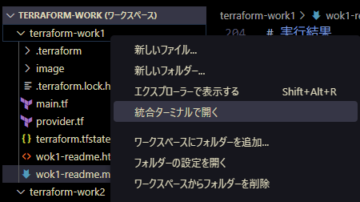

* az account show でテナント・サブスクリプションを確認する。

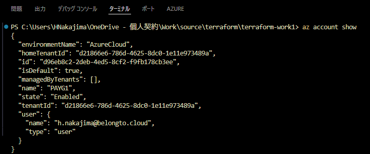

* terraform init で初期化。作業ディレクトリにプロバイダー (azurerm/225MB) がダウンロードされる。

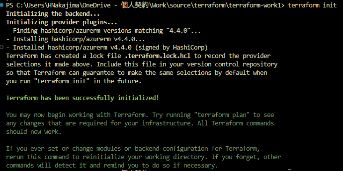

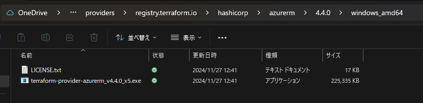

  ```PowerShell
  PS C:\Users\HNakajima\OneDrive - 個人契約\Work\source\terraform\terraform-work1> terraform init
  Initializing the backend...
  Initializing provider plugins...
  - Finding hashicorp/azurerm versions matching "4.4.0"...
  - Installing hashicorp/azurerm v4.4.0...
  - Installed hashicorp/azurerm v4.4.0 (signed by HashiCorp)
  Terraform has created a lock file .terraform.lock.hcl to record the provider
  selections it made above. Include this file in your version control repository
  so that Terraform can guarantee to make the same selections by default when
  you run "terraform init" in the future.

  Terraform has been successfully initialized!

  You may now begin working with Terraform. Try running "terraform plan" to see
  any changes that are required for your infrastructure. All Terraform commands
  should now work.

  If you ever set or change modules or backend configuration for Terraform,
  rerun this command to reinitialize your working directory. If you forget, other
  commands will detect it and remind you to do so if necessary.
  ```

* terraform plan で実行内容を確認。⇒ 2 リソース追加される。

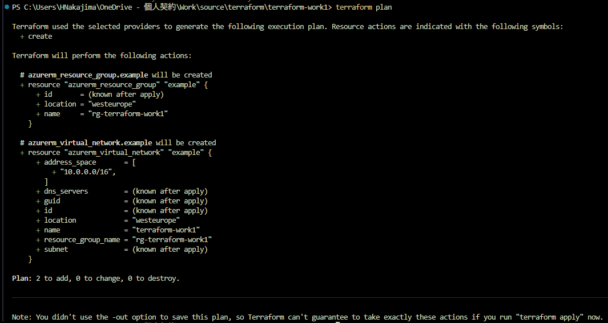

  ```PowerShell
  PS C:\Users\HNakajima\OneDrive - 個人契約\Work\source\terraform\terraform-work1> terraform plan   

  Terraform used the selected providers to generate the following execution plan. Resource actions are indicated with the following symbols:
    + create

  Terraform will perform the following actions:

    # azurerm_resource_group.example will be created
    + resource "azurerm_resource_group" "example" {
        + id       = (known after apply)
        + location = "westeurope"
        + name     = "rg-terraform-work1"
      }

    # azurerm_virtual_network.example will be created
    + resource "azurerm_virtual_network" "example" {
        + address_space       = [
            + "10.0.0.0/16",
          ]
        + dns_servers         = (known after apply)
        + guid                = (known after apply)
        + id                  = (known after apply)
        + location            = "westeurope"
        + name                = "terraform-work1"
        + resource_group_name = "rg-terraform-work1"
        + subnet              = (known after apply)
      }

  Plan: 2 to add, 0 to change, 0 to destroy.

  ──────────────────────────────────────────────────

  Note: You didn't use the -out option to save this plan, so Terraform can't guarantee to take exactly these actions if you run "terraform apply" now.
  ```

* terraform apply で環境に適用する。
  * 「Enter a value: に yes を入力することで実行する。⇒「Enter a value: 」までは terraform plan と同じ。

  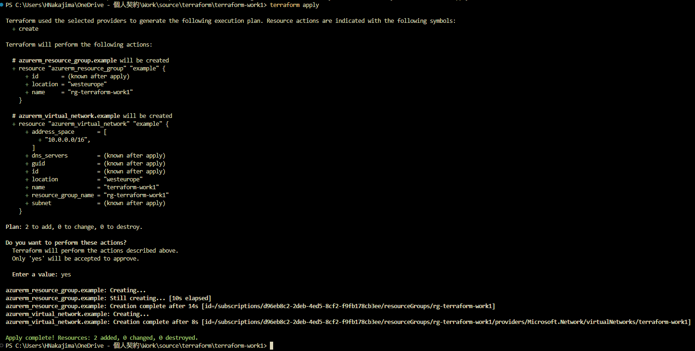

    ```PowerShell
    PS C:\Users\HNakajima\OneDrive - 個人契約\Work\source\terraform\terraform-work1> terraform apply      

    Terraform used the selected providers to generate the following execution plan. Resource actions are indicated with the following symbols:
      + create

    Terraform will perform the following actions:

      # azurerm_resource_group.example will be created
      + resource "azurerm_resource_group" "example" {
          + id       = (known after apply)
          + location = "westeurope"
          + name     = "rg-terraform-work1"
        }

      # azurerm_virtual_network.example will be created
      + resource "azurerm_virtual_network" "example" {
          + address_space       = [
              + "10.0.0.0/16",
            ]
          + dns_servers         = (known after apply)
          + guid                = (known after apply)
          + id                  = (known after apply)
          + location            = "westeurope"
          + name                = "terraform-work1"
          + resource_group_name = "rg-terraform-work1"
          + subnet              = (known after apply)
        }

    Plan: 2 to add, 0 to change, 0 to destroy.

    Do you want to perform these actions?
      Terraform will perform the actions described above.
      Only 'yes' will be accepted to approve.

      Enter a value: yes

    azurerm_resource_group.example: Creating...
    azurerm_resource_group.example: Still creating... [10s elapsed]
    azurerm_resource_group.example: Creation complete after 14s [id=/subscriptions/xxxxxxxx-xxxx-xxxx-xxxx-xxxxxxxxxxxx/resourceGroups/rg-terraform-work1]
    azurerm_virtual_network.example: Creating...
    azurerm_virtual_network.example: Creation complete after 8s [id=/subscriptions/xxxxxxxx-xxxx-xxxx-xxxx-xxxxxxxxxxxx/resourceGroups/rg-terraform-work1/providers/Microsoft.Network/virtualNetworks/terraform-work1]

    Apply complete! Resources: 2 added, 0 changed, 0 destroyed.
    ```

## 実行結果

* リソースグループと仮想ネットワークが作成された。

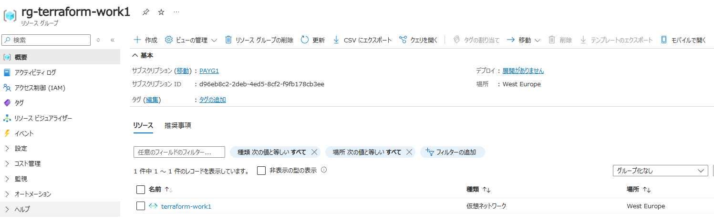

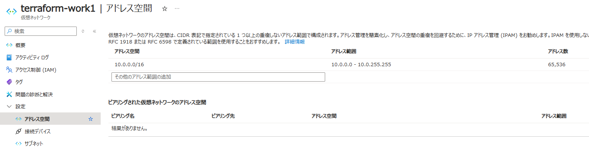

* アクティビティログには、サインインした Entra 実行ユーザーのログが残る。

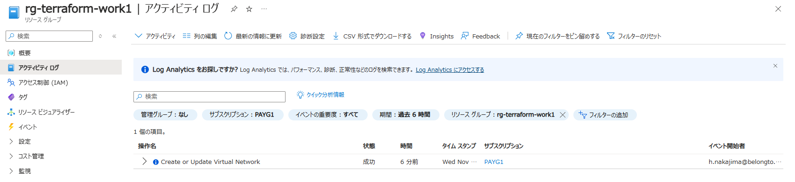

* 一方、デプロイ履歴には残らない。⇒ Azure ポータルでデプロイした際は履歴が残る。

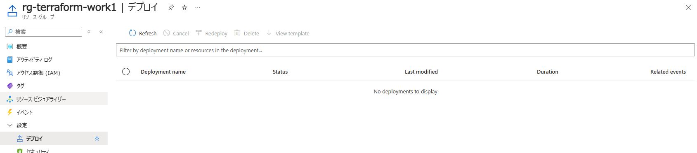

---
