# 概要

* work2 は以下の MS Learning を拡張し、リソースグループ・仮想ネットワーク・サブネット・サブネットへの委任・NSGを作成します。
* random、backend、variables、output を使用します。
  [クイックスタート: Terraform を使用して仮想ネットワークを作成する - Azure Virtual Network | Microsoft Learn](https://learn.microsoft.com/ja-jp/azure/virtual-network/quick-create-terraform?tabs=azure-cli)
  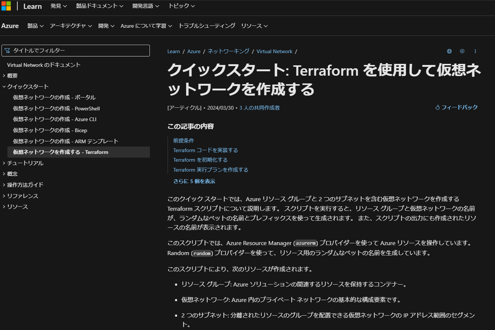

* ルートのフォルダ・ファイル構成
  * terraform-work2
    ∟ .terrtaform - init 時に作成される Provider がダウンロードされるフォルダ
    ∟ image - readme の画像ファイルを格納するフォルダ
    ∟ tfstate - リモートバックエンドからダウンロードした tfstate ファイル
    ∟ .terraform.lock.hcl - init 時に作成される、Provider と .tf ファイルの依存関係等が記録されたファイル ⇒ [Dependency Lock File](https://developer.hashicorp.com/terraform/language/files/dependency-lock)
    ∟ main.tf - リソースを記述した tf ファイル
    ∟ outputs.tf - 出力を記述した tf ファイル
    ∟ provider.tf - プロバイダーを記述した tf ファイル
    ∟ variables.tf - 変数を記述した tf ファイル
    ∟ work2-readme.html - Markdown を HTML 化したファイル
    ∟ work2-readme.md - この Markdown ファイル

---

* terraform ブロック

  ```js
  terraform {
    required_providers {
        azurerm = {
        source  = "hashicorp/azurerm"
        version = "=4.4.0"
        }  
        random = {
        source  = "hashicorp/random"
        version = "~>3.0"
        }
    }  
    backend "azurerm" {
        resource_group_name  = "rg-logs"
        storage_account_name = "stohradtf01"
        container_name       = "tfstate"
        key                  = "terraform-work2.tfstate"
    }
  }
  ```

  * [Random Provider](https://registry.terraform.io/providers/hashicorp/random/latest/docs) でランダムな文字列や数値やペット名を生成可能となる。
  * backend でステート (tfstate) の保存先を指定する。
    * container_name は Blob コンテナ名。自動作成してくれないので先に作成しておく必要がある。 
    * key はストレージアカウントのキーではなく、保存先のコンテナファイル名。 
    * backend の認証は Entra、Access Key、SAS で設定する。
      * 環境変数(ARM_ACCESS_KEY)、AzCLI、ServicePrincipal、Managed ID、Access Key、SAS Token 等を指定可能。
        以下参照。
        [Backend Type: azurerm | Terraform | HashiCorp Developer](https://developer.hashicorp.com/terraform/language/backend/azurerm)
        [Terraform 状態を Azure Storage に格納する](https://learn.microsoft.com/ja-jp/azure/developer/terraform/store-state-in-azure-storage?tabs=azure-cli)
    * backend 自体はローカル以外に Blob、S3、Kubernetes、HTTP、PostgreSQL等を設定・保存可能。
    * ローカル－リモート間で backend を切り替えることが可能。ローカルで作成してしまった後共有するため等。
      terraform init -migrate-state / terraform -reconfigure を使用する。
      [【Terraform】Backend の切り替え方法とは？](https://qiita.com/empty948/items/9564858aa4783ffa9cf7)

---

* variable ブロック

  ```js
  variable "resource_group_location" {
    type        = string
    default     = "japanwest"
    description = "Location of the resource group."
  }

  variable "resource_group_name_prefix" {
    type        = string
    default     = "rg"
  }
  ```
  * 変数を別ファイルにし、resource ブロックで参照する。
  * location とリソースグループ名の prefix を変数化している。
  * 実運用では既存リソース名やVNETのアドレス空間/サブネットサイズ、設定情報等をすべて variables.tf で保持する想定。

---

* resource ブロック
  * random_pet でランダムなペット名を生成する。
    * prefix に変数をセットしている。length は 単語数 (デフォルト 2)。
    [Terraform Randomの使い方をAzure ストレージアカウント作成しながら学ぶ](https://www.tama-negi.com/2021/12/18/terraform_randam/)
  * リソースグループに location と random_pet の変数をセットして作成する。  
    ```js
    resource "random_pet" "prefix" {
      prefix = var.resource_group_name_prefix
      length = 1
    }

    # Resource Group
    resource "azurerm_resource_group" "rg" {
      location = var.resource_group_location
      name     = "${random_pet.prefix.id}"
    }
    ```

  * VNET/Subnet/NSG の作成と NSG 割当を行う。
    * Subnet は委任するパターンとサービスエンドポイントを設定するパターンを定義する。
    * NSG はグローバルIPを許可する受信規則を作成する。
    * Subnet1 に NSG を割り当てる。
    ```js
    # Virtual Network
    resource "azurerm_virtual_network" "terraform-work2-network" {
      name                = "${random_pet.prefix.id}-vnet"
      address_space       = ["10.0.0.0/16"]
      location            = azurerm_resource_group.rg.location
      resource_group_name = azurerm_resource_group.rg.name
    }

    # subnet は vnet にnestできない
    # https://qiita.com/Rami21/items/00a94e77cc8c8cbc7a45
    # Subnet 1
    resource "azurerm_subnet" "terraform-work2-subnet-1" {
      name                 = "subnet-1"
      resource_group_name  = azurerm_resource_group.rg.name
      virtual_network_name = azurerm_virtual_network.my_terraform_network.name
      address_prefixes     = ["10.0.0.0/24"]
      delegation {
          name = "delegation"

          service_delegation {
          name    = "Microsoft.ContainerInstance/containerGroups"
          actions = ["Microsoft.Network/virtualNetworks/subnets/join/action",
                      "Microsoft.Network/virtualNetworks/subnets/prepareNetworkPolicies/action"]
          }
      }
    }

    # Subnet 2
    resource "azurerm_subnet" "terraform-work2-subnet-2" {
      name                 = "subnet-2"
      resource_group_name  = azurerm_resource_group.rg.name
      virtual_network_name = azurerm_virtual_network.my_terraform_network.name
      address_prefixes     = ["10.0.1.0/24"]
      service_endpoints    = ["Microsoft.Storage"]
    }

    # Network Security Group
    resource "azurerm_network_security_group" "terraform-work2-nsg" {
      name                = "terraform-work2-nsg"
      location            = azurerm_resource_group.rg.location
      resource_group_name = azurerm_resource_group.rg.name

      security_rule {
          name                       = "allow"
          priority                   = 100
          direction                  = "Inbound"
          access                     = "Allow"
          protocol                   = "*"
          source_port_range          = "*"
          destination_port_range     = "*"
          source_address_prefix      = "120.75.97.239" # your global ip
          destination_address_prefix = "10.0.0.0/24"
      }  
    }

    # NSG の割当 -> Subnet1
    resource "azurerm_subnet_network_security_group_association" "subnet1" {
      subnet_id                 = azurerm_subnet.terraform-work2-subnet-1.id
      network_security_group_id = azurerm_network_security_group.terraform-work2-nsg.id
    }
    ```

---

* output ブロック
  * terraform apply 実行後、CLI にプリントする。Public IP アドレスや Random で作成した VM パスワード等。
    [Terraformのoutputとは何か](https://qiita.com/kyntk/items/2cdd38c2438ac257ac4e)
  * 実際の運用では、別ファイル化した (モジュール化した) リソース作成において、作成したリソースの ID を output で連携して他リソース作成時のプロパティとして使用する事が多いと思われる。
    例）VNET/Subnet 作成後、VM に 割り当てる NIC に サブネット ID を連携して使用する。
    [TerraformのModule間で値をやり取りする](https://zenn.dev/not75743/articles/8b98519fc9fde0)
    ```
    output "resource_group_name" {
      description = "The name of the created resource group."
      value       = azurerm_resource_group.rg.name
    }

    output "virtual_network_name" {
      description = "The name of the created virtual network."
      value       = azurerm_virtual_network.terraform-work2-network.name
    }
    ～略～
    ```
  
---

# 実行概要

## 実行方法

* terraform init で初期化。プロバイダー (azurerm / random) がダウンロードされる。
  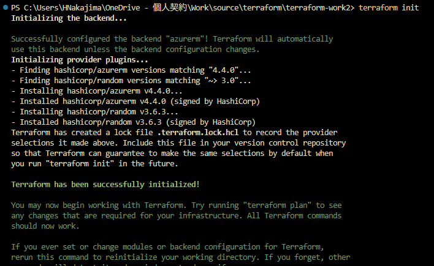
  
  ```PowerShell
  PS C:\Users\HNakajima\OneDrive - 個人契約\Work\source\terraform\terraform-work2> terraform init 
  Initializing the backend...

  Successfully configured the backend "azurerm"! Terraform will automatically
  use this backend unless the backend configuration changes.
  Initializing provider plugins...
  - Finding hashicorp/azurerm versions matching "4.4.0"...
  - Finding hashicorp/random versions matching "~> 3.0"...
  - Installing hashicorp/azurerm v4.4.0...
  - Installed hashicorp/azurerm v4.4.0 (signed by HashiCorp)
  - Installing hashicorp/random v3.6.3...
  - Installed hashicorp/random v3.6.3 (signed by HashiCorp)
  Terraform has created a lock file .terraform.lock.hcl to record the provider
  selections it made above. Include this file in your version control repository
  so that Terraform can guarantee to make the same selections by default when
  you run "terraform init" in the future.

  Terraform has been successfully initialized!

  You may now begin working with Terraform. Try running "terraform plan" to see
  any changes that are required for your infrastructure. All Terraform commands
  should now work.

  If you ever set or change modules or backend configuration for Terraform,
  rerun this command to reinitialize your working directory. If you forget, other
  commands will detect it and remind you to do so if necessary.
  ```

* terraform plan で実行内容を確認する。
  * サブネットにおいて VNET の変数名を間違えているエラーだった。その他、リージョン名が間違っている場合などエラーがあれば表示される。
    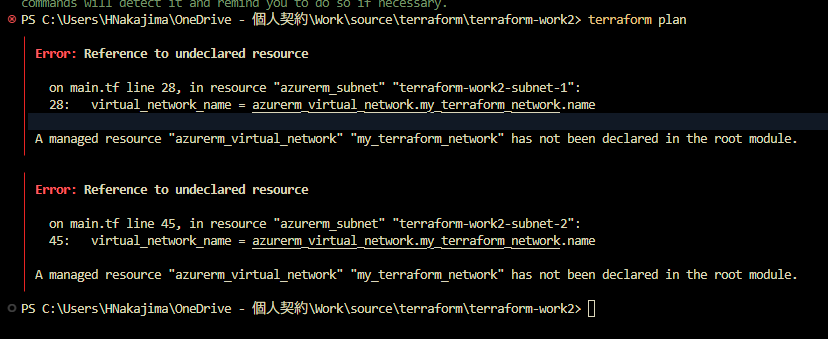
    ```PowerShell
    PS C:\Users\HNakajima\OneDrive - 個人契約\Work\source\terraform\terraform-work2> terraform plan 
    ╷
    │ Error: Reference to undeclared resource
    │ 
    │   on main.tf line 28, in resource "azurerm_subnet" "terraform-work2-subnet-1":
    │   28:   virtual_network_name = azurerm_virtual_network.my_terraform_network.name
    │ 
    │ A managed resource "azurerm_virtual_network" "my_terraform_network" has not been declared in the root module.
    ╵
    ╷
    │ Error: Reference to undeclared resource
    │ 
    │   on main.tf line 45, in resource "azurerm_subnet" "terraform-work2-subnet-2":
    │   45:   virtual_network_name = azurerm_virtual_network.my_terraform_network.name
    │ 
    │ A managed resource "azurerm_virtual_network" "my_terraform_network" has not been declared in the root module.
    ╵
    ```
  * 変数名を正しいものに修正した。
  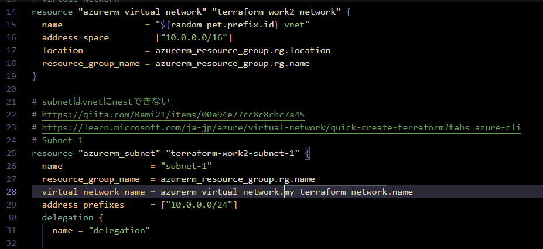
  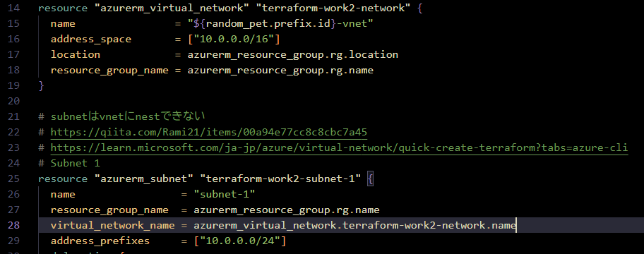

* 改めて terraform plan で実行内容を確認すると、エラーは解消された。
  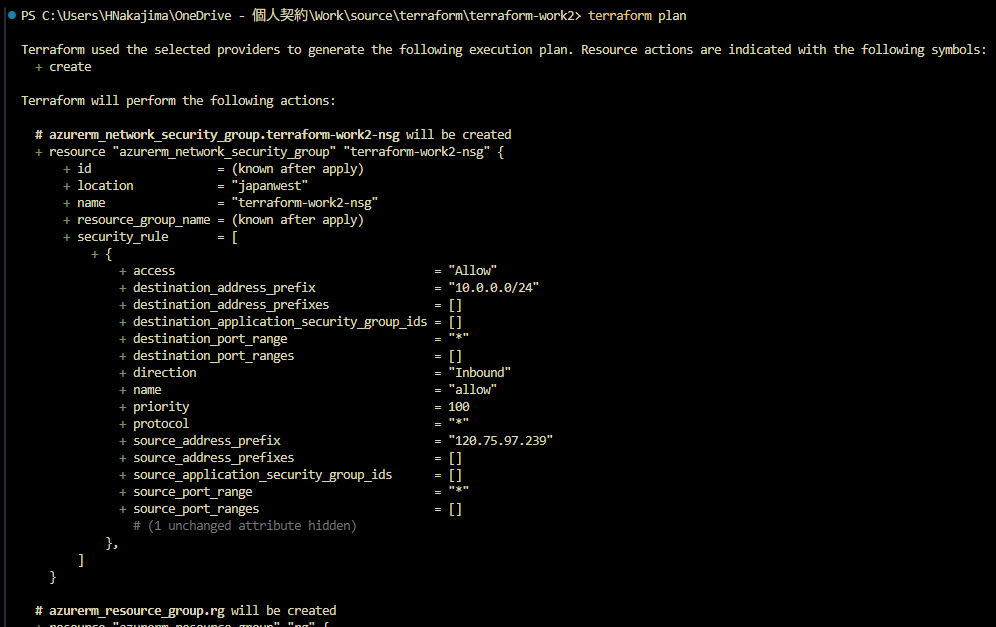
  ```PowerShell
  PS C:\Users\HNakajima\OneDrive - 個人契約\Work\source\terraform\terraform-work2> terraform plan

  Terraform used the selected providers to generate the following execution plan. Resource actions are indicated with the following symbols:
    + create

  Terraform will perform the following actions:

    # azurerm_network_security_group.terraform-work2-nsg will be created
    + resource "azurerm_network_security_group" "terraform-work2-nsg" {
        + id                  = (known after apply)
        + location            = "japanwest"
        + name                = "terraform-work2-nsg"
        + resource_group_name = (known after apply)
        + security_rule       = [
            + {
                + access                                     = "Allow"
                + destination_address_prefix                 = "10.0.0.0/24"
                + destination_address_prefixes               = []
                + destination_application_security_group_ids = []
                + destination_port_range                     = "*"
                + destination_port_ranges                    = []
                + direction                                  = "Inbound"
                + name                                       = "allow"
                + priority                                   = 100
                + protocol                                   = "*"
                + source_address_prefix                      = "120.75.97.239"
                + source_address_prefixes                    = []
                + source_application_security_group_ids      = []
                + source_port_range                          = "*"
                + source_port_ranges                         = []
                  # (1 unchanged attribute hidden)
              },
          ]
      }

    # azurerm_resource_group.rg will be created
    + resource "azurerm_resource_group" "rg" {
        + id       = (known after apply)
        + location = "japanwest"
        + name     = (known after apply)
      }

    # azurerm_subnet.terraform-work2-subnet-1 will be created
    + resource "azurerm_subnet" "terraform-work2-subnet-1" {
        + address_prefixes                              = [
            + "10.0.0.0/24",
          ]
        + default_outbound_access_enabled               = true
        + id                                            = (known after apply)
        + name                                          = "subnet-1"
        + private_endpoint_network_policies             = "Disabled"
        + private_link_service_network_policies_enabled = true
        + resource_group_name                           = (known after apply)
        + virtual_network_name                          = (known after apply)

        + delegation {
            + name = "delegation"

            + service_delegation {
                + actions = [
                    + "Microsoft.Network/virtualNetworks/subnets/join/action",
                    + "Microsoft.Network/virtualNetworks/subnets/prepareNetworkPolicies/action",
                  ]
                + name    = "Microsoft.ContainerInstance/containerGroups"
              }
          }
      }

    # azurerm_subnet.terraform-work2-subnet-2 will be created
    + resource "azurerm_subnet" "terraform-work2-subnet-2" {
        + address_prefixes                              = [
            + "10.0.1.0/24",
          ]
        + default_outbound_access_enabled               = true
        + id                                            = (known after apply)
        + name                                          = "subnet-2"
        + private_endpoint_network_policies             = "Disabled"
        + private_link_service_network_policies_enabled = true
        + resource_group_name                           = (known after apply)
        + service_endpoints                             = [
            + "Microsoft.Storage",
          ]
        + virtual_network_name                          = (known after apply)
      }

    # azurerm_subnet_network_security_group_association.subnet1 will be created
    + resource "azurerm_subnet_network_security_group_association" "subnet1" {
        + id                        = (known after apply)
        + network_security_group_id = (known after apply)
        + subnet_id                 = (known after apply)
      }

    # azurerm_virtual_network.terraform-work2-network will be created
    + resource "azurerm_virtual_network" "terraform-work2-network" {
        + address_space       = [
            + "10.0.0.0/16",
          ]
        + dns_servers         = (known after apply)
        + guid                = (known after apply)
        + id                  = (known after apply)
        + location            = "japanwest"
        + name                = (known after apply)
        + resource_group_name = (known after apply)
        + subnet              = (known after apply)
      }

    # random_pet.prefix will be created
    + resource "random_pet" "prefix" {
        + id        = (known after apply)
        + length    = 1
        + prefix    = "rg"
        + separator = "-"
      }

  Plan: 7 to add, 0 to change, 0 to destroy.

  Changes to Outputs:
    + resource_group_name  = (known after apply)
    + subnet_name_1        = "subnet-1"
    + subnet_name_2        = "subnet-2"
    + virtual_network_name = (known after apply)

  ───────────────────────────────────────────────────────────

  Note: You didn't use the -out option to save this plan, so Terraform can't guarantee to take exactly these actions if you run "terraform apply" now.
  ```

* terraform apply で環境に適用する。45秒程度掛かった。
  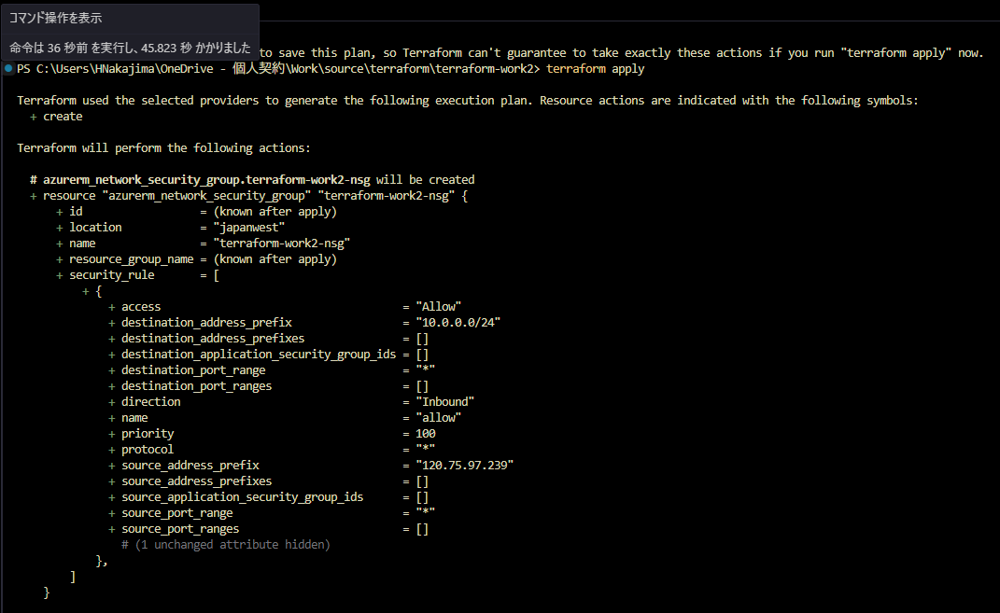
  ```PowerShell
  PS C:\Users\HNakajima\OneDrive - 個人契約\Work\source\terraform\terraform-work2> terraform apply

  Terraform used the selected providers to generate the following execution plan. Resource actions are indicated with the following symbols:
    + create

  Terraform will perform the following actions:

    # azurerm_network_security_group.terraform-work2-nsg will be created
    + resource "azurerm_network_security_group" "terraform-work2-nsg" {
        + id                  = (known after apply)
        + location            = "japanwest"
        + name                = "terraform-work2-nsg"
        + resource_group_name = (known after apply)
        + security_rule       = [
            + {
                + access                                     = "Allow"
                + destination_address_prefix                 = "10.0.0.0/24"
                + destination_address_prefixes               = []
                + destination_application_security_group_ids = []
                + destination_port_range                     = "*"
                + destination_port_ranges                    = []
                + direction                                  = "Inbound"
                + name                                       = "allow"
                + priority                                   = 100
                + protocol                                   = "*"
                + source_address_prefix                      = "120.75.97.239"
                + source_address_prefixes                    = []
                + source_application_security_group_ids      = []
                + source_port_range                          = "*"
                + source_port_ranges                         = []
                  # (1 unchanged attribute hidden)
              },
          ]
      }

    # azurerm_resource_group.rg will be created
    + resource "azurerm_resource_group" "rg" {
        + id       = (known after apply)
        + location = "japanwest"
        + name     = (known after apply)
      }

    # azurerm_subnet.terraform-work2-subnet-1 will be created
    + resource "azurerm_subnet" "terraform-work2-subnet-1" {
        + address_prefixes                              = [
            + "10.0.0.0/24",
          ]
        + default_outbound_access_enabled               = true
        + id                                            = (known after apply)
        + name                                          = "subnet-1"
        + private_endpoint_network_policies             = "Disabled"
        + private_link_service_network_policies_enabled = true
        + resource_group_name                           = (known after apply)
        + virtual_network_name                          = (known after apply)

        + delegation {
            + name = "delegation"

            + service_delegation {
                + actions = [
                    + "Microsoft.Network/virtualNetworks/subnets/join/action",
                    + "Microsoft.Network/virtualNetworks/subnets/prepareNetworkPolicies/action",
                  ]
                + name    = "Microsoft.ContainerInstance/containerGroups"
              }
          }
      }

    # azurerm_subnet.terraform-work2-subnet-2 will be created
    + resource "azurerm_subnet" "terraform-work2-subnet-2" {
        + address_prefixes                              = [
            + "10.0.1.0/24",
          ]
        + default_outbound_access_enabled               = true
        + id                                            = (known after apply)
        + name                                          = "subnet-2"
        + private_endpoint_network_policies             = "Disabled"
        + private_link_service_network_policies_enabled = true
        + resource_group_name                           = (known after apply)
        + service_endpoints                             = [
            + "Microsoft.Storage",
          ]
        + virtual_network_name                          = (known after apply)
      }

    # azurerm_subnet_network_security_group_association.subnet1 will be created
    + resource "azurerm_subnet_network_security_group_association" "subnet1" {
        + id                        = (known after apply)
        + network_security_group_id = (known after apply)
        + subnet_id                 = (known after apply)
      }

    # azurerm_virtual_network.terraform-work2-network will be created
    + resource "azurerm_virtual_network" "terraform-work2-network" {
        + address_space       = [
            + "10.0.0.0/16",
          ]
        + dns_servers         = (known after apply)
        + guid                = (known after apply)
        + id                  = (known after apply)
        + location            = "japanwest"
        + name                = (known after apply)
        + resource_group_name = (known after apply)
        + subnet              = (known after apply)
      }

    # random_pet.prefix will be created
    + resource "random_pet" "prefix" {
        + id        = (known after apply)
        + length    = 1
        + prefix    = "rg"
        + separator = "-"
      }

  Plan: 7 to add, 0 to change, 0 to destroy.

  Changes to Outputs:
    + resource_group_name  = (known after apply)
    + subnet_name_1        = "subnet-1"
    + subnet_name_2        = "subnet-2"
    + virtual_network_name = (known after apply)

  Do you want to perform these actions?
    Terraform will perform the actions described above.
    Only 'yes' will be accepted to approve.

    Enter a value: yes

  random_pet.prefix: Creating...
  random_pet.prefix: Creation complete after 0s [id=rg-mackerel]
  azurerm_resource_group.rg: Creating...
  azurerm_resource_group.rg: Still creating... [10s elapsed]
  azurerm_resource_group.rg: Creation complete after 12s [id=/subscriptions/xxxxxxxx-xxxx-xxxx-xxxx-xxxxxxxxxxxx/resourceGroups/rg-mackerel]
  azurerm_virtual_network.terraform-work2-network: Creating...
  azurerm_network_security_group.terraform-work2-nsg: Creating...
  azurerm_network_security_group.terraform-work2-nsg: Creation complete after 2s [id=/subscriptions/xxxxxxxx-xxxx-xxxx-xxxx-xxxxxxxxxxxx/resourceGroups/rg-mackerel/providers/Microsoft.Network/networkSecurityGroups/terraform-work2-nsg]
  azurerm_virtual_network.terraform-work2-network: Creation complete after 5s [id=/subscriptions/xxxxxxxx-xxxx-xxxx-xxxx-xxxxxxxxxxxx/resourceGroups/rg-mackerel/providers/Microsoft.Network/virtualNetworks/rg-mackerel-vnet]
  azurerm_subnet.terraform-work2-subnet-2: Creating...
  azurerm_subnet.terraform-work2-subnet-1: Creating...
  azurerm_subnet.terraform-work2-subnet-2: Creation complete after 3s [id=/subscriptions/xxxxxxxx-xxxx-xxxx-xxxx-xxxxxxxxxxxx/resourceGroups/rg-mackerel/providers/Microsoft.Network/virtualNetworks/rg-mackerel-vnet/subnets/subnet-2]
  azurerm_subnet.terraform-work2-subnet-1: Creation complete after 7s [id=/subscriptions/xxxxxxxx-xxxx-xxxx-xxxx-xxxxxxxxxxxx/resourceGroups/rg-mackerel/providers/Microsoft.Network/virtualNetworks/rg-mackerel-vnet/subnets/subnet-1]
  azurerm_subnet_network_security_group_association.subnet1: Creating...
  azurerm_subnet_network_security_group_association.subnet1: Creation complete after 4s [id=/subscriptions/xxxxxxxx-xxxx-xxxx-xxxx-xxxxxxxxxxxx/resourceGroups/rg-mackerel/providers/Microsoft.Network/virtualNetworks/rg-mackerel-vnet/subnets/subnet-1]

  Apply complete! Resources: 7 added, 0 changed, 0 destroyed.

  Outputs:

  resource_group_name = "rg-mackerel"
  subnet_name_1 = "subnet-1"
  subnet_name_2 = "subnet-2"
  virtual_network_name = "rg-mackerel-vnet"
  ```
  * Outputs として、各リソースの名前がプリントされた。ペット名は mackerel だった。

## 実行結果

* リソースグループ、仮想ネットワーク、サブネット、NSG が作成された。
  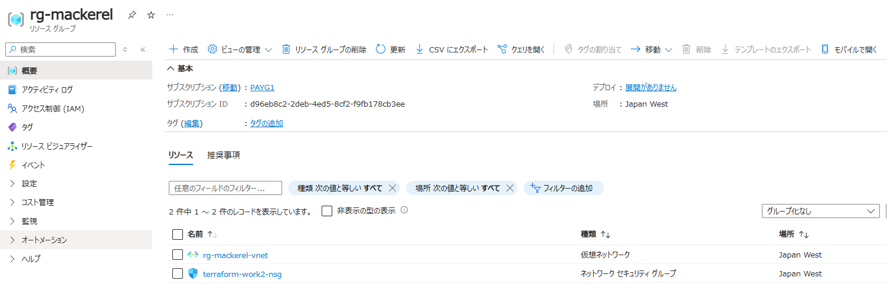
  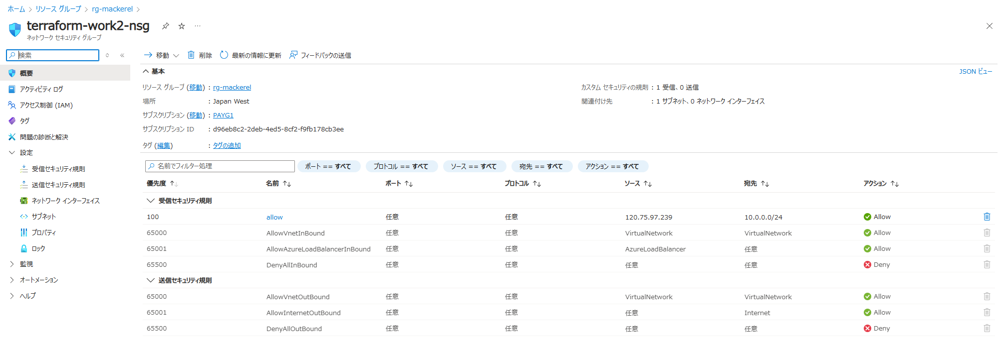

* アドレス空間が重複している警告は出なかった。
  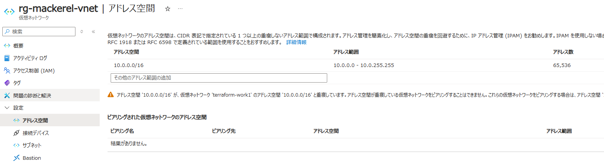

* Subnet1 に NSG の割当及び委任先が設定されている。
  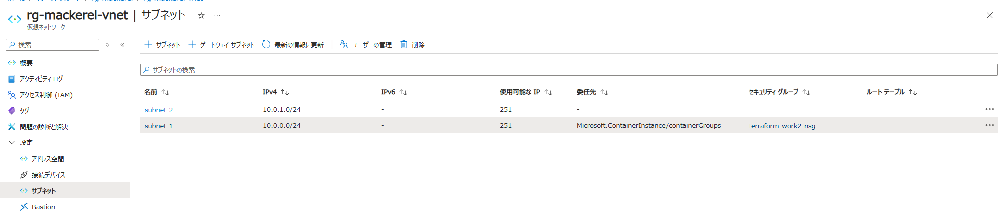
* Subnet 2 にサービスエンドポイントが設定されている。
  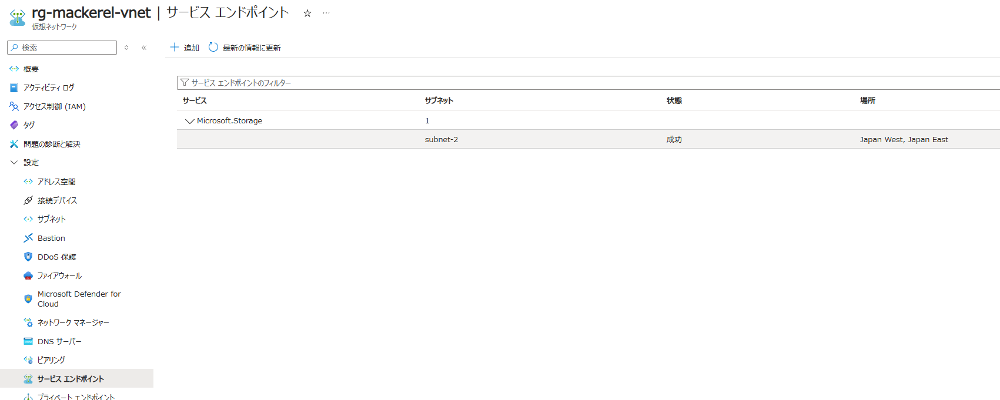

* デプロイ履歴には残らない。
  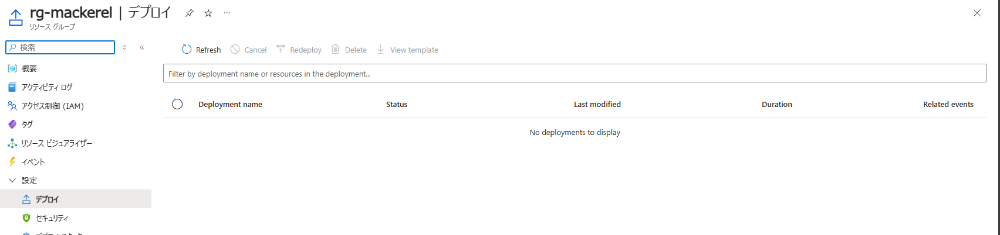

* Backend に tfstate が生成される。
  
  * tfstate の内容は以下 Json となる。terraform apply 毎に作成され管理する。
  * 指定していないプロパティ等のリソースの状態が保持されている。
    * 例えば tfstate を削除してしまった後、terraform apply するとリソースが存在するためエラーとなり、復旧が必要となる (復旧はかなり難しいとの記述が多数見受けられる)。
  ```json
  {
    "version": 4,
    "terraform_version": "1.9.8",
    "serial": 3,
    "lineage": "ee567991-efde-ae7a-5d53-d2078c2bc913",
    "outputs": {
      "resource_group_name": {
        "value": "rg-mackerel",
        "type": "string"
      },
      "subnet_name_1": {
        "value": "subnet-1",
        "type": "string"
      },
      "subnet_name_2": {
        "value": "subnet-2",
        "type": "string"
      },
      "virtual_network_name": {
        "value": "rg-mackerel-vnet",
        "type": "string"
      }
    },
    "resources": [
      {
        "mode": "managed",
        "type": "azurerm_network_security_group",
        "name": "terraform-work2-nsg",
        "provider": "provider[\"registry.terraform.io/hashicorp/azurerm\"]",
        "instances": [
          {
            "schema_version": 0,
            "attributes": {
              "id": "/subscriptions/xxxxxxxx-xxxx-xxxx-xxxx-xxxxxxxxxxxx/resourceGroups/rg-mackerel/providers/Microsoft.Network/networkSecurityGroups/terraform-work2-nsg",
              "location": "japanwest",
              "name": "terraform-work2-nsg",
              "resource_group_name": "rg-mackerel",
              "security_rule": [
                {
                  "access": "Allow",
                  "description": "",
                  "destination_address_prefix": "10.0.0.0/24",
                  "destination_address_prefixes": [],
                  "destination_application_security_group_ids": [],
                  "destination_port_range": "*",
                  "destination_port_ranges": [],
                  "direction": "Inbound",
                  "name": "allow",
                  "priority": 100,
                  "protocol": "*",
                  "source_address_prefix": "120.75.97.239",
                  "source_address_prefixes": [],
                  "source_application_security_group_ids": [],
                  "source_port_range": "*",
                  "source_port_ranges": []
                }
              ],
              "tags": null,
              "timeouts": null
            },
            "sensitive_attributes": [],
            "private": "eyJlMmJmYjczMC1lY2FhLTExZTYtOGY4OC0zNDM2M2JjN2M0YzAiOnsiY3JlYXRlIjoxODAwMDAwMDAwMDAwLCJkZWxldGUiOjE4MDAwMDAwMDAwMDAsInJlYWQiOjMwMDAwMDAwMDAwMCwidXBkYXRlIjoxODAwMDAwMDAwMDAwfX0=",
            "dependencies": [
              "azurerm_resource_group.rg",
              "random_pet.prefix"
            ]
          }
        ]
      },
      {
        "mode": "managed",
        "type": "azurerm_resource_group",
        "name": "rg",
        "provider": "provider[\"registry.terraform.io/hashicorp/azurerm\"]",
        "instances": [
          {
            "schema_version": 0,
            "attributes": {
              "id": "/subscriptions/xxxxxxxx-xxxx-xxxx-xxxx-xxxxxxxxxxxx/resourceGroups/rg-mackerel",
              "location": "japanwest",
              "managed_by": "",
              "name": "rg-mackerel",
              "tags": null,
              "timeouts": null
            },
            "sensitive_attributes": [],
            "private": "eyJlMmJmYjczMC1lY2FhLTExZTYtOGY4OC0zNDM2M2JjN2M0YzAiOnsiY3JlYXRlIjo1NDAwMDAwMDAwMDAwLCJkZWxldGUiOjU0MDAwMDAwMDAwMDAsInJlYWQiOjMwMDAwMDAwMDAwMCwidXBkYXRlIjo1NDAwMDAwMDAwMDAwfX0=",
            "dependencies": [
              "random_pet.prefix"
            ]
          }
        ]
      },
      {
        "mode": "managed",
        "type": "azurerm_subnet",
        "name": "terraform-work2-subnet-1",
        "provider": "provider[\"registry.terraform.io/hashicorp/azurerm\"]",
        "instances": [
          {
            "schema_version": 0,
            "attributes": {
              "address_prefixes": [
                "10.0.0.0/24"
              ],
              "default_outbound_access_enabled": true,
              "delegation": [
                {
                  "name": "delegation",
                  "service_delegation": [
                    {
                      "actions": [
                        "Microsoft.Network/virtualNetworks/subnets/join/action",
                        "Microsoft.Network/virtualNetworks/subnets/prepareNetworkPolicies/action"
                      ],
                      "name": "Microsoft.ContainerInstance/containerGroups"
                    }
                  ]
                }
              ],
              "id": "/subscriptions/xxxxxxxx-xxxx-xxxx-xxxx-xxxxxxxxxxxx/resourceGroups/rg-mackerel/providers/Microsoft.Network/virtualNetworks/rg-mackerel-vnet/subnets/subnet-1",
              "name": "subnet-1",
              "private_endpoint_network_policies": "Disabled",
              "private_link_service_network_policies_enabled": true,
              "resource_group_name": "rg-mackerel",
              "service_endpoint_policy_ids": null,
              "service_endpoints": null,
              "timeouts": null,
              "virtual_network_name": "rg-mackerel-vnet"
            },
            "sensitive_attributes": [],
            "private": "eyJlMmJmYjczMC1lY2FhLTExZTYtOGY4OC0zNDM2M2JjN2M0YzAiOnsiY3JlYXRlIjoxODAwMDAwMDAwMDAwLCJkZWxldGUiOjE4MDAwMDAwMDAwMDAsInJlYWQiOjMwMDAwMDAwMDAwMCwidXBkYXRlIjoxODAwMDAwMDAwMDAwfX0=",
            "dependencies": [
              "azurerm_resource_group.rg",
              "azurerm_virtual_network.terraform-work2-network",
              "random_pet.prefix"
            ]
          }
        ]
      },
      {
        "mode": "managed",
        "type": "azurerm_subnet",
        "name": "terraform-work2-subnet-2",
        "provider": "provider[\"registry.terraform.io/hashicorp/azurerm\"]",
        "instances": [
          {
            "schema_version": 0,
            "attributes": {
              "address_prefixes": [
                "10.0.1.0/24"
              ],
              "default_outbound_access_enabled": true,
              "delegation": [],
              "id": "/subscriptions/xxxxxxxx-xxxx-xxxx-xxxx-xxxxxxxxxxxx/resourceGroups/rg-mackerel/providers/Microsoft.Network/virtualNetworks/rg-mackerel-vnet/subnets/subnet-2",
              "name": "subnet-2",
              "private_endpoint_network_policies": "Disabled",
              "private_link_service_network_policies_enabled": true,
              "resource_group_name": "rg-mackerel",
              "service_endpoint_policy_ids": null,
              "service_endpoints": [
                "Microsoft.Storage"
              ],
              "timeouts": null,
              "virtual_network_name": "rg-mackerel-vnet"
            },
            "sensitive_attributes": [],
            "private": "eyJlMmJmYjczMC1lY2FhLTExZTYtOGY4OC0zNDM2M2JjN2M0YzAiOnsiY3JlYXRlIjoxODAwMDAwMDAwMDAwLCJkZWxldGUiOjE4MDAwMDAwMDAwMDAsInJlYWQiOjMwMDAwMDAwMDAwMCwidXBkYXRlIjoxODAwMDAwMDAwMDAwfX0=",
            "dependencies": [
              "azurerm_resource_group.rg",
              "azurerm_virtual_network.terraform-work2-network",
              "random_pet.prefix"
            ]
          }
        ]
      },
      {
        "mode": "managed",
        "type": "azurerm_subnet_network_security_group_association",
        "name": "subnet1",
        "provider": "provider[\"registry.terraform.io/hashicorp/azurerm\"]",
        "instances": [
          {
            "schema_version": 0,
            "attributes": {
              "id": "/subscriptions/xxxxxxxx-xxxx-xxxx-xxxx-xxxxxxxxxxxx/resourceGroups/rg-mackerel/providers/Microsoft.Network/virtualNetworks/rg-mackerel-vnet/subnets/subnet-1",
              "network_security_group_id": "/subscriptions/xxxxxxxx-xxxx-xxxx-xxxx-xxxxxxxxxxxx/resourceGroups/rg-mackerel/providers/Microsoft.Network/networkSecurityGroups/terraform-work2-nsg",
              "subnet_id": "/subscriptions/xxxxxxxx-xxxx-xxxx-xxxx-xxxxxxxxxxxx/resourceGroups/rg-mackerel/providers/Microsoft.Network/virtualNetworks/rg-mackerel-vnet/subnets/subnet-1",
              "timeouts": null
            },
            "sensitive_attributes": [],
            "private": "eyJlMmJmYjczMC1lY2FhLTExZTYtOGY4OC0zNDM2M2JjN2M0YzAiOnsiY3JlYXRlIjoxODAwMDAwMDAwMDAwLCJkZWxldGUiOjE4MDAwMDAwMDAwMDAsInJlYWQiOjMwMDAwMDAwMDAwMH19",
            "dependencies": [
              "azurerm_network_security_group.terraform-work2-nsg",
              "azurerm_resource_group.rg",
              "azurerm_subnet.terraform-work2-subnet-1",
              "azurerm_virtual_network.terraform-work2-network",
              "random_pet.prefix"
            ]
          }
        ]
      },
      {
        "mode": "managed",
        "type": "azurerm_virtual_network",
        "name": "terraform-work2-network",
        "provider": "provider[\"registry.terraform.io/hashicorp/azurerm\"]",
        "instances": [
          {
            "schema_version": 0,
            "attributes": {
              "address_space": [
                "10.0.0.0/16"
              ],
              "bgp_community": "",
              "ddos_protection_plan": [],
              "dns_servers": [],
              "edge_zone": "",
              "encryption": [],
              "flow_timeout_in_minutes": 0,
              "guid": "db60a60e-11eb-47cd-b7d5-127834e20c4d",
              "id": "/subscriptions/xxxxxxxx-xxxx-xxxx-xxxx-xxxxxxxxxxxx/resourceGroups/rg-mackerel/providers/Microsoft.Network/virtualNetworks/rg-mackerel-vnet",
              "location": "japanwest",
              "name": "rg-mackerel-vnet",
              "resource_group_name": "rg-mackerel",
              "subnet": [],
              "tags": null,
              "timeouts": null
            },
            "sensitive_attributes": [],
            "private": "eyJlMmJmYjczMC1lY2FhLTExZTYtOGY4OC0zNDM2M2JjN2M0YzAiOnsiY3JlYXRlIjoxODAwMDAwMDAwMDAwLCJkZWxldGUiOjE4MDAwMDAwMDAwMDAsInJlYWQiOjMwMDAwMDAwMDAwMCwidXBkYXRlIjoxODAwMDAwMDAwMDAwfX0=",
            "dependencies": [
              "azurerm_resource_group.rg",
              "random_pet.prefix"
            ]
          }
        ]
      },
      {
        "mode": "managed",
        "type": "random_pet",
        "name": "prefix",
        "provider": "provider[\"registry.terraform.io/hashicorp/random\"]",
        "instances": [
          {
            "schema_version": 0,
            "attributes": {
              "id": "rg-mackerel",
              "keepers": null,
              "length": 1,
              "prefix": "rg",
              "separator": "-"
            },
            "sensitive_attributes": []
          }
        ]
      }
    ],
    "check_results": null
  }
  ```
---