# 概要

* work3 は以下の MS Learning で、Public IP で公開する VM (Web Server) を作成します。

  [クイック スタート: Terraform を使用して Windows VM を作成する](https://learn.microsoft.com/ja-jp/azure/virtual-machines/windows/quick-create-terraform)

  [TerraformでAzureにVMをデプロイするチュートリアルを覗いてみる](https://zenn.dev/microsoft/articles/1bfe6f97c84248)

  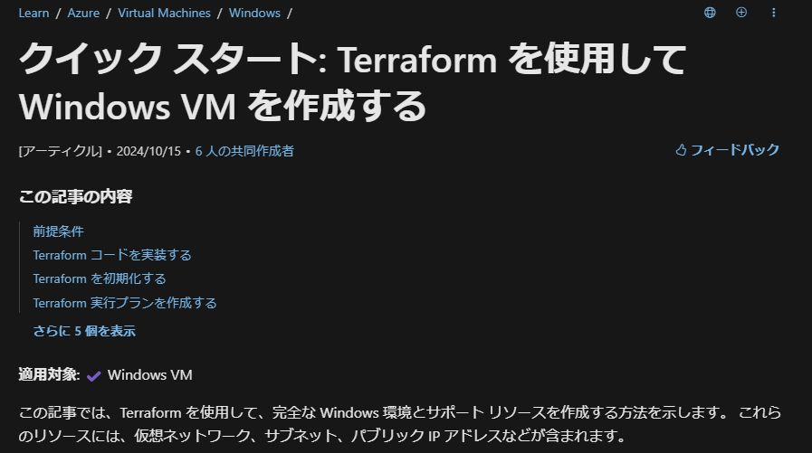

* ルートのフォルダ・ファイル構成

  ```text
terraform-work3
 ∟ .terrtaform - init 時に作成される Provider がダウンロードされるフォルダ
 ∟ image - readme の画像ファイルを格納するフォルダ
 ∟ tfstate - リモートバックエンドからダウンロードした tfstate ファイル
 ∟ .terraform.lock.hcl - init 時に作成される、Provider と .tf ファイルの依存関係等が記録されたファイル ⇒ [Dependency Lock File](https://developer.hashicorp.com/terraform/language/files/dependency-lock)
 ∟ main.tf - リソースを記述した tf ファイル
 ∟ outputs.tf - 出力を記述した tf ファイル
 ∟ provider.tf - プロバイダーを記述した tf ファイル
 ∟ variables.tf - 変数を記述した tf ファイル
 ∟ work3-readme.html - Markdown を HTML 化したファイル
 ∟ README.md - この Markdown ファイル
  ```

---

* terraform ブロック
* variable ブロック
  * 割愛

---

* resource ブロック
  * 動的な Public IP を作成し、NIC の IP 構成に紐づける (MS Learn の通り)。Private IP も動的。
  * NSG の関連付けは専用のブロックで行う。
    ```js
    # Create public IPs
    resource "azurerm_public_ip" "terraform_work3_public_ip" {
      name                = "${random_pet.prefix.id}-public-ip"
      location            = azurerm_resource_group.rg.location
      resource_group_name = azurerm_resource_group.rg.name
      allocation_method   = "Dynamic"
    }

    # Create Network Security Group and rules
    resource "azurerm_network_security_group" "terraform_work3_nsg" {
      name                = "${random_pet.prefix.id}-nsg"
      location            = azurerm_resource_group.rg.location
      resource_group_name = azurerm_resource_group.rg.name

      security_rule {
        name                       = "RDP"
        priority                   = 1000
        direction                  = "Inbound"
        access                     = "Allow"
        protocol                   = "*"
        source_port_range          = "*"
        destination_port_range     = "3389"
        source_address_prefix      = "120.75.97.239" # your global ip
        destination_address_prefix = "*"
      }
      security_rule {
        name                       = "web"
        priority                   = 1001
        direction                  = "Inbound"
        access                     = "Allow"
        protocol                   = "Tcp"
        source_port_range          = "*"
        destination_port_range     = "80"
        source_address_prefix      = "120.75.97.239" # your global ip
        destination_address_prefix = "*"
      }
    }

    # Create network interface
    resource "azurerm_network_interface" "terraform_work3_nic" {
      name                = "${random_pet.prefix.id}-nic"
      location            = azurerm_resource_group.rg.location
      resource_group_name = azurerm_resource_group.rg.name

      ip_configuration {
        name                          = "terraform_work3_nic_configuration"
        subnet_id                     = azurerm_subnet.terraform_work3_subnet.id
        private_ip_address_allocation = "Dynamic"
        public_ip_address_id          = azurerm_public_ip.terraform_work3_public_ip.id
      }
    }

    # Connect the security group to the network interface
    resource "azurerm_network_interface_security_group_association" "example" {
      network_interface_id      = azurerm_network_interface.terraform_work3_nic.id
      network_security_group_id = azurerm_network_security_group.terraform_work3_nsg.id
    }
    ```
  
  * ブート診断用ストレージアカウントを作成し、その Blob エンドポイントを VM のブート診断 URI に紐づける。
  * VM の SKU、OS ディスク、ソースイメージを指定する。パスワードはランダムで生成した result をセットしている。
    ```js
    # Create storage account for boot diagnostics
    resource "azurerm_storage_account" "terraform_work3_storage_account" {
      name                     = "diag${random_id.random_id.hex}"
      location                 = azurerm_resource_group.rg.location
      resource_group_name      = azurerm_resource_group.rg.name
      account_tier             = "Standard"
      account_replication_type = "LRS"
    }

    # Create virtual machine
    resource "azurerm_windows_virtual_machine" "main" {
      name                  = "${var.prefix}-vm"
      admin_username        = "azureuser"
      admin_password        = random_password.password.result
      location              = azurerm_resource_group.rg.location
      resource_group_name   = azurerm_resource_group.rg.name
      network_interface_ids = [azurerm_network_interface.terraform_work3_nic.id]
      size                  = "Standard_DS1_v2"

      os_disk {
        name                 = "myOsDisk"
        caching              = "ReadWrite"
        storage_account_type = "Premium_LRS"
      }

      source_image_reference {
        publisher = "MicrosoftWindowsServer"
        offer     = "WindowsServer"
        sku       = "2022-datacenter-azure-edition"
        version   = "latest"
      }

      boot_diagnostics {
        storage_account_uri = azurerm_storage_account.terraform_work3_storage_account.primary_blob_endpoint
      }
    }
    ```
  
  * IIS をインストールするため、カスタムスクリプト拡張機能を使用している。
    * PowerShell スクリプトを記述している。

    [Windows でのカスタムのスクリプト拡張機能](https://learn.microsoft.com/ja-jp/azure/virtual-machines/extensions/custom-script-windows)

  * Random は常にランダムを生成するわけではなく、初回生成後 ステート (tfstate) に格納されて2回目以降は再利用される。
    * ただし、Keepers に指定した値が変更された場合、ランダムが再生成される。
    * 上記の場合リソースグループ名なので、リソースを追加・設定変更する場合再利用されるが、terraform destroy した場合リソースグループごと削除されるため、再実行の際は新しいリソースグループ名やパスワードが生成される。

      [Resource "Keepers"](https://registry.terraform.io/providers/hashicorp/random/latest/docs#resource-keepers)

      [Terraform Random Provider を使ってみた](https://nishikoh.github.io/article/terraform-random-provider/)

    ```js  
    # Install IIS web server to the virtual machine
    resource "azurerm_virtual_machine_extension" "web_server_install" {
      name                       = "${random_pet.prefix.id}-wsi"
      virtual_machine_id         = azurerm_windows_virtual_machine.main.id
      publisher                  = "Microsoft.Compute"
      type                       = "CustomScriptExtension"
      type_handler_version       = "1.8"
      auto_upgrade_minor_version = true

      settings = <<SETTINGS
        {
          "commandToExecute": "powershell -ExecutionPolicy Unrestricted Install-WindowsFeature -Name Web-Server -IncludeAllSubFeature -IncludeManagementTools"
        }
      SETTINGS
    }

    # Generate random text for a unique storage account name
    resource "random_id" "random_id" {
      keepers = {
        # Generate a new ID only when a new resource group is defined
        resource_group = azurerm_resource_group.rg.name
      }

      byte_length = 8
    }

    resource "random_password" "password" {
      length      = 20
      min_lower   = 1
      min_upper   = 1
      min_numeric = 1
      min_special = 1
      special     = true
    }
    ```

---

* output ブロック
  * Public IP アドレス、ランダム生成されたパスワードを出力する。
    * パスワードは sensitive=true のためマスキングされる。
    ```js
    output "public_ip_address" {
      value = azurerm_windows_virtual_machine.main.public_ip_address
    }

    output "admin_password" {
      sensitive = true
      value     = azurerm_windows_virtual_machine.main.admin_password
    }
    ```
  
---
# 実行結果
* 現時点で最新の 4.11.0 を指定した。

  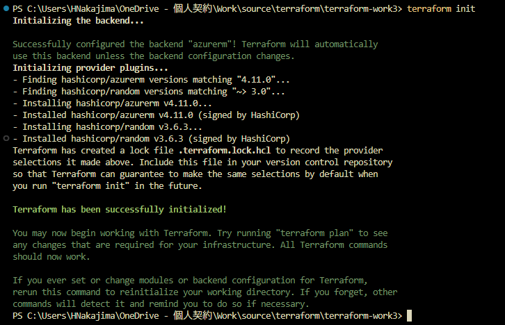

  ```PowerShell
  PS C:\Users\HNakajima\OneDrive - 個人契約\Work\source\terraform\terraform-work3> terraform init 
  Initializing the backend...

  Successfully configured the backend "azurerm"! Terraform will automatically
  use this backend unless the backend configuration changes.
  Initializing provider plugins...
  - Finding hashicorp/azurerm versions matching "4.11.0"...
  - Finding hashicorp/random versions matching "~> 3.0"...
  - Installing hashicorp/azurerm v4.11.0...
  - Installed hashicorp/azurerm v4.11.0 (signed by HashiCorp)
  - Installing hashicorp/random v3.6.3...
  ```

  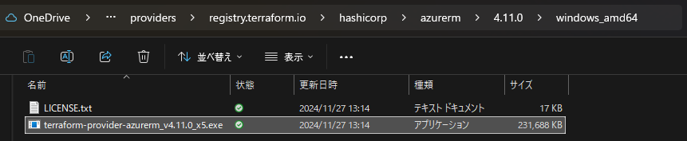

  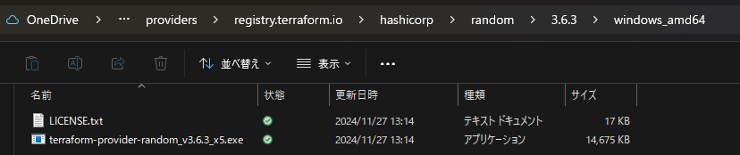

* terraform plan で実行内容を確認。

  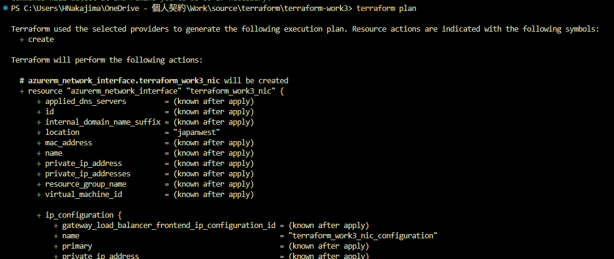

  ```powershell
  PS C:\Users\HNakajima\OneDrive - 個人契約\Work\source\terraform\terraform-work3> terraform plan 

  Terraform used the selected providers to generate the following execution plan. Resource actions are indicated with the following symbols:
    + create

  Terraform will perform the following actions:

    # azurerm_network_interface.terraform_work3_nic will be created
    + resource "azurerm_network_interface" "terraform_work3_nic" {
        + applied_dns_servers         = (known after apply)
        + id                          = (known after apply)
        + internal_domain_name_suffix = (known after apply)
        + location                    = "japanwest"
        + mac_address                 = (known after apply)
        + name                        = (known after apply)
        + private_ip_address          = (known after apply)
        + private_ip_addresses        = (known after apply)
        + resource_group_name         = (known after apply)
        + virtual_machine_id          = (known after apply)

        + ip_configuration {
            + gateway_load_balancer_frontend_ip_configuration_id = (known after apply)
            + name                                               = "terraform_work3_nic_configuration"
            + primary                                            = (known after apply)
            + private_ip_address                                 = (known after apply)
            + private_ip_address_allocation                      = "Dynamic"
            + private_ip_address_version                         = "IPv4"
            + public_ip_address_id                               = (known after apply)
            + subnet_id                                          = (known after apply)
          }
      }

    # azurerm_network_interface_security_group_association.example will be created
    + resource "azurerm_network_interface_security_group_association" "example" {
        + id                        = (known after apply)
        + network_interface_id      = (known after apply)
        + network_security_group_id = (known after apply)
      }

    # azurerm_network_security_group.terraform_work3_nsg will be created
    + resource "azurerm_network_security_group" "terraform_work3_nsg" {
        + id                  = (known after apply)
        + location            = "japanwest"
        + name                = (known after apply)
        + resource_group_name = (known after apply)
        + security_rule       = [
            + {
                + access                                     = "Allow"
                + destination_address_prefix                 = "*"
                + destination_address_prefixes               = []
                + destination_application_security_group_ids = []
                + destination_port_range                     = "3389"
                + destination_port_ranges                    = []
                + direction                                  = "Inbound"
                + name                                       = "RDP"
                + priority                                   = 1000
                + protocol                                   = "*"
                + source_address_prefix                      = "120.75.97.239"
                + source_address_prefixes                    = []
                + source_application_security_group_ids      = []
                + source_port_range                          = "*"
                + source_port_ranges                         = []
                  # (1 unchanged attribute hidden)
              },
            + {
                + access                                     = "Allow"
                + destination_address_prefix                 = "*"
                + destination_address_prefixes               = []
                + destination_application_security_group_ids = []
                + destination_port_range                     = "80"
                + destination_port_ranges                    = []
                + direction                                  = "Inbound"
                + name                                       = "web"
                + priority                                   = 1001
                + protocol                                   = "Tcp"
                + source_address_prefix                      = "120.75.97.239"
                + source_address_prefixes                    = []
                + source_application_security_group_ids      = []
                + source_port_range                          = "*"
                + source_port_ranges                         = []
                  # (1 unchanged attribute hidden)
              },
          ]
      }

    # azurerm_public_ip.terraform_work3_public_ip will be created
    + resource "azurerm_public_ip" "terraform_work3_public_ip" {
        + allocation_method       = "Dynamic"
        + ddos_protection_mode    = "VirtualNetworkInherited"
        + fqdn                    = (known after apply)
        + id                      = (known after apply)
        + idle_timeout_in_minutes = 4
        + ip_address              = (known after apply)
        + ip_version              = "IPv4"
        + location                = "japanwest"
        + name                    = (known after apply)
        + resource_group_name     = (known after apply)
        + sku                     = "Standard"
        + sku_tier                = "Regional"
      }

    # azurerm_resource_group.rg will be created
    + resource "azurerm_resource_group" "rg" {
        + id       = (known after apply)
        + location = "japanwest"
        + name     = (known after apply)
      }

    # azurerm_storage_account.terraform_work3_storage_account will be created
    + resource "azurerm_storage_account" "terraform_work3_storage_account" {
        + access_tier                        = (known after apply)
        + account_kind                       = "StorageV2"
        + account_replication_type           = "LRS"
        + account_tier                       = "Standard"
        + allow_nested_items_to_be_public    = true
        + cross_tenant_replication_enabled   = false
        + default_to_oauth_authentication    = false
        + dns_endpoint_type                  = "Standard"
        + https_traffic_only_enabled         = true
        + id                                 = (known after apply)
        + infrastructure_encryption_enabled  = false
        + is_hns_enabled                     = false
        + large_file_share_enabled           = (known after apply)
        + local_user_enabled                 = true
        + location                           = "japanwest"
        + min_tls_version                    = "TLS1_2"
        + name                               = (known after apply)
        + nfsv3_enabled                      = false
        + primary_access_key                 = (sensitive value)
        + primary_blob_connection_string     = (sensitive value)
        + primary_blob_endpoint              = (known after apply)
        + primary_blob_host                  = (known after apply)
        + primary_blob_internet_endpoint     = (known after apply)
        + primary_blob_internet_host         = (known after apply)
        + primary_blob_microsoft_endpoint    = (known after apply)
        + primary_blob_microsoft_host        = (known after apply)
        + primary_connection_string          = (sensitive value)
        + primary_dfs_endpoint               = (known after apply)
        + primary_dfs_host                   = (known after apply)
        + primary_dfs_internet_endpoint      = (known after apply)
        + primary_dfs_internet_host          = (known after apply)
        + primary_dfs_microsoft_endpoint     = (known after apply)
        + primary_dfs_microsoft_host         = (known after apply)
        + primary_file_endpoint              = (known after apply)
        + primary_file_host                  = (known after apply)
        + primary_file_internet_endpoint     = (known after apply)
        + primary_file_internet_host         = (known after apply)
        + primary_file_microsoft_endpoint    = (known after apply)
        + primary_file_microsoft_host        = (known after apply)
        + primary_location                   = (known after apply)
        + primary_queue_endpoint             = (known after apply)
        + primary_queue_host                 = (known after apply)
        + primary_queue_microsoft_endpoint   = (known after apply)
        + primary_queue_microsoft_host       = (known after apply)
        + primary_table_endpoint             = (known after apply)
        + primary_table_host                 = (known after apply)
        + primary_table_microsoft_endpoint   = (known after apply)
        + primary_table_microsoft_host       = (known after apply)
        + primary_web_endpoint               = (known after apply)
        + primary_web_host                   = (known after apply)
        + primary_web_internet_endpoint      = (known after apply)
        + primary_web_internet_host          = (known after apply)
        + primary_web_microsoft_endpoint     = (known after apply)
        + primary_web_microsoft_host         = (known after apply)
        + public_network_access_enabled      = true
        + queue_encryption_key_type          = "Service"
        + resource_group_name                = (known after apply)
        + secondary_access_key               = (sensitive value)
        + secondary_blob_connection_string   = (sensitive value)
        + secondary_blob_endpoint            = (known after apply)
        + secondary_blob_host                = (known after apply)
        + secondary_blob_internet_endpoint   = (known after apply)
        + secondary_blob_internet_host       = (known after apply)
        + secondary_blob_microsoft_endpoint  = (known after apply)
        + secondary_blob_microsoft_host      = (known after apply)
        + secondary_connection_string        = (sensitive value)
        + secondary_dfs_endpoint             = (known after apply)
        + secondary_dfs_host                 = (known after apply)
        + secondary_dfs_internet_endpoint    = (known after apply)
        + secondary_dfs_internet_host        = (known after apply)
        + secondary_dfs_microsoft_endpoint   = (known after apply)
        + secondary_dfs_microsoft_host       = (known after apply)
        + secondary_file_endpoint            = (known after apply)
        + secondary_file_host                = (known after apply)
        + secondary_file_internet_endpoint   = (known after apply)
        + secondary_file_internet_host       = (known after apply)
        + secondary_file_microsoft_endpoint  = (known after apply)
        + secondary_file_microsoft_host      = (known after apply)
        + secondary_location                 = (known after apply)
        + secondary_queue_endpoint           = (known after apply)
        + secondary_queue_host               = (known after apply)
        + secondary_queue_microsoft_endpoint = (known after apply)
        + secondary_queue_microsoft_host     = (known after apply)
        + secondary_table_endpoint           = (known after apply)
        + secondary_table_host               = (known after apply)
        + secondary_table_microsoft_endpoint = (known after apply)
        + secondary_table_microsoft_host     = (known after apply)
        + secondary_web_endpoint             = (known after apply)
        + secondary_web_host                 = (known after apply)
        + secondary_web_internet_endpoint    = (known after apply)
        + secondary_web_internet_host        = (known after apply)
        + secondary_web_microsoft_endpoint   = (known after apply)
        + secondary_web_microsoft_host       = (known after apply)
        + sftp_enabled                       = false
        + shared_access_key_enabled          = true
        + table_encryption_key_type          = "Service"

        + blob_properties (known after apply)

        + network_rules (known after apply)

        + queue_properties (known after apply)

        + routing (known after apply)

        + share_properties (known after apply)

        + static_website (known after apply)
      }

    # azurerm_subnet.terraform_work3_subnet will be created
    + resource "azurerm_subnet" "terraform_work3_subnet" {
        + address_prefixes                              = [
            + "10.0.1.0/24",
          ]
        + default_outbound_access_enabled               = true
        + id                                            = (known after apply)
        + name                                          = (known after apply)
        + private_endpoint_network_policies             = "Disabled"
        + private_link_service_network_policies_enabled = true
        + resource_group_name                           = (known after apply)
        + virtual_network_name                          = (known after apply)
      }

    # azurerm_virtual_machine_extension.web_server_install will be created
    + resource "azurerm_virtual_machine_extension" "web_server_install" {
        + auto_upgrade_minor_version  = true
        + failure_suppression_enabled = false
        + id                          = (known after apply)
        + name                        = (known after apply)
        + publisher                   = "Microsoft.Compute"
        + settings                    = <<-EOT
              {
                    "commandToExecute": "powershell -ExecutionPolicy Unrestricted Install-WindowsFeature -Name Web-Server -IncludeAllSubFeature -IncludeManagementTools"
                  }
          EOT
        + type                        = "CustomScriptExtension"
        + type_handler_version        = "1.8"
        + virtual_machine_id          = (known after apply)
      }

    # azurerm_virtual_network.terraform_work3_network will be created
    + resource "azurerm_virtual_network" "terraform_work3_network" {
        + address_space       = [
            + "10.0.0.0/16",
          ]
        + dns_servers         = (known after apply)
        + guid                = (known after apply)
        + id                  = (known after apply)
        + location            = "japanwest"
        + name                = (known after apply)
        + resource_group_name = (known after apply)
        + subnet              = (known after apply)
      }

    # azurerm_windows_virtual_machine.main will be created
    + resource "azurerm_windows_virtual_machine" "main" {
        + admin_password                                         = (sensitive value)
        + admin_username                                         = "azureuser"
        + allow_extension_operations                             = true
        + bypass_platform_safety_checks_on_user_schedule_enabled = false
        + computer_name                                          = (known after apply)
        + disk_controller_type                                   = (known after apply)
        + enable_automatic_updates                               = true
        + extensions_time_budget                                 = "PT1H30M"
        + hotpatching_enabled                                    = false
        + id                                                     = (known after apply)
        + location                                               = "japanwest"
        + max_bid_price                                          = -1
        + name                                                   = "win-vm-iis-vm"
        + network_interface_ids                                  = (known after apply)
        + patch_assessment_mode                                  = "ImageDefault"
        + patch_mode                                             = "AutomaticByOS"
        + platform_fault_domain                                  = -1
        + priority                                               = "Regular"
        + private_ip_address                                     = (known after apply)
        + private_ip_addresses                                   = (known after apply)
        + provision_vm_agent                                     = true
        + public_ip_address                                      = (known after apply)
        + public_ip_addresses                                    = (known after apply)
        + resource_group_name                                    = (known after apply)
        + size                                                   = "Standard_DS1_v2"
        + virtual_machine_id                                     = (known after apply)
        + vm_agent_platform_updates_enabled                      = false

        + boot_diagnostics {
            + storage_account_uri = (known after apply)
          }

        + os_disk {
            + caching                   = "ReadWrite"
            + disk_size_gb              = (known after apply)
            + name                      = "myOsDisk"
            + storage_account_type      = "Premium_LRS"
            + write_accelerator_enabled = false
          }

        + source_image_reference {
            + offer     = "WindowsServer"
            + publisher = "MicrosoftWindowsServer"
            + sku       = "2022-datacenter-azure-edition"
            + version   = "latest"
          }

        + termination_notification (known after apply)
      }

    # random_id.random_id will be created
    + resource "random_id" "random_id" {
        + b64_std     = (known after apply)
        + b64_url     = (known after apply)
        + byte_length = 8
        + dec         = (known after apply)
        + hex         = (known after apply)
        + id          = (known after apply)
        + keepers     = {
            + "resource_group" = (known after apply)
          }
      }

    # random_password.password will be created
    + resource "random_password" "password" {
        + bcrypt_hash = (sensitive value)
        + id          = (known after apply)
        + length      = 20
        + lower       = true
        + min_lower   = 1
        + min_numeric = 1
        + min_special = 1
        + min_upper   = 1
        + number      = true
        + numeric     = true
        + result      = (sensitive value)
        + special     = true
        + upper       = true
      }

    # random_pet.prefix will be created
    + resource "random_pet" "prefix" {
        + id        = (known after apply)
        + length    = 1
        + prefix    = "win-vm-iis"
        + separator = "-"
      }

  Plan: 13 to add, 0 to change, 0 to destroy.

  Changes to Outputs:
    + admin_password      = (sensitive value)
    + public_ip_address   = (known after apply)
    + resource_group_name = (known after apply)

  ────────────────────────────────────────────────────────

  Note: You didn't use the -out option to save this plan, so Terraform can't guarantee to take exactly these actions if you run "terraform apply" now.
  ```

* terraform apply で環境に適用する。
  * 「Enter a value: yes」も入力したが、適用中にエラーとなった。

  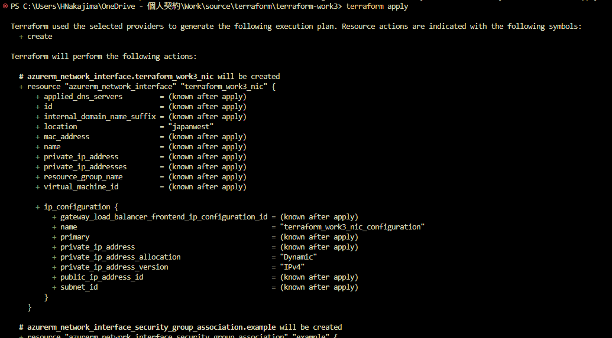

    ```PowerShell
    PS C:\Users\HNakajima\OneDrive - 個人契約\Work\source\terraform\terraform-work3> terraform apply

    Terraform used the selected providers to generate the following execution plan. Resource actions are indicated with the following symbols:
      + create

    Terraform will perform the following actions:

      # azurerm_network_interface.terraform_work3_nic will be created
      + resource "azurerm_network_interface" "terraform_work3_nic" {
          + applied_dns_servers         = (known after apply)
          + id                          = (known after apply)
          + internal_domain_name_suffix = (known after apply)
          + location                    = "japanwest"
          + mac_address                 = (known after apply)
          + name                        = (known after apply)
          + private_ip_address          = (known after apply)
          + private_ip_addresses        = (known after apply)
          + resource_group_name         = (known after apply)
          + virtual_machine_id          = (known after apply)

          + ip_configuration {
              + gateway_load_balancer_frontend_ip_configuration_id = (known after apply)
              + name                                               = "terraform_work3_nic_configuration"
              + primary                                            = (known after apply)
              + private_ip_address                                 = (known after apply)
              + private_ip_address_allocation                      = "Dynamic"
              + private_ip_address_version                         = "IPv4"
              + public_ip_address_id                               = (known after apply)
              + subnet_id                                          = (known after apply)
            }
        }

      # azurerm_network_interface_security_group_association.example will be created
      + resource "azurerm_network_interface_security_group_association" "example" {
          + id                        = (known after apply)
          + network_interface_id      = (known after apply)
          + network_security_group_id = (known after apply)
        }

      # azurerm_network_security_group.terraform_work3_nsg will be created
      + resource "azurerm_network_security_group" "terraform_work3_nsg" {
          + id                  = (known after apply)
          + location            = "japanwest"
          + name                = (known after apply)
          + resource_group_name = (known after apply)
          + security_rule       = [
              + {
                  + access                                     = "Allow"
                  + destination_address_prefix                 = "*"
                  + destination_address_prefixes               = []
                  + destination_application_security_group_ids = []
                  + destination_port_range                     = "3389"
                  + destination_port_ranges                    = []
                  + direction                                  = "Inbound"
                  + name                                       = "RDP"
                  + priority                                   = 1000
                  + protocol                                   = "*"
                  + source_address_prefix                      = "120.75.97.239"
                  + source_address_prefixes                    = []
                  + source_application_security_group_ids      = []
                  + source_port_range                          = "*"
                  + source_port_ranges                         = []
                    # (1 unchanged attribute hidden)
                },
              + {
                  + access                                     = "Allow"
                  + destination_address_prefix                 = "*"
                  + destination_address_prefixes               = []
                  + destination_application_security_group_ids = []
                  + destination_port_range                     = "80"
                  + destination_port_ranges                    = []
                  + direction                                  = "Inbound"
                  + name                                       = "web"
                  + priority                                   = 1001
                  + protocol                                   = "Tcp"
                  + source_address_prefix                      = "120.75.97.239"
                  + source_address_prefixes                    = []
                  + source_application_security_group_ids      = []
                  + source_port_range                          = "*"
                  + source_port_ranges                         = []
                    # (1 unchanged attribute hidden)
                },
            ]
        }

      # azurerm_public_ip.terraform_work3_public_ip will be created
      + resource "azurerm_public_ip" "terraform_work3_public_ip" {
          + allocation_method       = "Dynamic"
          + ddos_protection_mode    = "VirtualNetworkInherited"
          + fqdn                    = (known after apply)
          + id                      = (known after apply)
          + idle_timeout_in_minutes = 4
          + ip_address              = (known after apply)
          + ip_version              = "IPv4"
          + location                = "japanwest"
          + name                    = (known after apply)
          + resource_group_name     = (known after apply)
          + sku                     = "Standard"
          + sku_tier                = "Regional"
        }

      # azurerm_resource_group.rg will be created
      + resource "azurerm_resource_group" "rg" {
          + id       = (known after apply)
          + location = "japanwest"
          + name     = (known after apply)
        }

      # azurerm_storage_account.terraform_work3_storage_account will be created
      + resource "azurerm_storage_account" "terraform_work3_storage_account" {
          + access_tier                        = (known after apply)
          + account_kind                       = "StorageV2"
          + account_replication_type           = "LRS"
          + account_tier                       = "Standard"
          + allow_nested_items_to_be_public    = true
          + cross_tenant_replication_enabled   = false
          + default_to_oauth_authentication    = false
          + dns_endpoint_type                  = "Standard"
          + https_traffic_only_enabled         = true
          + id                                 = (known after apply)
          + infrastructure_encryption_enabled  = false
          + is_hns_enabled                     = false
          + large_file_share_enabled           = (known after apply)
          + local_user_enabled                 = true
          + location                           = "japanwest"
          + min_tls_version                    = "TLS1_2"
          + name                               = (known after apply)
          + nfsv3_enabled                      = false
          + primary_access_key                 = (sensitive value)
          + primary_blob_connection_string     = (sensitive value)
          + primary_blob_endpoint              = (known after apply)
          + primary_blob_host                  = (known after apply)
          + primary_blob_internet_endpoint     = (known after apply)
          + primary_blob_internet_host         = (known after apply)
          + primary_blob_microsoft_endpoint    = (known after apply)
          + primary_blob_microsoft_host        = (known after apply)
          + primary_connection_string          = (sensitive value)
          + primary_dfs_endpoint               = (known after apply)
          + primary_dfs_host                   = (known after apply)
          + primary_dfs_internet_endpoint      = (known after apply)
          + primary_dfs_internet_host          = (known after apply)
          + primary_dfs_microsoft_endpoint     = (known after apply)
          + primary_dfs_microsoft_host         = (known after apply)
          + primary_file_endpoint              = (known after apply)
          + primary_file_host                  = (known after apply)
          + primary_file_internet_endpoint     = (known after apply)
          + primary_file_internet_host         = (known after apply)
          + primary_file_microsoft_endpoint    = (known after apply)
          + primary_file_microsoft_host        = (known after apply)
          + primary_location                   = (known after apply)
          + primary_queue_endpoint             = (known after apply)
          + primary_queue_host                 = (known after apply)
          + primary_queue_microsoft_endpoint   = (known after apply)
          + primary_queue_microsoft_host       = (known after apply)
          + primary_table_endpoint             = (known after apply)
          + primary_table_host                 = (known after apply)
          + primary_table_microsoft_endpoint   = (known after apply)
          + primary_table_microsoft_host       = (known after apply)
          + primary_web_endpoint               = (known after apply)
          + primary_web_host                   = (known after apply)
          + primary_web_internet_endpoint      = (known after apply)
          + primary_web_internet_host          = (known after apply)
          + primary_web_microsoft_endpoint     = (known after apply)
          + primary_web_microsoft_host         = (known after apply)
          + public_network_access_enabled      = true
          + queue_encryption_key_type          = "Service"
          + resource_group_name                = (known after apply)
          + secondary_access_key               = (sensitive value)
          + secondary_blob_connection_string   = (sensitive value)
          + secondary_blob_endpoint            = (known after apply)
          + secondary_blob_host                = (known after apply)
          + secondary_blob_internet_endpoint   = (known after apply)
          + secondary_blob_internet_host       = (known after apply)
          + secondary_blob_microsoft_endpoint  = (known after apply)
          + secondary_blob_microsoft_host      = (known after apply)
          + secondary_connection_string        = (sensitive value)
          + secondary_dfs_endpoint             = (known after apply)
          + secondary_dfs_host                 = (known after apply)
          + secondary_dfs_internet_endpoint    = (known after apply)
          + secondary_dfs_internet_host        = (known after apply)
          + secondary_dfs_microsoft_endpoint   = (known after apply)
          + secondary_dfs_microsoft_host       = (known after apply)
          + secondary_file_endpoint            = (known after apply)
          + secondary_file_host                = (known after apply)
          + secondary_file_internet_endpoint   = (known after apply)
          + secondary_file_internet_host       = (known after apply)
          + secondary_file_microsoft_endpoint  = (known after apply)
          + secondary_file_microsoft_host      = (known after apply)
          + secondary_location                 = (known after apply)
          + secondary_queue_endpoint           = (known after apply)
          + secondary_queue_host               = (known after apply)
          + secondary_queue_microsoft_endpoint = (known after apply)
          + secondary_queue_microsoft_host     = (known after apply)
          + secondary_table_endpoint           = (known after apply)
          + secondary_table_host               = (known after apply)
          + secondary_table_microsoft_endpoint = (known after apply)
          + secondary_table_microsoft_host     = (known after apply)
          + secondary_web_endpoint             = (known after apply)
          + secondary_web_host                 = (known after apply)
          + secondary_web_internet_endpoint    = (known after apply)
          + secondary_web_internet_host        = (known after apply)
          + secondary_web_microsoft_endpoint   = (known after apply)
          + secondary_web_microsoft_host       = (known after apply)
          + sftp_enabled                       = false
          + shared_access_key_enabled          = true
          + table_encryption_key_type          = "Service"

          + blob_properties (known after apply)

          + network_rules (known after apply)

          + queue_properties (known after apply)

          + routing (known after apply)

          + share_properties (known after apply)

          + static_website (known after apply)
        }

      # azurerm_subnet.terraform_work3_subnet will be created
      + resource "azurerm_subnet" "terraform_work3_subnet" {
          + address_prefixes                              = [
              + "10.0.1.0/24",
            ]
          + default_outbound_access_enabled               = true
          + id                                            = (known after apply)
          + name                                          = (known after apply)
          + private_endpoint_network_policies             = "Disabled"
          + private_link_service_network_policies_enabled = true
          + resource_group_name                           = (known after apply)
          + virtual_network_name                          = (known after apply)
        }

      # azurerm_virtual_machine_extension.web_server_install will be created
      + resource "azurerm_virtual_machine_extension" "web_server_install" {
          + auto_upgrade_minor_version  = true
          + failure_suppression_enabled = false
          + id                          = (known after apply)
          + name                        = (known after apply)
          + publisher                   = "Microsoft.Compute"
          + settings                    = <<-EOT
                {
                      "commandToExecute": "powershell -ExecutionPolicy Unrestricted Install-WindowsFeature -Name Web-Server -IncludeAllSubFeature -IncludeManagementTools"
                    }
            EOT
          + type                        = "CustomScriptExtension"
          + type_handler_version        = "1.8"
          + virtual_machine_id          = (known after apply)
        }

      # azurerm_virtual_network.terraform_work3_network will be created
      + resource "azurerm_virtual_network" "terraform_work3_network" {
          + address_space       = [
              + "10.0.0.0/16",
            ]
          + dns_servers         = (known after apply)
          + guid                = (known after apply)
          + id                  = (known after apply)
          + location            = "japanwest"
          + name                = (known after apply)
          + resource_group_name = (known after apply)
          + subnet              = (known after apply)
        }

      # azurerm_windows_virtual_machine.main will be created
      + resource "azurerm_windows_virtual_machine" "main" {
          + admin_password                                         = (sensitive value)
          + admin_username                                         = "azureuser"
          + allow_extension_operations                             = true
          + bypass_platform_safety_checks_on_user_schedule_enabled = false
          + computer_name                                          = (known after apply)
          + disk_controller_type                                   = (known after apply)
          + enable_automatic_updates                               = true
          + extensions_time_budget                                 = "PT1H30M"
          + hotpatching_enabled                                    = false
          + id                                                     = (known after apply)
          + location                                               = "japanwest"
          + max_bid_price                                          = -1
          + name                                                   = "win-vm-iis-vm"
          + network_interface_ids                                  = (known after apply)
          + patch_assessment_mode                                  = "ImageDefault"
          + patch_mode                                             = "AutomaticByOS"
          + platform_fault_domain                                  = -1
          + priority                                               = "Regular"
          + private_ip_address                                     = (known after apply)
          + private_ip_addresses                                   = (known after apply)
          + provision_vm_agent                                     = true
          + public_ip_address                                      = (known after apply)
          + public_ip_addresses                                    = (known after apply)
          + resource_group_name                                    = (known after apply)
          + size                                                   = "Standard_DS1_v2"
          + virtual_machine_id                                     = (known after apply)
          + vm_agent_platform_updates_enabled                      = false

          + boot_diagnostics {
              + storage_account_uri = (known after apply)
            }

          + os_disk {
              + caching                   = "ReadWrite"
              + disk_size_gb              = (known after apply)
              + name                      = "myOsDisk"
              + storage_account_type      = "Premium_LRS"
              + write_accelerator_enabled = false
            }

          + source_image_reference {
              + offer     = "WindowsServer"
              + publisher = "MicrosoftWindowsServer"
              + sku       = "2022-datacenter-azure-edition"
              + version   = "latest"
            }

          + termination_notification (known after apply)
        }

      # random_id.random_id will be created
      + resource "random_id" "random_id" {
          + b64_std     = (known after apply)
          + b64_url     = (known after apply)
          + byte_length = 8
          + dec         = (known after apply)
          + hex         = (known after apply)
          + id          = (known after apply)
          + keepers     = {
              + "resource_group" = (known after apply)
            }
        }

      # random_password.password will be created
      + resource "random_password" "password" {
          + bcrypt_hash = (sensitive value)
          + id          = (known after apply)
          + length      = 20
          + lower       = true
          + min_lower   = 1
          + min_numeric = 1
          + min_special = 1
          + min_upper   = 1
          + number      = true
          + numeric     = true
          + result      = (sensitive value)
          + special     = true
          + upper       = true
        }

      # random_pet.prefix will be created
      + resource "random_pet" "prefix" {
          + id        = (known after apply)
          + length    = 1
          + prefix    = "win-vm-iis"
          + separator = "-"
        }

    Plan: 13 to add, 0 to change, 0 to destroy.

    Changes to Outputs:
      + admin_password      = (sensitive value)
      + public_ip_address   = (known after apply)
      + resource_group_name = (known after apply)

    Do you want to perform these actions?
      Terraform will perform the actions described above.
      Only 'yes' will be accepted to approve.

      Enter a value: yes

    random_pet.prefix: Creating...
    random_pet.prefix: Creation complete after 0s [id=win-vm-iis-cricket]
    random_password.password: Creating...
    random_password.password: Creation complete after 1s [id=none]
    azurerm_resource_group.rg: Creating...
    azurerm_resource_group.rg: Still creating... [10s elapsed]
    azurerm_resource_group.rg: Creation complete after 11s [id=/subscriptions/xxxxxxxx-xxxx-xxxx-xxxx-xxxxxxxxxxxx/resourceGroups/rg-win-vm-iis-cricket]
    azurerm_virtual_network.terraform_work3_network: Creating...
    azurerm_public_ip.terraform_work3_public_ip: Creating...
    random_id.random_id: Creating...
    random_id.random_id: Creation complete after 0s [id=Al61oLoA6do]
    azurerm_network_security_group.terraform_work3_nsg: Creating...
    azurerm_storage_account.terraform_work3_storage_account: Creating...
    azurerm_network_security_group.terraform_work3_nsg: Creation complete after 3s [id=/subscriptions/xxxxxxxx-xxxx-xxxx-xxxx-xxxxxxxxxxxx/resourceGroups/rg-win-vm-iis-cricket/providers/Microsoft.Network/networkSecurityGroups/win-vm-iis-cricket-nsg]
    azurerm_virtual_network.terraform_work3_network: Creation complete after 5s [id=/subscriptions/xxxxxxxx-xxxx-xxxx-xxxx-xxxxxxxxxxxx/resourceGroups/rg-win-vm-iis-cricket/providers/Microsoft.Network/virtualNetworks/win-vm-iis-cricket-vnet]
    azurerm_subnet.terraform_work3_subnet: Creating...
    azurerm_subnet.terraform_work3_subnet: Creation complete after 3s [id=/subscriptions/xxxxxxxx-xxxx-xxxx-xxxx-xxxxxxxxxxxx/resourceGroups/rg-win-vm-iis-cricket/providers/Microsoft.Network/virtualNetworks/win-vm-iis-cricket-vnet/subnets/win-vm-iis-cricket-subnet]
    azurerm_storage_account.terraform_work3_storage_account: Still creating... [10s elapsed]
    azurerm_storage_account.terraform_work3_storage_account: Still creating... [20s elapsed]
    azurerm_storage_account.terraform_work3_storage_account: Still creating... [30s elapsed]
    azurerm_storage_account.terraform_work3_storage_account: Still creating... [40s elapsed]
    azurerm_storage_account.terraform_work3_storage_account: Still creating... [50s elapsed]
    azurerm_storage_account.terraform_work3_storage_account: Still creating... [1m0s elapsed]
    azurerm_storage_account.terraform_work3_storage_account: Creation complete after 1m9s [id=/subscriptions/xxxxxxxx-xxxx-xxxx-xxxx-xxxxxxxxxxxx/resourceGroups/rg-win-vm-iis-cricket/providers/Microsoft.Storage/storageAccounts/diag025eb5a0ba00e9da]
    ╷
    │ Error: static IP allocation must be used when creating Standard SKU public IP addresses
    │
    │   with azurerm_public_ip.terraform_work3_public_ip,
    │   on main.tf line 29, in resource "azurerm_public_ip" "terraform_work3_public_ip":
    │   29: resource "azurerm_public_ip" "terraform_work3_public_ip" {
    │
    ╵
    ```

* Public IP を Dynamic で作成できなかったため。
  * azurerm_punlic_ip のオプションのプロパティ sku がデフォルトで Standard であるため、Dynamic で作成できないため。
  * このようなパターンは検知してくれない模様。

    [azurerm_public_ip](https://registry.terraform.io/providers/hashicorp/azurerm/latest/docs/resources/public_ip)

    ```
    sku - (Optional) The SKU of the Public IP. Accepted values are Basic and Standard. Defaults to Standard. 
    ```

    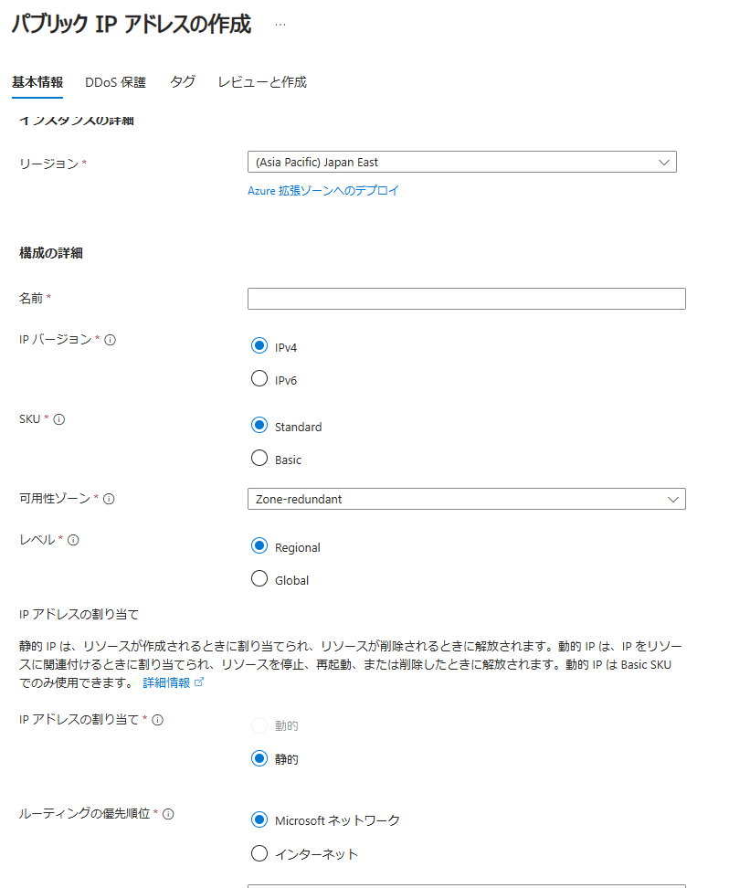

  * Basic Public IP はリタイア予定であるため、Static に修正してリトライする。

  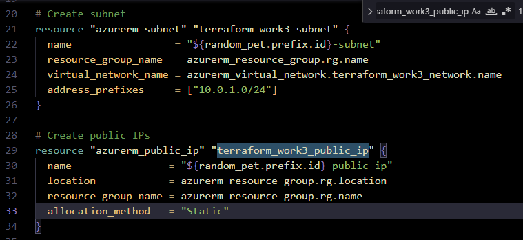

* terraform apply で環境に適用する。9分程度掛かった。

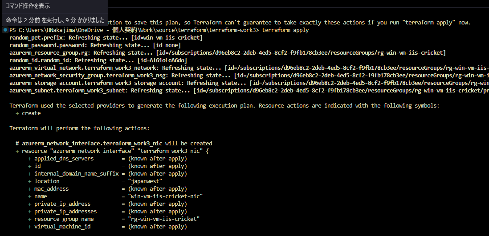

  ```powershell
  PS C:\Users\HNakajima\OneDrive - 個人契約\Work\source\terraform\terraform-work3> terraform apply
  random_pet.prefix: Refreshing state... [id=win-vm-iis-cricket]
  random_password.password: Refreshing state... [id=none]
  azurerm_resource_group.rg: Refreshing state... [id=/subscriptions/xxxxxxxx-xxxx-xxxx-xxxx-xxxxxxxxxxxx/resourceGroups/rg-win-vm-iis-cricket]
  random_id.random_id: Refreshing state... [id=Al61oLoA6do]
  azurerm_virtual_network.terraform_work3_network: Refreshing state... [id=/subscriptions/xxxxxxxx-xxxx-xxxx-xxxx-xxxxxxxxxxxx/resourceGroups/rg-win-vm-iis-cricket/providers/Microsoft.Network/virtualNetworks/win-vm-iis-cricket-vnet]
  azurerm_network_security_group.terraform_work3_nsg: Refreshing state... [id=/subscriptions/xxxxxxxx-xxxx-xxxx-xxxx-xxxxxxxxxxxx/resourceGroups/rg-win-vm-iis-cricket/providers/Microsoft.Network/networkSecurityGroups/win-vm-iis-cricket-nsg]
  azurerm_storage_account.terraform_work3_storage_account: Refreshing state... [id=/subscriptions/xxxxxxxx-xxxx-xxxx-xxxx-xxxxxxxxxxxx/resourceGroups/rg-win-vm-iis-cricket/providers/Microsoft.Storage/storageAccounts/diag025eb5a0ba00e9da]
  azurerm_subnet.terraform_work3_subnet: Refreshing state... [id=/subscriptions/xxxxxxxx-xxxx-xxxx-xxxx-xxxxxxxxxxxx/resourceGroups/rg-win-vm-iis-cricket/providers/Microsoft.Network/virtualNetworks/win-vm-iis-cricket-vnet/subnets/win-vm-iis-cricket-subnet]

  Terraform used the selected providers to generate the following execution plan. Resource actions are indicated with the following symbols:
    + create

  Terraform will perform the following actions:

    # azurerm_network_interface.terraform_work3_nic will be created
    + resource "azurerm_network_interface" "terraform_work3_nic" {
        + applied_dns_servers         = (known after apply)
        + id                          = (known after apply)
        + internal_domain_name_suffix = (known after apply)
        + location                    = "japanwest"
        + mac_address                 = (known after apply)
        + name                        = "win-vm-iis-cricket-nic"
        + private_ip_address          = (known after apply)
        + private_ip_addresses        = (known after apply)
        + resource_group_name         = "rg-win-vm-iis-cricket"
        + virtual_machine_id          = (known after apply)

        + ip_configuration {
            + gateway_load_balancer_frontend_ip_configuration_id = (known after apply)
            + name                                               = "terraform_work3_nic_configuration"
            + primary                                            = (known after apply)
            + private_ip_address                                 = (known after apply)
            + private_ip_address_allocation                      = "Dynamic"
            + private_ip_address_version                         = "IPv4"
            + public_ip_address_id                               = (known after apply)
            + subnet_id                                          = "/subscriptions/xxxxxxxx-xxxx-xxxx-xxxx-xxxxxxxxxxxx/resourceGroups/rg-win-vm-iis-cricket/providers/Microsoft.Network/virtualNetworks/win-vm-iis-cricket-vnet/subnets/win-vm-iis-cricket-subnet"
          }
      }

    # azurerm_network_interface_security_group_association.example will be created
    + resource "azurerm_network_interface_security_group_association" "example" {
        + id                        = (known after apply)
        + network_interface_id      = (known after apply)
        + network_security_group_id = "/subscriptions/xxxxxxxx-xxxx-xxxx-xxxx-xxxxxxxxxxxx/resourceGroups/rg-win-vm-iis-cricket/providers/Microsoft.Network/networkSecurityGroups/win-vm-iis-cricket-nsg"
      }

    # azurerm_public_ip.terraform_work3_public_ip will be created
    + resource "azurerm_public_ip" "terraform_work3_public_ip" {
        + allocation_method       = "Static"
        + ddos_protection_mode    = "VirtualNetworkInherited"
        + fqdn                    = (known after apply)
        + id                      = (known after apply)
        + idle_timeout_in_minutes = 4
        + ip_address              = (known after apply)
        + ip_version              = "IPv4"
        + location                = "japanwest"
        + name                    = "win-vm-iis-cricket-public-ip"
        + resource_group_name     = "rg-win-vm-iis-cricket"
        + sku                     = "Standard"
        + sku_tier                = "Regional"
      }

    # azurerm_virtual_machine_extension.web_server_install will be created
    + resource "azurerm_virtual_machine_extension" "web_server_install" {
        + auto_upgrade_minor_version  = true
        + failure_suppression_enabled = false
        + id                          = (known after apply)
        + name                        = "win-vm-iis-cricket-wsi"
        + publisher                   = "Microsoft.Compute"
        + settings                    = <<-EOT
              {
                    "commandToExecute": "powershell -ExecutionPolicy Unrestricted Install-WindowsFeature -Name Web-Server -IncludeAllSubFeature -IncludeManagementTools"
                  }
          EOT
        + type                        = "CustomScriptExtension"
        + type_handler_version        = "1.8"
        + virtual_machine_id          = (known after apply)
      }

    # azurerm_windows_virtual_machine.main will be created
    + resource "azurerm_windows_virtual_machine" "main" {
        + admin_password                                         = (sensitive value)
        + admin_username                                         = "azureuser"
        + allow_extension_operations                             = true
        + bypass_platform_safety_checks_on_user_schedule_enabled = false
        + computer_name                                          = (known after apply)
        + disk_controller_type                                   = (known after apply)
        + enable_automatic_updates                               = true
        + extensions_time_budget                                 = "PT1H30M"
        + hotpatching_enabled                                    = false
        + id                                                     = (known after apply)
        + location                                               = "japanwest"
        + max_bid_price                                          = -1
        + name                                                   = "win-vm-iis-vm"
        + network_interface_ids                                  = (known after apply)
        + patch_assessment_mode                                  = "ImageDefault"
        + patch_mode                                             = "AutomaticByOS"
        + platform_fault_domain                                  = -1
        + priority                                               = "Regular"
        + private_ip_address                                     = (known after apply)
        + private_ip_addresses                                   = (known after apply)
        + provision_vm_agent                                     = true
        + public_ip_address                                      = (known after apply)
        + public_ip_addresses                                    = (known after apply)
        + resource_group_name                                    = "rg-win-vm-iis-cricket"
        + size                                                   = "Standard_DS1_v2"
        + virtual_machine_id                                     = (known after apply)
        + vm_agent_platform_updates_enabled                      = false

        + boot_diagnostics {
            + storage_account_uri = "https://diag025eb5a0ba00e9da.blob.core.windows.net/"
          }

        + os_disk {
            + caching                   = "ReadWrite"
            + disk_size_gb              = (known after apply)
            + name                      = "myOsDisk"
            + storage_account_type      = "Premium_LRS"
            + write_accelerator_enabled = false
          }

        + source_image_reference {
            + offer     = "WindowsServer"
            + publisher = "MicrosoftWindowsServer"
            + sku       = "2022-datacenter-azure-edition"
            + version   = "latest"
          }

        + termination_notification (known after apply)
      }

  Plan: 5 to add, 0 to change, 0 to destroy.

  Changes to Outputs:
    + public_ip_address   = (known after apply)

  Do you want to perform these actions?
    Terraform will perform the actions described above.
    Only 'yes' will be accepted to approve.

    Enter a value: yes

  azurerm_public_ip.terraform_work3_public_ip: Creating...
  azurerm_public_ip.terraform_work3_public_ip: Creation complete after 4s [id=/subscriptions/xxxxxxxx-xxxx-xxxx-xxxx-xxxxxxxxxxxx/resourceGroups/rg-win-vm-iis-cricket/providers/Microsoft.Network/publicIPAddresses/win-vm-iis-cricket-public-ip]
  azurerm_network_interface.terraform_work3_nic: Creating...
  azurerm_network_interface.terraform_work3_nic: Still creating... [10s elapsed]
  azurerm_network_interface.terraform_work3_nic: Creation complete after 13s [id=/subscriptions/xxxxxxxx-xxxx-xxxx-xxxx-xxxxxxxxxxxx/resourceGroups/rg-win-vm-iis-cricket/providers/Microsoft.Network/networkInterfaces/win-vm-iis-cricket-nic]
  azurerm_network_interface_security_group_association.example: Creating...
  azurerm_windows_virtual_machine.main: Creating...
  azurerm_network_interface_security_group_association.example: Still creating... [10s elapsed]
  azurerm_windows_virtual_machine.main: Still creating... [10s elapsed]
  azurerm_network_interface_security_group_association.example: Creation complete after 13s [id=/subscriptions/xxxxxxxx-xxxx-xxxx-xxxx-xxxxxxxxxxxx/resourceGroups/rg-win-vm-iis-cricket/providers/Microsoft.Network/networkInterfaces/win-vm-iis-cricket-nic|/subscriptions/xxxxxxxx-xxxx-4ed5-8cf2-f9
  fb178cb3ee/resourceGroups/rg-win-vm-iis-cricket/providers/Microsoft.Network/networkSecurityGroups/win-vm-iis-cricket-nsg]                                                                                                                                                                            azurerm_windows_virtual_machine.main: Still creating... [20s elapsed]
  azurerm_windows_virtual_machine.main: Still creating... [30s elapsed]
  azurerm_windows_virtual_machine.main: Still creating... [40s elapsed]
  azurerm_windows_virtual_machine.main: Still creating... [50s elapsed]
  azurerm_windows_virtual_machine.main: Still creating... [1m0s elapsed]
  azurerm_windows_virtual_machine.main: Creation complete after 1m6s [id=/subscriptions/xxxxxxxx-xxxx-xxxx-xxxx-xxxxxxxxxxxx/resourceGroups/rg-win-vm-iis-cricket/providers/Microsoft.Compute/virtualMachines/win-vm-iis-vm]
  azurerm_virtual_machine_extension.web_server_install: Creating...
  azurerm_virtual_machine_extension.web_server_install: Still creating... [10s elapsed]
  azurerm_virtual_machine_extension.web_server_install: Still creating... [20s elapsed]
  azurerm_virtual_machine_extension.web_server_install: Still creating... [30s elapsed]
  azurerm_virtual_machine_extension.web_server_install: Still creating... [40s elapsed]
  azurerm_virtual_machine_extension.web_server_install: Still creating... [50s elapsed]
  azurerm_virtual_machine_extension.web_server_install: Still creating... [1m0s elapsed]
  azurerm_virtual_machine_extension.web_server_install: Still creating... [1m10s elapsed]
  azurerm_virtual_machine_extension.web_server_install: Still creating... [1m20s elapsed]
  azurerm_virtual_machine_extension.web_server_install: Still creating... [1m30s elapsed]
  azurerm_virtual_machine_extension.web_server_install: Still creating... [1m40s elapsed]
  azurerm_virtual_machine_extension.web_server_install: Still creating... [1m50s elapsed]
  azurerm_virtual_machine_extension.web_server_install: Still creating... [2m0s elapsed]
  azurerm_virtual_machine_extension.web_server_install: Still creating... [2m11s elapsed]
  azurerm_virtual_machine_extension.web_server_install: Still creating... [2m21s elapsed]
  azurerm_virtual_machine_extension.web_server_install: Still creating... [2m31s elapsed]
  azurerm_virtual_machine_extension.web_server_install: Still creating... [2m41s elapsed]
  azurerm_virtual_machine_extension.web_server_install: Still creating... [2m51s elapsed]
  azurerm_virtual_machine_extension.web_server_install: Still creating... [3m1s elapsed]
  azurerm_virtual_machine_extension.web_server_install: Still creating... [3m11s elapsed]
  azurerm_virtual_machine_extension.web_server_install: Still creating... [3m21s elapsed]
  azurerm_virtual_machine_extension.web_server_install: Still creating... [3m31s elapsed]
  azurerm_virtual_machine_extension.web_server_install: Still creating... [3m41s elapsed]
  azurerm_virtual_machine_extension.web_server_install: Still creating... [3m51s elapsed]
  azurerm_virtual_machine_extension.web_server_install: Still creating... [4m1s elapsed]
  azurerm_virtual_machine_extension.web_server_install: Still creating... [4m11s elapsed]
  azurerm_virtual_machine_extension.web_server_install: Still creating... [4m21s elapsed]
  azurerm_virtual_machine_extension.web_server_install: Still creating... [4m31s elapsed]
  azurerm_virtual_machine_extension.web_server_install: Still creating... [4m41s elapsed]
  azurerm_virtual_machine_extension.web_server_install: Still creating... [4m51s elapsed]
  azurerm_virtual_machine_extension.web_server_install: Still creating... [5m1s elapsed]
  azurerm_virtual_machine_extension.web_server_install: Still creating... [5m11s elapsed]
  azurerm_virtual_machine_extension.web_server_install: Still creating... [5m21s elapsed]
  azurerm_virtual_machine_extension.web_server_install: Still creating... [5m31s elapsed]
  azurerm_virtual_machine_extension.web_server_install: Still creating... [5m41s elapsed]
  azurerm_virtual_machine_extension.web_server_install: Still creating... [5m51s elapsed]
  azurerm_virtual_machine_extension.web_server_install: Still creating... [6m1s elapsed]
  azurerm_virtual_machine_extension.web_server_install: Still creating... [6m11s elapsed]
  azurerm_virtual_machine_extension.web_server_install: Still creating... [6m21s elapsed]
  azurerm_virtual_machine_extension.web_server_install: Still creating... [6m31s elapsed]
  azurerm_virtual_machine_extension.web_server_install: Still creating... [6m41s elapsed]
  azurerm_virtual_machine_extension.web_server_install: Still creating... [6m51s elapsed]
  azurerm_virtual_machine_extension.web_server_install: Still creating... [7m1s elapsed]
  azurerm_virtual_machine_extension.web_server_install: Still creating... [7m11s elapsed]
  azurerm_virtual_machine_extension.web_server_install: Creation complete after 7m18s [id=/subscriptions/xxxxxxxx-xxxx-xxxx-xxxx-xxxxxxxxxxxx/resourceGroups/rg-win-vm-iis-cricket/providers/Microsoft.Compute/virtualMachines/win-vm-iis-vm/extensions/win-vm-iis-cricket-wsi]

  Apply complete! Resources: 5 added, 0 changed, 0 destroyed.

  Outputs:

  admin_password = <sensitive>
  public_ip_address = "20.78.184.148"
  resource_group_name = "rg-win-vm-iis-cricket"
  ```
  * リソースグループ(ペット名は cricket)、Public IP、VM パスワードが出力された。
  * VM のパスワードはマスキングされている。 

---

## 実行結果
* リソースグループ、仮想ネットワーク、サブネット、NSG、VM一式が作成された。

  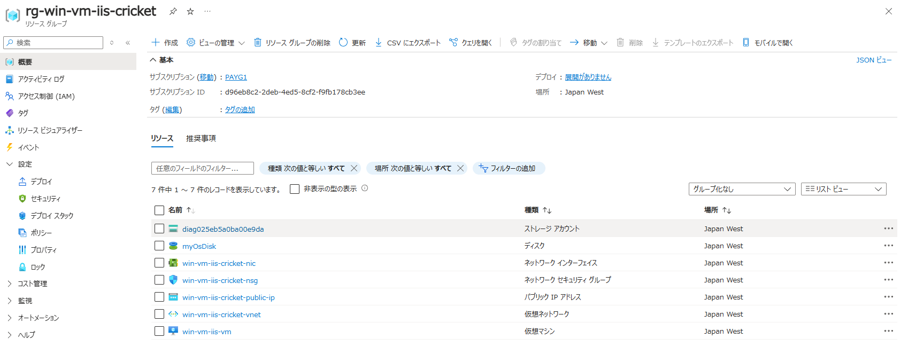

  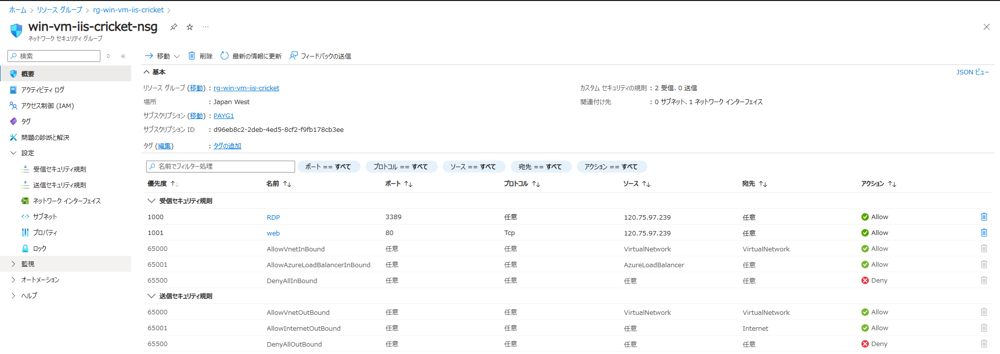

  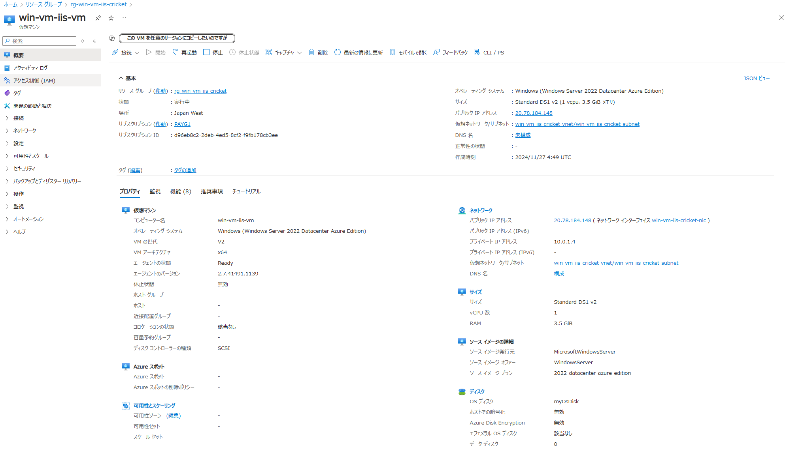

* IIS も動作していた。

  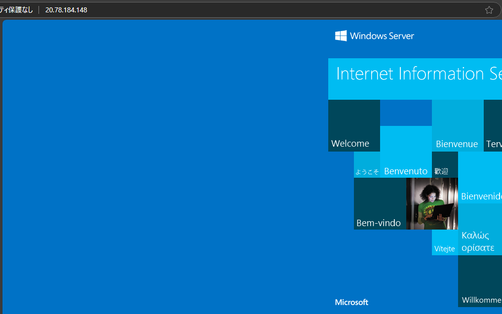

* tfstateを確認する。

  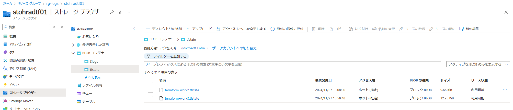

* マスキングされた VM パスワードは tfstate で確認可能。

  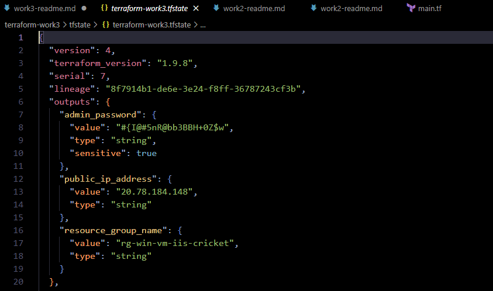

---

# 所感

* (一般的な開発環境を考えると) 一回作成すれば、環境を直ぐに再作成可能なため節約になる。再作成の際もコマンド打つだけなので時間短縮になる。
  * 再作成するの面倒だな、停止して残しておこう…から再作成が直ぐにできるし節約になるから一旦壊しておこうになる。
  * あるいは、一旦壊しとこう、後で時間掛かるけどポチポチ作ろう…からコマンド打つだけで再作成できるの楽、になる。

* Bicep と比較して、より抽象化した記述ができるので楽。
  * サブネット等をネストして書かなくて良い (＝関連を覚えていなくても良い)。
    * Terraform では例えば NSG の割当は専用の resource ブロックがある。
    * Bicep はネストが深くなる傾向にある。Properties で書くのが辛かった記憶がある (今は楽になっているかもしれない)。

    [microsoft.compute/vm-simple-windows/main.bicep](https://aka.ms/bicepdemo#eJytWVtv2zYUfvev4ENR2UPtOMlarAaKJW2yLFviGrGTPRRFQUu0TUQiVZKy6xb+7zukbqQutjc0LRpJ5+Php8NzVS8CIn1BY0U563qPkgiGI4IWXCC1IuiJCpXgEN1jf0UZGXi9TowFjhAOIsoKuFSCsmWnc+Fom2ApN1wE+7RdgJo7wpZq1T09g1tJ/ESQrrNNoad5m0dGvyYEXY2naGxznyTzkProdoISSQKkOMK+T6Tc/2IBk3d4TsKJIAv6LdsSvYPld3xDRNd78WMd6X12/Rc/ErP11GC6gkieCJ/cCJ7E3d6ABq9QCu3tQH2F9U+gGptVt/G4PAIg6kXbVN3txKtuehmG3Mf6GkVErXjwvxlcYFC1IUH3Uwch72oLbkB9T19PFWwAl58rNCfl5vfp3iXlYn2F7/Tvx5/E8D2WJT8WYBHUGcbT58QilS2pUJrBbv9QFvCNRGsipLZl4d/3AzRbUYk2NAxRTP1nhNEiCcMtirHyV0CbRnhJEF8AHnBLuiasqq5O/mx4+qYfYIV9whQR/SVhECecBV6TFIISNPV9Lkh/eXYQIiPYK6DyuRV8CLChagW6mMJgeiHbYN9XPrNkb21ZhWxd1kSijmpnchh7cIea1d8estLb46y0F3ZQr2vWszNbhr9DMu2TgGrfPYwwhjkSVhI7YsF+rHv4DbIGG7iolsfuuiLcP06fssAtg/2A5ap5iX7PgpigdZZ6omp6XkcGVu6RZ54vV2fyy/p1Tetdnpt1PgHmKK8oslRa5O9CbbXs5IjGgnOYc6WYSBrFIemvo7oNdKWmaotm27hQfDAPl9kXbmYikYoEdzhh/so6IJmpNppLLhV4Z40FSLmAjHrp+zxhypAH5JxzFVC8lAdLNJRmo4dRP18cbZ/uxzrz6+c4CGCRzLoBkJ4OB+bPyembFCGTOSPFzlNzZ0salp79mgKyYxgTBe3Nc67ifvs0vp5ltFJRbmvDO8cFZIGTUPXH05tsvww1EXxBQ/KXBDd5h36ApROgMCVKgQ3kyDxBKZq8B0tdMzwPSTBCSiTEyNazOKo+3XWQczAj566zMxTINwVZEvwjJ3mTEKkulYJ/cRpKDswUdbkiwrw49QWXfKEGlzr6BvlbD7IC2a4mj2dt5MEwFUYYzwjDpVM0UwHYNQtiTpkCEBxZ6m9dj0Sx2qZ+471CQ/gLPVzuQBW/s7lPU8mJi5AXJsMMX/eHp152Krp1HjV4MIjyIB4VV9r6z0l+eOnSMqPcPUy97IyewVhGZNR6cDAl67zRsflm3ndStGmpx5N2xnbfeTRXq8fKiMaCx0QoSgqXbOsUR60Sswxa9qpzw0MeQQXVFE07P6o09ga1M0xsAzXFW5OxmnDtBmuL4jbj1S2Th9pDEuqHn7KXzF+2cIg8J5ic2z8//+2tV0DqWvPnlGvdI3Q6HA4tQdpfg1Zt9Y1nSQIqiJ/S9m7ZHBw3cMQQYpSZt5lwoR4wW2pyLh1DSHGfw9l4Mz+2Jelp2Gt/qYsv7dRchVgU9uB2Hfv355o7uAm6yRFcRLsL1FP98Yef1aBpDM1JeXROZbKdoiLKnn7ulC+aFqY9flTWtIPeg13r2jXPQjVFgKsHIRo0RwpUaQu3O/rwoKTvCd1b3eYtwKJ7wjbtCY4/KBp/4GxBl4kwmH2BSmPfQE+Pis81VqQpLdqDdwF383iTlfNc3GbZ3EOa1ubmvQ26h8PhJPM0KKD1AHhluVnv6BPWoR0TFsiPTJs3bVcc3R0NdaI4sv3gA4/iRJGcatap5l5wXo/c6L85wQrq8QYLknVhpQ3TeWCU/bbCkcsa1k9JirFLQf84X95G7q0Nyb+ajdxbOw2kLUJtc/ON4oEsiCDMzjiZb+l2bWRZNOvOpuabQumJfLEwuBaxaRCKSax4nH0DgXUh1p2a57iAttUVzHM2J18QQH6Ms3L0h+DRbWQ6nxwRYQb3QXUhqrReaVNb9FTT6VXeVjV5I/ghTItap5N6bfV68tRHffNel9azc0sUJsDVrrWVt7jWzWd9azuJZ3msdnq1/NZGz+Rb6ttJoGkfPUcxDtXUr7upnrOuSrltXVIbKiyLPwpabXwHZSTBJbig2OZ9uRzMQz53rL9zuqKCV7frjI7vakNjD/3eOCaBJZIw7NUbgOg6nzGOyCEnxUBSTSd0cQy3ly8tlEVvYM9vg9rgpnVpK6cKDq63hrtiZa9njg7Gb8KUTjhF+nMmuuOzoJUp6sOeQSgTblX16fM/IQRDIp7yZFAd9NK2KFH8MV4KHJB7yniJLjwu9cFLwEX6m3QGtgCyNjZY82Fay22fvse4PmjoH2uIHNk3LqQcR0fubUuKKcYTnihwN7SCKLP+uwXcqijkVvBY09Bg8TVgnX8BB0tGKQ==)

* Backend の管理が重要。
  * [Terraform ステートを試してみた](https://qiita.com/zumax/items/74fad1270d3deab7379f)
  * リモートバックエンドならばロックがサポートされている。
    * Blob のリースを取得することでロックされる。
    * 例）destroy 実行時に CLI が反応せず中断するとロックされたままになったため、Azure ポータルで Blob のリース解約を行う必要があった。

    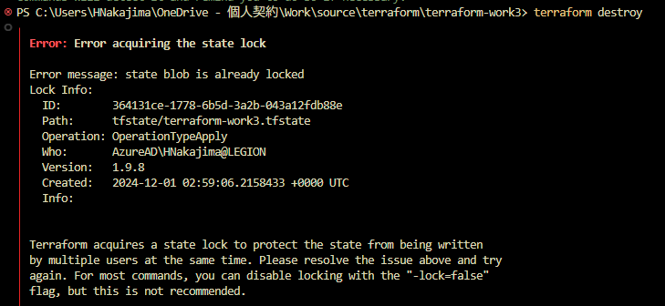

    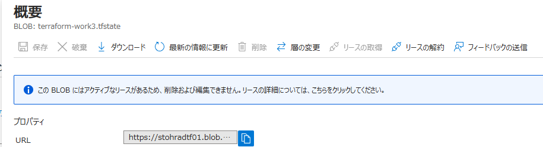

    * ローカルバックエンドになる Git 等のバージョン管理システムは推奨されていない。
      * Push や Pull 忘れによりデグレードが発生する。
      * 同時の apply 実行を防止するロックの仕組みがない。

* Azure ポータルとより連携できると有り難い。
  * Preview で Azure ポータルのテンプレートメニューから Terraform ファイルをエクスポート可能であるので今後楽になるかもしれない (tfstate があれば)。
  * Bicep はテンプレートスペックに対応している (ただし、テンプレートスペックが適用可能な環境は限られる)。

    [Azure Resource Manager テンプレートスペックに Bicep ファイルを格納してデプロイする](https://qiita.com/07JP27/items/d76711102858501ce157)

    [Azure Resource Manager テンプレート スペック](https://learn.microsoft.com/ja-jp/azure/azure-resource-manager/templates/template-specs?tabs=azure-powershell)
