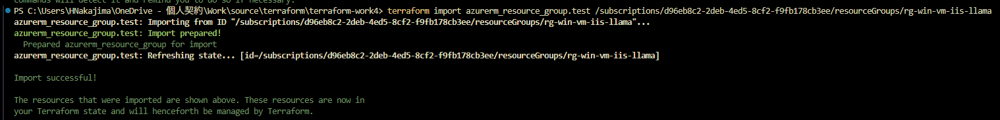
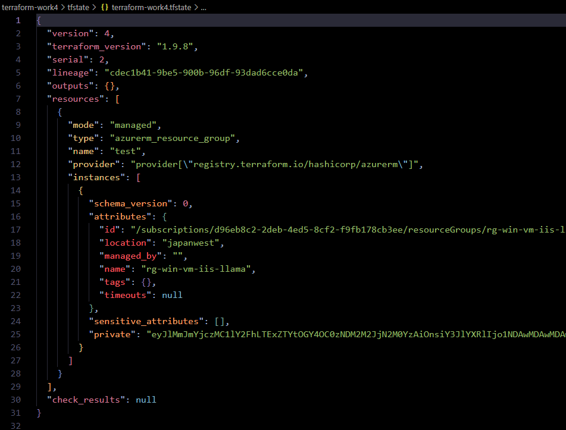

# 概要

##### 既に構築済みのリソースを Terraform で管理するためには、tf/tfstate ファイルを生成する必要がある

1. terraform import を使用する
2. terraform import block を使用する
3. aztfexport を使用する

work4 では「1. terraform import を使用する」を検証します。

* ルートのフォルダ・ファイル構成

  ```text
terraform-work4
 ∟ image - readme の画像ファイルを格納するフォルダ
 ∟ tfstate - リモートバックエンドからダウンロードした tfstate ファイル
 ∟ import-main.tf - リソースを記述した tf ファイル
 ∟ provider.tf - プロバイダーを記述した tf ファイル
 ∟ work4-readme.html - Markdown を HTML 化したファイル
 ∟ README.md - この Markdown ファイル
  ```

---

1. terraform import を使用する

   [Import](https://developer.hashicorp.com/terraform/cli/import)

   [Azure 環境への IaC 導入前に作成した既存リソースを Terraform に取り込む](https://zenn.dev/microsoft/articles/20240322-terraform-import-azure)

* コマンド：`terraform import [Terraformリソース定義.変数名] [リソースID]`
  * Import コマンドでは tfstate (ステート) のみエクスポートされる。
    * よって、生成された tfstate ファイルから値を抜き出し、tf ファイルを完成させなければならない。
  * Import コマンドはリソース一つ一つに対して実行しなければならない。
  * つらい。

---

1.  main.tf にリソース分の resource ブロックを用意する (コマンドの実行に必要ではない)
    ```json
    resource "azurerm_resource_group" "test" {
    }
    ```

2. Azure のリソース ID を調査しておき、コマンドを実行する
   * work3 のリソースに対して Terraform 化してみる。
   * `terraform init` を実行する。
   * `terraform import [Terraformリソース定義.変数名] [リソースグループID]` を実行する。
   * Backend に tfstate が生成される。

    

        ```PowerShell
        PS C:\Users\HNakajima\OneDrive - 個人契約\Work\source\terraform\terraform-work4> terraform import azurerm_resource_group.test /subscriptions/xxxxxxxx-xxxx-xxxx-xxxx-xxxxxxxxxxxx/resourceGroups/rg-win-vm-iis-llama
        azurerm_resource_group.test: Importing from ID "/subscriptions/xxxxxxxx-xxxx-xxxx-xxxx-xxxxxxxxxxxx/resourceGroups/rg-win-vm-iis-llama"...
        azurerm_resource_group.test: Import prepared!
        Prepared azurerm_resource_group for import
        azurerm_resource_group.test: Refreshing state... [id=/subscriptions/xxxxxxxx-xxxx-xxxx-xxxx-xxxxxxxxxxxx/resourceGroups/rg-win-vm-iis-llama]

        Import successful!

        The resources that were imported are shown above. These resources are now in
        your Terraform state and will henceforth be managed by Terraform.
        ```

3. 生成された tfstate を確認し、main.tf の resource ブロックに追記する
   * リソースグループであれば name/location を抜き出し追記する。

    

        ```json
        {
        "version": 4,
        "terraform_version": "1.9.8",
        "serial": 2,
        "lineage": "cdec1b41-9be5-900b-96df-93dad6cce0da",
        "outputs": {},
        "resources": [
            {
            "mode": "managed",
            "type": "azurerm_resource_group",
            "name": "test",
            "provider": "provider[\"registry.terraform.io/hashicorp/azurerm\"]",
            "instances": [
                {
                "schema_version": 0,
                "attributes": {
                    "id": "/subscriptions/xxxxxxxx-xxxx-xxxx-xxxx-xxxxxxxxxxxx/resourceGroups/rg-win-vm-iis-llama",
                    "location": "japanwest",
                    "managed_by": "",
                    "name": "rg-win-vm-iis-llama",
                    "tags": {},
                    "timeouts": null
                },
                "sensitive_attributes": [],
                "private": "eyJlMmJmYjczMC1lY2FhLTExZTYtOGY4OC0zNDM2M2JjN2M0YzAiOnsiY3JlYXRlIjo1NDAwMDAwMDAwMDAwLCJkZWxldGUiOjU0MDAwMDAwMDAwMDAsInJlYWQiOjMwMDAwMDAwMDAwMCwidXBkYXRlIjo1NDAwMDAwMDAwMDAwfSwic2NoZW1hX3ZlcnNpb24iOiIwIn0="
                }
            ]
            }
        ],
        "check_results": null
        }
        ```

4. `terraform plan` で差分を確認する
   * `No changes` になるまで修正する

5. 適宜、リソースの追加や設定変更等の修正を行い、`terraform plan`、`terraform apply`して環境へ適用する

---
