# 概要

##### 既に構築済みのリソースを Terraform で管理するためには、tf/tfstate ファイルを生成する必要がある

1. terraform import を使用する
2. terraform import block を使用する
3. aztfexport を使用する

work5 では「2. terraform import block を使用する」を検証します。

* ルートのフォルダ・ファイル構成

```text
terraform-work5
 ∟ .terrtaform - init 時に作成される Provider がダウンロードされるフォルダ
 ∟ image - readme の画像ファイルを格納するフォルダ
 ∟ tfstate - リモートバックエンドからダウンロードした tfstate ファイル
 ∟ .terraform.lock.hcl - init 時に作成される、Provider と .tf ファイルの依存関係等が記録されたファイル ⇒ [Dependency Lock File](https://developer.hashicorp.com/terraform/language/files/dependency-lock)
 ∟ import.tf - Import block で生成された resource ブロックを修正し、Application Gateway を追記した tf ファイル
 ∟ import.tf.プロパティのエラー修正前 - Import block で生成された tf ファイル (エラーあり)
 ∟ importblock-main.tf.bak - Import block を記述した tf ファイル
 ∟ provider.tf - プロバイダーを記述した tf ファイル
 ∟ work5-readme.html - Markdown を HTML 化したファイル
 ∟ README.md - この Markdown ファイル
```

---

## 実行方法・結果

2. terraform import block を使用する
   * [Import](https://developer.hashicorp.com/terraform/cli/import)

   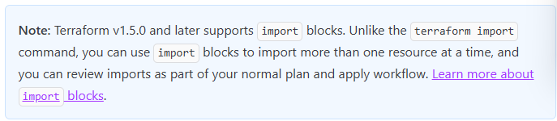

     * v1.5.0以降では import block が使える。

   * [Import blocks](https://developer.hashicorp.com/terraform/language/import)

     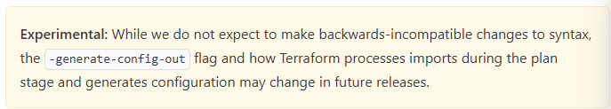

     * Experimental で、生成される構文については将来変更される可能性がある。
     * tf ファイルに `import {}` で複数リソースを定義しておきコマンド実行する。
       * to：Terraform リソース名.変数名
       * id：CSP のリソース ID
        ```js
        import {
            to = aws_instance.example
            id = "i-abcd1234"
        }
        ```
        * 生成されたファイル
        ```js
        resource "aws_instance" "example" {
            name = "hashi"
            # (other resource arguments...)
        }
        ```
     * コマンド：`terraform plan -generate-config-out="import.tf"`
       * import のように手書きではなく、記載した分の resource ブロックを自動生成してくれる機能。
       * 指定したファイル名で生成されるので、同名のファイルがあった場合エラーとなる。

   * 参考URL
     * [Terraformのimportコマンドとimportブロックを試してみた](https://dev.classmethod.jp/articles/terraform-import-command-and-import-block/)
     * [importブロックを使用して既存AzureリソースをTerraform定義ファイルに取り込む](https://blog.jbs.co.jp/entry/2024/03/11/160601)
     * [[Terraform] 既存のリソースをimportするにはimport blockが有用](https://zenn.dev/yuki0920/articles/736c66784e58f9)
     * [terraform importで数年やってきたがImport blockの良さに気づきました](https://zenn.dev/aeonpeople/articles/d63e84494d9e2c)

---

## 実行方法

1. importblock-main.tf にリソース分の import ブロックを用意する
   * work3 のリソースに対して Terraform 化してみる。
   * Azure のリソース ID を調査しておく。
   * terraform の対象リソース名と変数名を指定する。
    ```js
    # Resource Group
    import {
        id = "/subscriptions/xxxxxxxx-xxxx-xxxx-xxxx-xxxxxxxxxxxx/resourceGroups/rg-win-vm-iis-llama"
        to = azurerm_resource_group.rg
    }

    # VNet
    import {
        id = "/subscriptions/xxxxxxxx-xxxx-xxxx-xxxx-xxxxxxxxxxxx/resourceGroups/rg-win-vm-iis-llama/providers/Microsoft.Network/virtualNetworks/win-vm-iis-llama-vnet"
        to = azurerm_virtual_network.terraform_work5_network
    }

    # Public IP
    import {
        id = "/subscriptions/xxxxxxxx-xxxx-xxxx-xxxx-xxxxxxxxxxxx/resourceGroups/rg-win-vm-iis-llama/providers/Microsoft.Network/publicIPAddresses/win-vm-iis-llama-public-ip"
        to = azurerm_public_ip.terraform_work5_public_ip
    }

    # NSG
    import {
        id = "/subscriptions/xxxxxxxx-xxxx-xxxx-xxxx-xxxxxxxxxxxx/resourceGroups/rg-win-vm-iis-llama/providers/Microsoft.Network/networkSecurityGroups/win-vm-iis-llama-nsg"
        to = azurerm_network_security_group.terraform_work5_nsg
    }

    # NIC
    import {
        id = "/subscriptions/xxxxxxxx-xxxx-xxxx-xxxx-xxxxxxxxxxxx/resourceGroups/rg-win-vm-iis-llama/providers/Microsoft.Network/networkInterfaces/win-vm-iis-llama-nic"
        to = azurerm_network_interface.terraform_work5_nic
    }

    # VM
    import {
        id = "/subscriptions/xxxxxxxx-xxxx-xxxx-xxxx-xxxxxxxxxxxx/resourceGroups/rg-win-vm-iis-llama/providers/Microsoft.Compute/virtualMachines/win-vm-iis-vm"
        to = azurerm_windows_virtual_machine.main
    }

    # Storage Account
    import {
        id = "/subscriptions/xxxxxxxx-xxxx-xxxx-xxxx-xxxxxxxxxxxx/resourceGroups/rg-win-vm-iis-llama/providers/Microsoft.Storage/storageAccounts/diag3abb2f58b75025ad"
        to = azurerm_storage_account.terraform_work5_storage_account
    }
    
    # VM Extension
    import {
        id = "/subscriptions/xxxxxxxx-xxxx-xxxx-xxxx-xxxxxxxxxxxx/resourceGroups/rg-win-vm-iis-llama/providers/Microsoft.Compute/virtualMachines/win-vm-iis-vm/extensions/win-vm-iis-llama-wsi"
        to = azurerm_virtual_machine_extension.web_server_install
    }

    # Subnet
    import {
        id = "/subscriptions/xxxxxxxx-xxxx-xxxx-xxxx-xxxxxxxxxxxx/resourceGroups/rg-win-vm-iis-llama/providers/Microsoft.Network/virtualNetworks/win-vm-iis-llama-vnet/subnets/win-vm-iis-llama-subnet"
        to = azurerm_subnet.terraform_work3_subnet 
    }

    # OS Disk は不要
    #import {
    #  id = "/subscriptions/xxxxxxxx-xxxx-xxxx-xxxx-xxxxxxxxxxxx/resourceGroups/RG-WIN-VM-IIS-LLAMA/providers/Microsoft.Compute/disks/myOsDisk"
    #  to = azurerm_managed_disk.myOsDisk
    #}
    ```

2. コマンドを実行する

   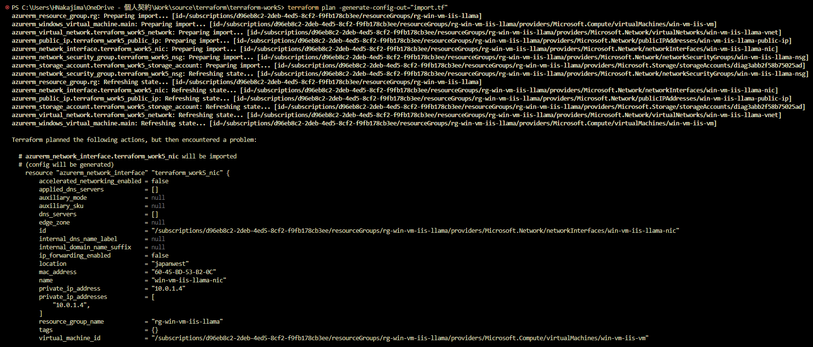

   ```PowerShell
    PS C:\Users\HNakajima\OneDrive - 個人契約\Work\source\terraform\terraform-work5> terraform plan -generate-config-out="import.tf" 
    azurerm_storage_account.terraform_work5_storage_account: Preparing import... [id=/subscriptions/xxxxxxxx-xxxx-xxxx-xxxx-xxxxxxxxxxxx/resourceGroups/rg-win-vm-iis-llama/providers/Microsoft.Storage/storageAccounts/diag3abb2f58b75025ad]
    azurerm_resource_group.rg: Preparing import... [id=/subscriptions/xxxxxxxx-xxxx-xxxx-xxxx-xxxxxxxxxxxx/resourceGroups/rg-win-vm-iis-llama]
    azurerm_subnet.terraform_work3_subnet: Preparing import... [id=/subscriptions/xxxxxxxx-xxxx-xxxx-xxxx-xxxxxxxxxxxx/resourceGroups/rg-win-vm-iis-llama/providers/Microsoft.Network/virtualNetworks/win-vm-iis-llama-vnet/subnets/win-vm-iis-llama-subnet]
    azurerm_public_ip.terraform_work5_public_ip: Preparing import... [id=/subscriptions/xxxxxxxx-xxxx-xxxx-xxxx-xxxxxxxxxxxx/resourceGroups/rg-win-vm-iis-llama/providers/Microsoft.Network/publicIPAddresses/win-vm-iis-llama-public-ip]
    azurerm_network_interface.terraform_work5_nic: Preparing import... [id=/subscriptions/xxxxxxxx-xxxx-xxxx-xxxx-xxxxxxxxxxxx/resourceGroups/rg-win-vm-iis-llama/providers/Microsoft.Network/networkInterfaces/win-vm-iis-llama-nic]
    azurerm_virtual_machine_extension.web_server_install: Preparing import... [id=/subscriptions/xxxxxxxx-xxxx-xxxx-xxxx-xxxxxxxxxxxx/resourceGroups/rg-win-vm-iis-llama/providers/Microsoft.Compute/virtualMachines/win-vm-iis-vm/extensions/win-vm-iis-llama-wsi]
    azurerm_virtual_network.terraform_work5_network: Preparing import... [id=/subscriptions/xxxxxxxx-xxxx-xxxx-xxxx-xxxxxxxxxxxx/resourceGroups/rg-win-vm-iis-llama/providers/Microsoft.Network/virtualNetworks/win-vm-iis-llama-vnet]
    azurerm_windows_virtual_machine.main: Preparing import... [id=/subscriptions/xxxxxxxx-xxxx-xxxx-xxxx-xxxxxxxxxxxx/resourceGroups/rg-win-vm-iis-llama/providers/Microsoft.Compute/virtualMachines/win-vm-iis-vm]
    azurerm_network_security_group.terraform_work5_nsg: Preparing import... [id=/subscriptions/xxxxxxxx-xxxx-xxxx-xxxx-xxxxxxxxxxxx/resourceGroups/rg-win-vm-iis-llama/providers/Microsoft.Network/networkSecurityGroups/win-vm-iis-llama-nsg]
    azurerm_virtual_network.terraform_work5_network: Refreshing state... [id=/subscriptions/xxxxxxxx-xxxx-xxxx-xxxx-xxxxxxxxxxxx/resourceGroups/rg-win-vm-iis-llama/providers/Microsoft.Network/virtualNetworks/win-vm-iis-llama-vnet]
    azurerm_public_ip.terraform_work5_public_ip: Refreshing state... [id=/subscriptions/xxxxxxxx-xxxx-xxxx-xxxx-xxxxxxxxxxxx/resourceGroups/rg-win-vm-iis-llama/providers/Microsoft.Network/publicIPAddresses/win-vm-iis-llama-public-ip]
    azurerm_virtual_machine_extension.web_server_install: Refreshing state... [id=/subscriptions/xxxxxxxx-xxxx-xxxx-xxxx-xxxxxxxxxxxx/resourceGroups/rg-win-vm-iis-llama/providers/Microsoft.Compute/virtualMachines/win-vm-iis-vm/extensions/win-vm-iis-llama-wsi]
    azurerm_subnet.terraform_work3_subnet: Refreshing state... [id=/subscriptions/xxxxxxxx-xxxx-xxxx-xxxx-xxxxxxxxxxxx/resourceGroups/rg-win-vm-iis-llama/providers/Microsoft.Network/virtualNetworks/win-vm-iis-llama-vnet/subnets/win-vm-iis-llama-subnet]
    azurerm_network_security_group.terraform_work5_nsg: Refreshing state... [id=/subscriptions/xxxxxxxx-xxxx-xxxx-xxxx-xxxxxxxxxxxx/resourceGroups/rg-win-vm-iis-llama/providers/Microsoft.Network/networkSecurityGroups/win-vm-iis-llama-nsg]
    azurerm_network_interface.terraform_work5_nic: Refreshing state... [id=/subscriptions/xxxxxxxx-xxxx-xxxx-xxxx-xxxxxxxxxxxx/resourceGroups/rg-win-vm-iis-llama/providers/Microsoft.Network/networkInterfaces/win-vm-iis-llama-nic]
    azurerm_resource_group.rg: Refreshing state... [id=/subscriptions/xxxxxxxx-xxxx-xxxx-xxxx-xxxxxxxxxxxx/resourceGroups/rg-win-vm-iis-llama]
    azurerm_storage_account.terraform_work5_storage_account: Refreshing state... [id=/subscriptions/xxxxxxxx-xxxx-xxxx-xxxx-xxxxxxxxxxxx/resourceGroups/rg-win-vm-iis-llama/providers/Microsoft.Storage/storageAccounts/diag3abb2f58b75025ad]
    azurerm_windows_virtual_machine.main: Refreshing state... [id=/subscriptions/xxxxxxxx-xxxx-xxxx-xxxx-xxxxxxxxxxxx/resourceGroups/rg-win-vm-iis-llama/providers/Microsoft.Compute/virtualMachines/win-vm-iis-vm]

    Terraform planned the following actions, but then encountered a problem:

    # azurerm_network_interface.terraform_work5_nic will be imported
    # (config will be generated)
        resource "azurerm_network_interface" "terraform_work5_nic" {
            accelerated_networking_enabled = false
            applied_dns_servers            = []
            auxiliary_mode                 = null
            auxiliary_sku                  = null
            dns_servers                    = []
            edge_zone                      = null
            id                             = "/subscriptions/xxxxxxxx-xxxx-xxxx-xxxx-xxxxxxxxxxxx/resourceGroups/rg-win-vm-iis-llama/providers/Microsoft.Network/networkInterfaces/win-vm-iis-llama-nic"
            internal_dns_name_label        = null
            internal_domain_name_suffix    = null
            ip_forwarding_enabled          = false
            location                       = "japanwest"
            mac_address                    = "60-45-BD-53-B2-0C"
            name                           = "win-vm-iis-llama-nic"
            private_ip_address             = "10.0.1.4"
            private_ip_addresses           = [
                "10.0.1.4",
            ]
            resource_group_name            = "rg-win-vm-iis-llama"
            tags                           = {}
            virtual_machine_id             = "/subscriptions/xxxxxxxx-xxxx-xxxx-xxxx-xxxxxxxxxxxx/resourceGroups/rg-win-vm-iis-llama/providers/Microsoft.Compute/virtualMachines/win-vm-iis-vm"

            ip_configuration {
                gateway_load_balancer_frontend_ip_configuration_id = null
                name                                               = "terraform_work3_nic_configuration"
                primary                                            = true
                private_ip_address                                 = "10.0.1.4"
                private_ip_address_allocation                      = "Dynamic"
                private_ip_address_version                         = "IPv4"
                public_ip_address_id                               = "/subscriptions/xxxxxxxx-xxxx-xxxx-xxxx-xxxxxxxxxxxx/resourceGroups/rg-win-vm-iis-llama/providers/Microsoft.Network/publicIPAddresses/win-vm-iis-llama-public-ip"
                subnet_id                                          = "/subscriptions/xxxxxxxx-xxxx-xxxx-xxxx-xxxxxxxxxxxx/resourceGroups/rg-win-vm-iis-llama/providers/Microsoft.Network/virtualNetworks/win-vm-iis-llama-vnet/subnets/win-vm-iis-llama-subnet"
            }
        }

    # azurerm_network_security_group.terraform_work5_nsg will be imported
    # (config will be generated)
        resource "azurerm_network_security_group" "terraform_work5_nsg" {
            id                  = "/subscriptions/xxxxxxxx-xxxx-xxxx-xxxx-xxxxxxxxxxxx/resourceGroups/rg-win-vm-iis-llama/providers/Microsoft.Network/networkSecurityGroups/win-vm-iis-llama-nsg"
            location            = "japanwest"
            name                = "win-vm-iis-llama-nsg"
            resource_group_name = "rg-win-vm-iis-llama"
            security_rule       = [
                {
                    access                                     = "Allow"
                    description                                = null
                    destination_address_prefix                 = "*"
                    destination_address_prefixes               = []
                    destination_application_security_group_ids = []
                    destination_port_range                     = "3389"
                    destination_port_ranges                    = []
                    direction                                  = "Inbound"
                    name                                       = "RDP"
                    priority                                   = 1000
                    protocol                                   = "*"
                    source_address_prefix                      = "120.75.97.239"
                    source_address_prefixes                    = []
                    source_application_security_group_ids      = []
                    source_port_range                          = "*"
                    source_port_ranges                         = []
                },
                {
                    access                                     = "Allow"
                    description                                = null
                    destination_address_prefix                 = "*"
                    destination_address_prefixes               = []
                    destination_application_security_group_ids = []
                    destination_port_range                     = "80"
                    destination_port_ranges                    = []
                    direction                                  = "Inbound"
                    name                                       = "web"
                    priority                                   = 1001
                    protocol                                   = "Tcp"
                    source_address_prefix                      = "120.75.97.239"
                    source_address_prefixes                    = []
                    source_application_security_group_ids      = []
                    source_port_range                          = "*"
                    source_port_ranges                         = []
                },
            ]
            tags                = {}
        }

    # azurerm_public_ip.terraform_work5_public_ip will be imported
    # (config will be generated)
        resource "azurerm_public_ip" "terraform_work5_public_ip" {
            allocation_method       = "Static"
            ddos_protection_mode    = "VirtualNetworkInherited"
            edge_zone               = null
            id                      = "/subscriptions/xxxxxxxx-xxxx-xxxx-xxxx-xxxxxxxxxxxx/resourceGroups/rg-win-vm-iis-llama/providers/Microsoft.Network/publicIPAddresses/win-vm-iis-llama-public-ip"
            idle_timeout_in_minutes = 4
            ip_address              = "20.27.105.119"
            ip_tags                 = {}
            ip_version              = "IPv4"
            location                = "japanwest"
            name                    = "win-vm-iis-llama-public-ip"
            resource_group_name     = "rg-win-vm-iis-llama"
            sku                     = "Standard"
            sku_tier                = "Regional"
            tags                    = {}
            zones                   = []
        }

    # azurerm_resource_group.rg will be imported
    # (config will be generated)
        resource "azurerm_resource_group" "rg" {
            id         = "/subscriptions/xxxxxxxx-xxxx-xxxx-xxxx-xxxxxxxxxxxx/resourceGroups/rg-win-vm-iis-llama"
            location   = "japanwest"
            managed_by = null
            name       = "rg-win-vm-iis-llama"
            tags       = {}
        }

    # azurerm_subnet.terraform_work3_subnet will be imported
    # (config will be generated)
        resource "azurerm_subnet" "terraform_work3_subnet" {
            address_prefixes                              = [
                "10.0.1.0/24",
            ]
            default_outbound_access_enabled               = true
            id                                            = "/subscriptions/xxxxxxxx-xxxx-xxxx-xxxx-xxxxxxxxxxxx/resourceGroups/rg-win-vm-iis-llama/providers/Microsoft.Network/virtualNetworks/win-vm-iis-llama-vnet/subnets/win-vm-iis-llama-subnet"
            name                                          = "win-vm-iis-llama-subnet"
            private_endpoint_network_policies             = "Disabled"
            private_link_service_network_policies_enabled = true
            resource_group_name                           = "rg-win-vm-iis-llama"
            service_endpoint_policy_ids                   = []
            service_endpoints                             = []
            virtual_network_name                          = "win-vm-iis-llama-vnet"
        }

    # azurerm_virtual_machine_extension.web_server_install will be imported
    # (config will be generated)
        resource "azurerm_virtual_machine_extension" "web_server_install" {
            auto_upgrade_minor_version  = true
            automatic_upgrade_enabled   = false
            failure_suppression_enabled = false
            id                          = "/subscriptions/xxxxxxxx-xxxx-xxxx-xxxx-xxxxxxxxxxxx/resourceGroups/rg-win-vm-iis-llama/providers/Microsoft.Compute/virtualMachines/win-vm-iis-vm/extensions/win-vm-iis-llama-wsi"
            name                        = "win-vm-iis-llama-wsi"
            provision_after_extensions  = []
            publisher                   = "Microsoft.Compute"
            settings                    = jsonencode(
                {
                    commandToExecute = "powershell -ExecutionPolicy Unrestricted Install-WindowsFeature -Name Web-Server -IncludeAllSubFeature -IncludeManagementTools"
                }
            )
            tags                        = {}
            type                        = "CustomScriptExtension"
            type_handler_version        = "1.8"
            virtual_machine_id          = "/subscriptions/xxxxxxxx-xxxx-xxxx-xxxx-xxxxxxxxxxxx/resourceGroups/rg-win-vm-iis-llama/providers/Microsoft.Compute/virtualMachines/win-vm-iis-vm"
        }

    Plan: 6 to import, 0 to add, 0 to change, 0 to destroy.
    ╷
    │ Warning: Config generation is experimental
    │
    │ Generating configuration during import is currently experimental, and the generated configuration format may change in future versions.
    ╵
    ╷
    │ Error: Missing required argument
    │
    │   with azurerm_windows_virtual_machine.main,
    │   on import.tf line 1:
    │   (source code not available)
    │
    │ The argument "admin_password" is required, but no definition was found.
    ╵
    ╷
    │ Error: expected flow_timeout_in_minutes to be in the range (4 - 30), got 0
    │
    │   with azurerm_virtual_network.terraform_work5_network,
    │   on import.tf line 5:
    │   (source code not available)
    │
    ╵
    ╷
    │ Error: parsing "": cannot parse an empty string
    │
    │   with azurerm_virtual_network.terraform_work5_network,
    │   on import.tf line 9:
    │   (source code not available)
    │
    ╵
    ╷
    │ Error: Value for unconfigurable attribute
    │
    │   with azurerm_virtual_network.terraform_work5_network,
    │   on import.tf line 9:
    │   (source code not available)
    │
    │ Can't configure a value for "subnet.0.id": its value will be decided automatically based on the result of applying this configuration.
    ╵
    ╷
    │ Error: expected blob_properties.0.change_feed_retention_in_days to be in the range (1 - 146000), got 0
    │
    │   with azurerm_storage_account.terraform_work5_storage_account,
    │   on import.tf line 29:
    │   (source code not available)
    │
    ╵
    ╷
    │ Error: Missing required argument
    │
    │   with azurerm_windows_virtual_machine.main,
    │   on import.tf line 25:
    │   (source code not available)
    │
    │ "platform_fault_domain": all of `platform_fault_domain,virtual_machine_scale_set_id` must be specified
    ╵
   ``` 

3. CLI に出力されたエラーを解消するため、生成された import.tf を修正する
   1) VNET 修正

    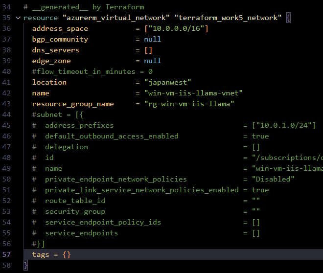

   2) VM パスワードをダミーにする
      * 既存のパスワードは後続の apply 実行後も変更されなかった (宣言型ではなくポータルの機能を使うからと思われる)。
        * tfstate にはパスワードは保存されなかった。
      * パスワード要件はチェックされるので注意。

        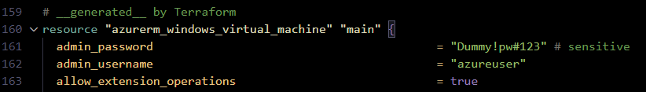

        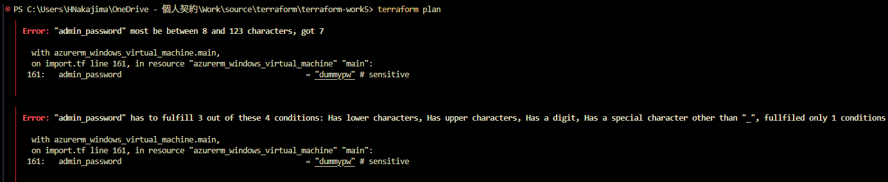 

        ```PowerShell
        PS C:\Users\HNakajima\OneDrive - 個人契約\Work\source\terraform\terraform-work5> terraform plan
            ╷
            │ Error: "admin_password" most be between 8 and 123 characters, got 7
            │
            │   with azurerm_windows_virtual_machine.main,
            │   on import.tf line 161, in resource "azurerm_windows_virtual_machine" "main":
            │  161:   admin_password                                         = "dummypw" # sensitive
            │
            ╵
            ╷
            │ Error: "admin_password" has to fulfill 3 out of these 4 conditions: Has lower characters, Has upper characters, Has a digit, Has a special character other than "_", fullfiled only 1 conditions
            │
            │   with azurerm_windows_virtual_machine.main,
            │   on import.tf line 161, in resource "azurerm_windows_virtual_machine" "main":
            │  161:   admin_password                                         = "dummypw" # sensitive
            │
            ╵
        ```
   3) VM のプロパティをコメント
      * 可用性セットのプロパティと思われる。

      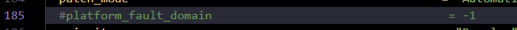

   4) Blob のプロパティをコメント

      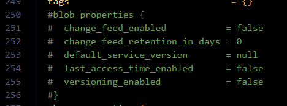

4. `terraform plan` で差分を確認する
   * このとき、インポートブロックを記述した `importblock-main.tf` は残しておいた状態で terraform plan する。
     * 削除したり拡張子を変えてしまうと通常の plan となり、import ではなく add になってしまう
       * ハマりポイント。通常作業では、作業ディレクトリ配下の .tf ファイルがすべて対象となるため、対象の .tf ファイル以外は拡張子を変えてしまう癖がついていた。
   * エラーが出なくなるまで修正する。

   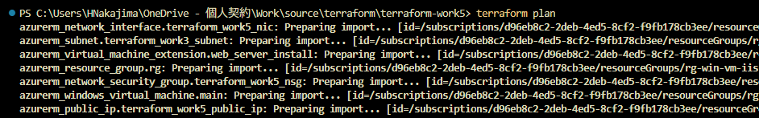

        ```PowerShell
        PS C:\Users\HNakajima\OneDrive - 個人契約\Work\source\terraform\terraform-work5> terraform plan
            azurerm_network_interface.terraform_work5_nic: Preparing import... [id=/subscriptions/xxxxxxxx-xxxx-xxxx-xxxx-xxxxxxxxxxxx/resourceGroups/rg-win-vm-iis-llama/providers/Microsoft.Network/networkInterfaces/win-vm-iis-llama-nic]
            
            ～略～

                    source_image_reference {
                        offer     = "WindowsServer"
                        publisher = "MicrosoftWindowsServer"
                        sku       = "2022-datacenter-azure-edition"
                        version   = "latest"
                    }
                }

            Plan: 9 to import, 0 to add, 0 to change, 0 to destroy.
            ──────────────────────────────────────────────────────────────────────────────────────── 
            Note: You didn't use the -out option to save this plan, so Terraform can't guarantee to take exactly these actions if you run "terraform apply" now.
        ```

5. `terraform apply` を実行し、tfstate ファイルを生成する

    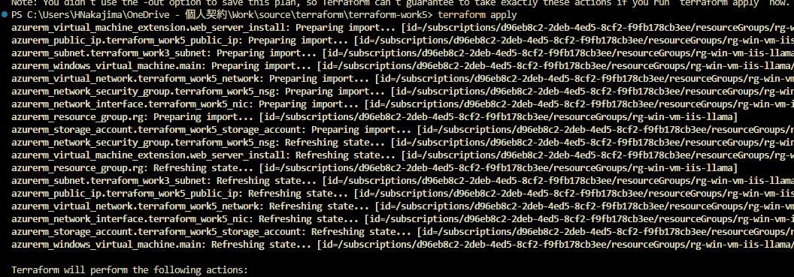

    ```PowerShell
    PS C:\Users\HNakajima\OneDrive - 個人契約\Work\source\terraform\terraform-work5> terraform apply
    azurerm_virtual_machine_extension.web_server_install: Preparing import... [id=/subscriptions/xxxxxxxx-xxxx-xxxx-xxxx-xxxxxxxxxxxx/resourceGroups/rg-win-vm-iis-llama/providers/Microsoft.Compute/virtualMachines/win-vm-iis-vm/extensions/win-vm-iis-llama-wsi]
    azurerm_public_ip.terraform_work5_public_ip: Preparing import... [id=/subscriptions/xxxxxxxx-xxxx-xxxx-xxxx-xxxxxxxxxxxx/resourceGroups/rg-win-vm-iis-llama/providers/Microsoft.Network/publicIPAddresses/win-vm-iis-llama-public-ip]
    azurerm_subnet.terraform_work3_subnet: Preparing import... [id=/subscriptions/xxxxxxxx-xxxx-xxxx-xxxx-xxxxxxxxxxxx/resourceGroups/rg-win-vm-iis-llama/providers/Microsoft.Network/virtualNetworks/win-vm-iis-llama-vnet/subnets/win-vm-iis-llama-subnet]
    azurerm_windows_virtual_machine.main: Preparing import... [id=/subscriptions/xxxxxxxx-xxxx-xxxx-xxxx-xxxxxxxxxxxx/resourceGroups/rg-win-vm-iis-llama/providers/Microsoft.Compute/virtualMachines/win-vm-iis-vm]
    azurerm_virtual_network.terraform_work5_network: Preparing import... [id=/subscriptions/xxxxxxxx-xxxx-xxxx-xxxx-xxxxxxxxxxxx/resourceGroups/rg-win-vm-iis-llama/providers/Microsoft.Network/virtualNetworks/win-vm-iis-llama-vnet]
    azurerm_network_security_group.terraform_work5_nsg: Preparing import... [id=/subscriptions/xxxxxxxx-xxxx-xxxx-xxxx-xxxxxxxxxxxx/resourceGroups/rg-win-vm-iis-llama/providers/Microsoft.Network/networkSecurityGroups/win-vm-iis-llama-nsg]
    azurerm_network_interface.terraform_work5_nic: Preparing import... [id=/subscriptions/xxxxxxxx-xxxx-xxxx-xxxx-xxxxxxxxxxxx/resourceGroups/rg-win-vm-iis-llama/providers/Microsoft.Network/networkInterfaces/win-vm-iis-llama-nic]
    azurerm_resource_group.rg: Preparing import... [id=/subscriptions/xxxxxxxx-xxxx-xxxx-xxxx-xxxxxxxxxxxx/resourceGroups/rg-win-vm-iis-llama]
    azurerm_storage_account.terraform_work5_storage_account: Preparing import... [id=/subscriptions/xxxxxxxx-xxxx-xxxx-xxxx-xxxxxxxxxxxx/resourceGroups/rg-win-vm-iis-llama/providers/Microsoft.Storage/storageAccounts/diag3abb2f58b75025ad]
    azurerm_network_security_group.terraform_work5_nsg: Refreshing state... [id=/subscriptions/xxxxxxxx-xxxx-xxxx-xxxx-xxxxxxxxxxxx/resourceGroups/rg-win-vm-iis-llama/providers/Microsoft.Network/networkSecurityGroups/win-vm-iis-llama-nsg]
    azurerm_virtual_machine_extension.web_server_install: Refreshing state... [id=/subscriptions/xxxxxxxx-xxxx-xxxx-xxxx-xxxxxxxxxxxx/resourceGroups/rg-win-vm-iis-llama/providers/Microsoft.Compute/virtualMachines/win-vm-iis-vm/extensions/win-vm-iis-llama-wsi]
    azurerm_resource_group.rg: Refreshing state... [id=/subscriptions/xxxxxxxx-xxxx-xxxx-xxxx-xxxxxxxxxxxx/resourceGroups/rg-win-vm-iis-llama]
    azurerm_subnet.terraform_work3_subnet: Refreshing state... [id=/subscriptions/xxxxxxxx-xxxx-xxxx-xxxx-xxxxxxxxxxxx/resourceGroups/rg-win-vm-iis-llama/providers/Microsoft.Network/virtualNetworks/win-vm-iis-llama-vnet/subnets/win-vm-iis-llama-subnet]
    azurerm_public_ip.terraform_work5_public_ip: Refreshing state... [id=/subscriptions/xxxxxxxx-xxxx-xxxx-xxxx-xxxxxxxxxxxx/resourceGroups/rg-win-vm-iis-llama/providers/Microsoft.Network/publicIPAddresses/win-vm-iis-llama-public-ip]
    azurerm_virtual_network.terraform_work5_network: Refreshing state... [id=/subscriptions/xxxxxxxx-xxxx-xxxx-xxxx-xxxxxxxxxxxx/resourceGroups/rg-win-vm-iis-llama/providers/Microsoft.Network/virtualNetworks/win-vm-iis-llama-vnet]
    azurerm_network_interface.terraform_work5_nic: Refreshing state... [id=/subscriptions/xxxxxxxx-xxxx-xxxx-xxxx-xxxxxxxxxxxx/resourceGroups/rg-win-vm-iis-llama/providers/Microsoft.Network/networkInterfaces/win-vm-iis-llama-nic]
    azurerm_storage_account.terraform_work5_storage_account: Refreshing state... [id=/subscriptions/xxxxxxxx-xxxx-xxxx-xxxx-xxxxxxxxxxxx/resourceGroups/rg-win-vm-iis-llama/providers/Microsoft.Storage/storageAccounts/diag3abb2f58b75025ad]
    azurerm_windows_virtual_machine.main: Refreshing state... [id=/subscriptions/xxxxxxxx-xxxx-xxxx-xxxx-xxxxxxxxxxxx/resourceGroups/rg-win-vm-iis-llama/providers/Microsoft.Compute/virtualMachines/win-vm-iis-vm]

    Terraform will perform the following actions:

    # azurerm_network_interface.terraform_work5_nic will be imported

    ～略～

    Plan: 9 to import, 0 to add, 0 to change, 0 to destroy.

    Do you want to perform these actions?
    Terraform will perform the actions described above.
    Only 'yes' will be accepted to approve.

    Enter a value: yes

    azurerm_resource_group.rg: Importing... [id=/subscriptions/xxxxxxxx-xxxx-xxxx-xxxx-xxxxxxxxxxxx/resourceGroups/rg-win-vm-iis-llama]
    azurerm_resource_group.rg: Import complete [id=/subscriptions/xxxxxxxx-xxxx-xxxx-xxxx-xxxxxxxxxxxx/resourceGroups/rg-win-vm-iis-llama]
    azurerm_public_ip.terraform_work5_public_ip: Importing... [id=/subscriptions/xxxxxxxx-xxxx-xxxx-xxxx-xxxxxxxxxxxx/resourceGroups/rg-win-vm-iis-llama/providers/Microsoft.Network/publicIPAddresses/win-vm-iis-llama-public-ip]
    azurerm_public_ip.terraform_work5_public_ip: Import complete [id=/subscriptions/xxxxxxxx-xxxx-xxxx-xxxx-xxxxxxxxxxxx/resourceGroups/rg-win-vm-iis-llama/providers/Microsoft.Network/publicIPAddresses/win-vm-iis-llama-public-ip]
    azurerm_subnet.terraform_work3_subnet: Importing... [id=/subscriptions/xxxxxxxx-xxxx-xxxx-xxxx-xxxxxxxxxxxx/resourceGroups/rg-win-vm-iis-llama/providers/Microsoft.Network/virtualNetworks/win-vm-iis-llama-vnet/subnets/win-vm-iis-llama-subnet]
    azurerm_subnet.terraform_work3_subnet: Import complete [id=/subscriptions/xxxxxxxx-xxxx-xxxx-xxxx-xxxxxxxxxxxx/resourceGroups/rg-win-vm-iis-llama/providers/Microsoft.Network/virtualNetworks/win-vm-iis-llama-vnet/subnets/win-vm-iis-llama-subnet]
    azurerm_network_security_group.terraform_work5_nsg: Importing... [id=/subscriptions/xxxxxxxx-xxxx-xxxx-xxxx-xxxxxxxxxxxx/resourceGroups/rg-win-vm-iis-llama/providers/Microsoft.Network/networkSecurityGroups/win-vm-iis-llama-nsg]
    azurerm_network_security_group.terraform_work5_nsg: Import complete [id=/subscriptions/xxxxxxxx-xxxx-xxxx-xxxx-xxxxxxxxxxxx/resourceGroups/rg-win-vm-iis-llama/providers/Microsoft.Network/networkSecurityGroups/win-vm-iis-llama-nsg]
    azurerm_virtual_network.terraform_work5_network: Importing... [id=/subscriptions/xxxxxxxx-xxxx-xxxx-xxxx-xxxxxxxxxxxx/resourceGroups/rg-win-vm-iis-llama/providers/Microsoft.Network/virtualNetworks/win-vm-iis-llama-vnet]
    azurerm_virtual_network.terraform_work5_network: Import complete [id=/subscriptions/xxxxxxxx-xxxx-xxxx-xxxx-xxxxxxxxxxxx/resourceGroups/rg-win-vm-iis-llama/providers/Microsoft.Network/virtualNetworks/win-vm-iis-llama-vnet]
    azurerm_network_interface.terraform_work5_nic: Importing... [id=/subscriptions/xxxxxxxx-xxxx-xxxx-xxxx-xxxxxxxxxxxx/resourceGroups/rg-win-vm-iis-llama/providers/Microsoft.Network/networkInterfaces/win-vm-iis-llama-nic]
    azurerm_network_interface.terraform_work5_nic: Import complete [id=/subscriptions/xxxxxxxx-xxxx-xxxx-xxxx-xxxxxxxxxxxx/resourceGroups/rg-win-vm-iis-llama/providers/Microsoft.Network/networkInterfaces/win-vm-iis-llama-nic]
    azurerm_virtual_machine_extension.web_server_install: Importing... [id=/subscriptions/xxxxxxxx-xxxx-xxxx-xxxx-xxxxxxxxxxxx/resourceGroups/rg-win-vm-iis-llama/providers/Microsoft.Compute/virtualMachines/win-vm-iis-vm/extensions/win-vm-iis-llama-wsi]
    azurerm_virtual_machine_extension.web_server_install: Import complete [id=/subscriptions/xxxxxxxx-xxxx-xxxx-xxxx-xxxxxxxxxxxx/resourceGroups/rg-win-vm-iis-llama/providers/Microsoft.Compute/virtualMachines/win-vm-iis-vm/extensions/win-vm-iis-llama-wsi]
    azurerm_windows_virtual_machine.main: Importing... [id=/subscriptions/xxxxxxxx-xxxx-xxxx-xxxx-xxxxxxxxxxxx/resourceGroups/rg-win-vm-iis-llama/providers/Microsoft.Compute/virtualMachines/win-vm-iis-vm]
    azurerm_windows_virtual_machine.main: Import complete [id=/subscriptions/xxxxxxxx-xxxx-xxxx-xxxx-xxxxxxxxxxxx/resourceGroups/rg-win-vm-iis-llama/providers/Microsoft.Compute/virtualMachines/win-vm-iis-vm]
    azurerm_storage_account.terraform_work5_storage_account: Importing... [id=/subscriptions/xxxxxxxx-xxxx-xxxx-xxxx-xxxxxxxxxxxx/resourceGroups/rg-win-vm-iis-llama/providers/Microsoft.Storage/storageAccounts/diag3abb2f58b75025ad]
    azurerm_storage_account.terraform_work5_storage_account: Import complete [id=/subscriptions/xxxxxxxx-xxxx-xxxx-xxxx-xxxxxxxxxxxx/resourceGroups/rg-win-vm-iis-llama/providers/Microsoft.Storage/storageAccounts/diag3abb2f58b75025ad]

    Apply complete! Resources: 9 imported, 0 added, 0 changed, 0 destroyed.
    ```

    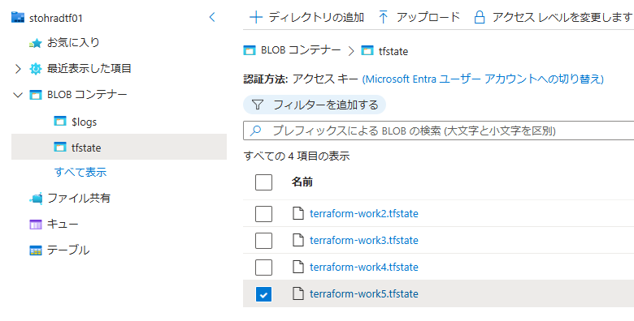

    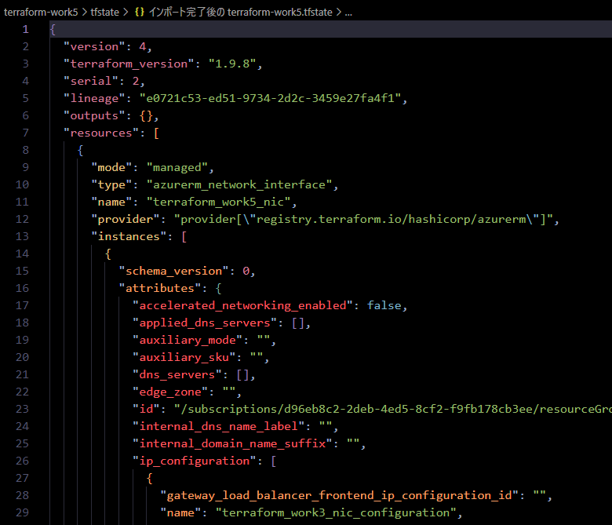

6. tfstate 生成後、`importblock-main.tf` は不要なため削除 or リネームする

---
#### 他リソース追加

7. 生成した tf ファイルに Application Gateway を追記し、既存リソースとともに Terraform で管理可能とする

    [クイックスタート: Azure Application Gateway で Web トラフィックを転送する - Terraform](https://learn.microsoft.com/ja-jp/azure/application-gateway/quick-create-terraform)

    ```js
    # ####################################################################
    # Application Gateway を追加
    # ####################################################################
    variable "backend_address_pool_name" {
        default = "myBackendPool"
    }

    variable "frontend_port_name" {
        default = "myFrontendPort"
    }

    variable "frontend_ip_configuration_name" {
        default = "myAGIPConfig"
    }

    variable "http_setting_name" {
        default = "myHTTPsetting"
    }

    variable "listener_name" {
        default = "myListener"
    }

    variable "request_routing_rule_name" {
        default = "myRoutingRule"
    }

    resource "azurerm_subnet" "frontend" {
        name                 = "myAGSubnet"
        resource_group_name  = azurerm_resource_group.rg.name
        virtual_network_name = azurerm_virtual_network.terraform_work5_network.name
        address_prefixes     = ["10.0.10.0/24"]
    }

    resource "azurerm_public_ip" "pip" {
        name                = "myAGPublicIPAddress"
        resource_group_name = azurerm_resource_group.rg.name
        location            = azurerm_resource_group.rg.location
        allocation_method   = "Static"
        sku                 = "Standard"
    }

    resource "azurerm_application_gateway" "main" {
        name                = "myAppGateway"
        resource_group_name = azurerm_resource_group.rg.name
        location            = azurerm_resource_group.rg.location

        sku {
            name     = "Standard_v2"
            tier     = "Standard_v2"
            capacity = 2
        }

        gateway_ip_configuration {
            name      = "my-gateway-ip-configuration"
            subnet_id = azurerm_subnet.frontend.id
        }

        frontend_port {
            name = var.frontend_port_name
            port = 80
        }

        frontend_ip_configuration {
            name                 = var.frontend_ip_configuration_name
            public_ip_address_id = azurerm_public_ip.pip.id
        }

        backend_address_pool {
            name = var.backend_address_pool_name
        }

        backend_http_settings {
            name                  = var.http_setting_name
            cookie_based_affinity = "Disabled"
            port                  = 80
            protocol              = "Http"
            request_timeout       = 60
        }

        http_listener {
            name                           = var.listener_name
            frontend_ip_configuration_name = var.frontend_ip_configuration_name
            frontend_port_name             = var.frontend_port_name
            protocol                       = "Http"
        }

        request_routing_rule {
            name                       = var.request_routing_rule_name
            rule_type                  = "Basic"
            http_listener_name         = var.listener_name
            backend_address_pool_name  = var.backend_address_pool_name
            backend_http_settings_name = var.http_setting_name
            priority                   = 1
        }
    }

    resource "azurerm_network_interface_application_gateway_backend_address_pool_association" "nic-assoc" {
        network_interface_id    = azurerm_network_interface.terraform_work5_nic.id
        ip_configuration_name   = "terraform_work3_nic_configuration"
        backend_address_pool_id = one(azurerm_application_gateway.main.backend_address_pool).id
    }
    ```

8. `terraform plan / terraform apply` する
    * `terraform plan` する。
    ```PowerShell
    PS C:\Users\HNakajima\OneDrive - 個人契約\Work\source\terraform\terraform-work5> terraform plan
    azurerm_resource_group.rg: Refreshing state... [id=/subscriptions/xxxxxxxx-xxxx-xxxx-xxxx-xxxxxxxxxxxx/resourceGroups/rg-win-vm-iis-llama]
    azurerm_virtual_machine_extension.web_server_install: Refreshing state... [id=/subscriptions/xxxxxxxx-xxxx-xxxx-xxxx-xxxxxxxxxxxx/resourceGroups/rg-win-vm-iis-llama/providers/Microsoft.Compute/virtualMachines/win-vm-iis-vm/extensions/win-vm-iis-llama-wsi]
    azurerm_subnet.terraform_work3_subnet: Refreshing state... [id=/subscriptions/xxxxxxxx-xxxx-xxxx-xxxx-xxxxxxxxxxxx/resourceGroups/rg-win-vm-iis-llama/providers/Microsoft.Network/virtualNetworks/win-vm-iis-llama-vnet/subnets/win-vm-iis-llama-subnet]
    azurerm_public_ip.terraform_work5_public_ip: Refreshing state... [id=/subscriptions/xxxxxxxx-xxxx-xxxx-xxxx-xxxxxxxxxxxx/resourceGroups/rg-win-vm-iis-llama/providers/Microsoft.Network/publicIPAddresses/win-vm-iis-llama-public-ip]
    azurerm_network_interface.terraform_work5_nic: Refreshing state... [id=/subscriptions/xxxxxxxx-xxxx-xxxx-xxxx-xxxxxxxxxxxx/resourceGroups/rg-win-vm-iis-llama/providers/Microsoft.Network/networkInterfaces/win-vm-iis-llama-nic]
    azurerm_virtual_network.terraform_work5_network: Refreshing state... [id=/subscriptions/xxxxxxxx-xxxx-xxxx-xxxx-xxxxxxxxxxxx/resourceGroups/rg-win-vm-iis-llama/providers/Microsoft.Network/virtualNetworks/win-vm-iis-llama-vnet]
    azurerm_network_security_group.terraform_work5_nsg: Refreshing state... [id=/subscriptions/xxxxxxxx-xxxx-xxxx-xxxx-xxxxxxxxxxxx/resourceGroups/rg-win-vm-iis-llama/providers/Microsoft.Network/networkSecurityGroups/win-vm-iis-llama-nsg]
    azurerm_windows_virtual_machine.main: Refreshing state... [id=/subscriptions/xxxxxxxx-xxxx-xxxx-xxxx-xxxxxxxxxxxx/resourceGroups/rg-win-vm-iis-llama/providers/Microsoft.Compute/virtualMachines/win-vm-iis-vm]
    azurerm_storage_account.terraform_work5_storage_account: Refreshing state... [id=/subscriptions/xxxxxxxx-xxxx-xxxx-xxxx-xxxxxxxxxxxx/resourceGroups/rg-win-vm-iis-llama/providers/Microsoft.Storage/storageAccounts/diag3abb2f58b75025ad]

    Terraform used the selected providers to generate the following execution plan. Resource actions are indicated with the following symbols:
    + create

    Terraform will perform the following actions:

    # azurerm_application_gateway.main will be created
    + resource "azurerm_application_gateway" "main" {
        + id                          = (known after apply)
        + location                    = "japanwest"
        + name                        = "myAppGateway"
        + private_endpoint_connection = (known after apply)
        + resource_group_name         = "rg-win-vm-iis-llama"

        + backend_address_pool {
            + fqdns        = []
            + id           = (known after apply)
            + ip_addresses = []
            + name         = "myBackendPool"
            }

        + backend_http_settings {
            + cookie_based_affinity               = "Disabled"
            + id                                  = (known after apply)
            + name                                = "myHTTPsetting"
            + pick_host_name_from_backend_address = false
            + port                                = 80
            + probe_id                            = (known after apply)
            + protocol                            = "Http"
            + request_timeout                     = 60
            + trusted_root_certificate_names      = []
                # (4 unchanged attributes hidden)
            }

        + frontend_ip_configuration {
            + id                            = (known after apply)
            + name                          = "myAGIPConfig"
            + private_ip_address            = (known after apply)
            + private_ip_address_allocation = "Dynamic"
            + private_link_configuration_id = (known after apply)
            + public_ip_address_id          = (known after apply)
            }

        + frontend_port {
            + id   = (known after apply)
            + name = "myFrontendPort"
            + port = 80
            }

        + gateway_ip_configuration {
            + id        = (known after apply)
            + name      = "my-gateway-ip-configuration"
            + subnet_id = (known after apply)
            }

        + http_listener {
            + frontend_ip_configuration_id   = (known after apply)
            + frontend_ip_configuration_name = "myAGIPConfig"
            + frontend_port_id               = (known after apply)
            + frontend_port_name             = "myFrontendPort"
            + host_names                     = []
            + id                             = (known after apply)
            + name                           = "myListener"
            + protocol                       = "Http"
            + ssl_certificate_id             = (known after apply)
            + ssl_profile_id                 = (known after apply)
                # (4 unchanged attributes hidden)
            }

        + request_routing_rule {
            + backend_address_pool_id     = (known after apply)
            + backend_address_pool_name   = "myBackendPool"
            + backend_http_settings_id    = (known after apply)
            + backend_http_settings_name  = "myHTTPsetting"
            + http_listener_id            = (known after apply)
            + http_listener_name          = "myListener"
            + id                          = (known after apply)
            + name                        = "myRoutingRule"
            + priority                    = 1
            + redirect_configuration_id   = (known after apply)
            + rewrite_rule_set_id         = (known after apply)
            + rule_type                   = "Basic"
            + url_path_map_id             = (known after apply)
                # (3 unchanged attributes hidden)
            }

        + sku {
            + capacity = 2
            + name     = "Standard_v2"
            + tier     = "Standard_v2"
            }

        + ssl_policy (known after apply)
        }

    # azurerm_network_interface_application_gateway_backend_address_pool_association.nic-assoc will be created
    + resource "azurerm_network_interface_application_gateway_backend_address_pool_association" "nic-assoc" {
        + backend_address_pool_id = (known after apply)
        + id                      = (known after apply)
        + ip_configuration_name   = "terraform_work3_nic_configuration"
        + network_interface_id    = "/subscriptions/xxxxxxxx-xxxx-xxxx-xxxx-xxxxxxxxxxxx/resourceGroups/rg-win-vm-iis-llama/providers/Microsoft.Network/networkInterfaces/win-vm-iis-llama-nic"
        }

    # azurerm_public_ip.pip will be created
    + resource "azurerm_public_ip" "pip" {
        + allocation_method       = "Static"
        + ddos_protection_mode    = "VirtualNetworkInherited"
        + fqdn                    = (known after apply)
        + id                      = (known after apply)
        + idle_timeout_in_minutes = 4
        + ip_address              = (known after apply)
        + ip_version              = "IPv4"
        + location                = "japanwest"
        + name                    = "myAGPublicIPAddress"
        + resource_group_name     = "rg-win-vm-iis-llama"
        + sku                     = "Standard"
        + sku_tier                = "Regional"
        }

    # azurerm_subnet.frontend will be created
    + resource "azurerm_subnet" "frontend" {
        + address_prefixes                              = [
            + "10.0.10.0/24",
            ]
        + default_outbound_access_enabled               = true
        + id                                            = (known after apply)
        + name                                          = "myAGSubnet"
        + private_endpoint_network_policies             = "Disabled"
        + private_link_service_network_policies_enabled = true
        + resource_group_name                           = "rg-win-vm-iis-llama"
        + virtual_network_name                          = "win-vm-iis-llama-vnet"
        }

    Plan: 4 to add, 0 to change, 0 to destroy.
    ───────────────────────────────────────────────────────────────────────────────── 

    Note: You didn't use the -out option to save this plan, so Terraform can't guarantee to take exactly these actions if you run "terraform apply" now.
    ```

    * `terraform apply` する。
      * apply 時にエラーとなり何回か実行したため、「1 to add」となっている。
    ```PowerShell
    PS C:\Users\HNakajima\OneDrive - 個人契約\Work\source\terraform\terraform-work5> terraform apply
    azurerm_subnet.terraform_work3_subnet: Refreshing state... [id=/subscriptions/xxxxxxxx-xxxx-xxxx-xxxx-xxxxxxxxxxxx/resourceGroups/rg-win-vm-iis-llama/providers/Microsoft.Network/virtualNetworks/win-vm-iis-llama-vnet/subnets/win-vm-iis-llama-subnet]
    azurerm_network_interface.terraform_work5_nic: Refreshing state... [id=/subscriptions/xxxxxxxx-xxxx-xxxx-xxxx-xxxxxxxxxxxx/resourceGroups/rg-win-vm-iis-llama/providers/Microsoft.Network/networkInterfaces/win-vm-iis-llama-nic]
    azurerm_public_ip.terraform_work5_public_ip: Refreshing state... [id=/subscriptions/xxxxxxxx-xxxx-xxxx-xxxx-xxxxxxxxxxxx/resourceGroups/rg-win-vm-iis-llama/providers/Microsoft.Network/publicIPAddresses/win-vm-iis-llama-public-ip]
    azurerm_resource_group.rg: Refreshing state... [id=/subscriptions/xxxxxxxx-xxxx-xxxx-xxxx-xxxxxxxxxxxx/resourceGroups/rg-win-vm-iis-llama]
    azurerm_virtual_machine_extension.web_server_install: Refreshing state... [id=/subscriptions/xxxxxxxx-xxxx-xxxx-xxxx-xxxxxxxxxxxx/resourceGroups/rg-win-vm-iis-llama/providers/Microsoft.Compute/virtualMachines/win-vm-iis-vm/extensions/win-vm-iis-llama-wsi]
    azurerm_network_security_group.terraform_work5_nsg: Refreshing state... [id=/subscriptions/xxxxxxxx-xxxx-xxxx-xxxx-xxxxxxxxxxxx/resourceGroups/rg-win-vm-iis-llama/providers/Microsoft.Network/networkSecurityGroups/win-vm-iis-llama-nsg]
    azurerm_virtual_network.terraform_work5_network: Refreshing state... [id=/subscriptions/xxxxxxxx-xxxx-xxxx-xxxx-xxxxxxxxxxxx/resourceGroups/rg-win-vm-iis-llama/providers/Microsoft.Network/virtualNetworks/win-vm-iis-llama-vnet]
    azurerm_windows_virtual_machine.main: Refreshing state... [id=/subscriptions/xxxxxxxx-xxxx-xxxx-xxxx-xxxxxxxxxxxx/resourceGroups/rg-win-vm-iis-llama/providers/Microsoft.Compute/virtualMachines/win-vm-iis-vm]
    azurerm_storage_account.terraform_work5_storage_account: Refreshing state... [id=/subscriptions/xxxxxxxx-xxxx-xxxx-xxxx-xxxxxxxxxxxx/resourceGroups/rg-win-vm-iis-llama/providers/Microsoft.Storage/storageAccounts/diag3abb2f58b75025ad]
    azurerm_public_ip.pip: Refreshing state... [id=/subscriptions/xxxxxxxx-xxxx-xxxx-xxxx-xxxxxxxxxxxx/resourceGroups/rg-win-vm-iis-llama/providers/Microsoft.Network/publicIPAddresses/myAGPublicIPAddress]
    azurerm_subnet.frontend: Refreshing state... [id=/subscriptions/xxxxxxxx-xxxx-xxxx-xxxx-xxxxxxxxxxxx/resourceGroups/rg-win-vm-iis-llama/providers/Microsoft.Network/virtualNetworks/win-vm-iis-llama-vnet/subnets/myAGSubnet]
    azurerm_application_gateway.main: Refreshing state... [id=/subscriptions/xxxxxxxx-xxxx-xxxx-xxxx-xxxxxxxxxxxx/resourceGroups/rg-win-vm-iis-llama/providers/Microsoft.Network/applicationGateways/myAppGateway]

    Terraform used the selected providers to generate the following execution plan. Resource actions are indicated with the following symbols:
    + create

    Terraform will perform the following actions:

    # azurerm_network_interface_application_gateway_backend_address_pool_association.nic-assoc will be created
    + resource "azurerm_network_interface_application_gateway_backend_address_pool_association" "nic-assoc" {
        + backend_address_pool_id = "/subscriptions/xxxxxxxx-xxxx-xxxx-xxxx-xxxxxxxxxxxx/resourceGroups/rg-win-vm-iis-llama/providers/Microsoft.Network/applicationGateways/myAppGateway/backendAddressPools/myBackendPool"
        + id                      = (known after apply)
        + ip_configuration_name   = "terraform_work3_nic_configuration"
        + network_interface_id    = "/subscriptions/xxxxxxxx-xxxx-xxxx-xxxx-xxxxxxxxxxxx/resourceGroups/rg-win-vm-iis-llama/providers/Microsoft.Network/networkInterfaces/win-vm-iis-llama-nic"
        }

    Plan: 1 to add, 0 to change, 0 to destroy.

    Do you want to perform these actions?
    Terraform will perform the actions described above.
    Only 'yes' will be accepted to approve.

    Enter a value: yes

    azurerm_network_interface_application_gateway_backend_address_pool_association.nic-assoc: Creating...
    azurerm_network_interface_application_gateway_backend_address_pool_association.nic-assoc: Still creating... [10s elapsed]
    azurerm_network_interface_application_gateway_backend_address_pool_association.nic-assoc: Creation complete after 10s [id=/subscriptions/xxxxxxxx-xxxx-xxxx-xxxx-xxxxxxxxxxxx/resourceGroups/rg-win-vm-iis-llama/providers/Microsoft.Network/networkInterfaces/win-vm-iis-llama-nic/ipConfigu
    rations/terraform_work3_nic_configuration|/subscriptions/xxxxxxxx-xxxx-xxxx-xxxx-xxxxxxxxxxxx/resourceGroups/rg-win-vm-iis-llama/providers/Microsoft.Network/applicationGateways/myAppGateway/backendAddressPools/myBackendPool]                                                             
    Apply complete! Resources: 1 added, 0 changed, 0 destroyed.
    ```

9.  リソースが追加された
    * Application Gateway用サブネット、Application Gateway、Public IP。

    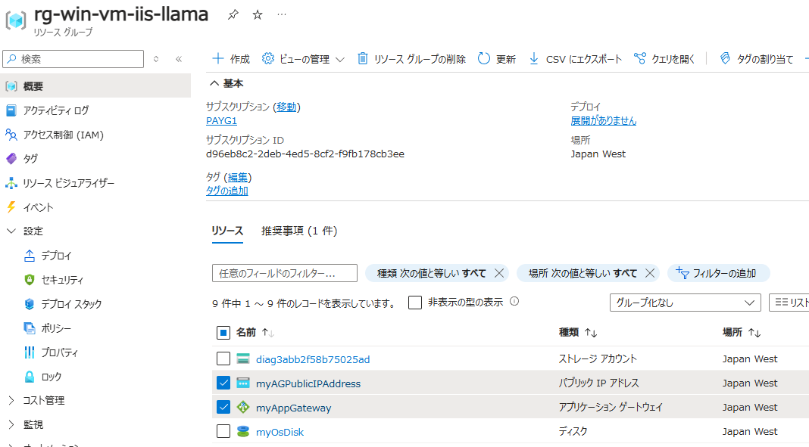

    * Application Gateway の Public IP で Web ページにもアクセス可能。

    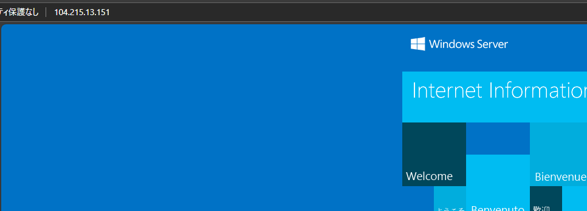

10. tfstate ファイルも更新されている
    * Application Gateway 等が追加された。

    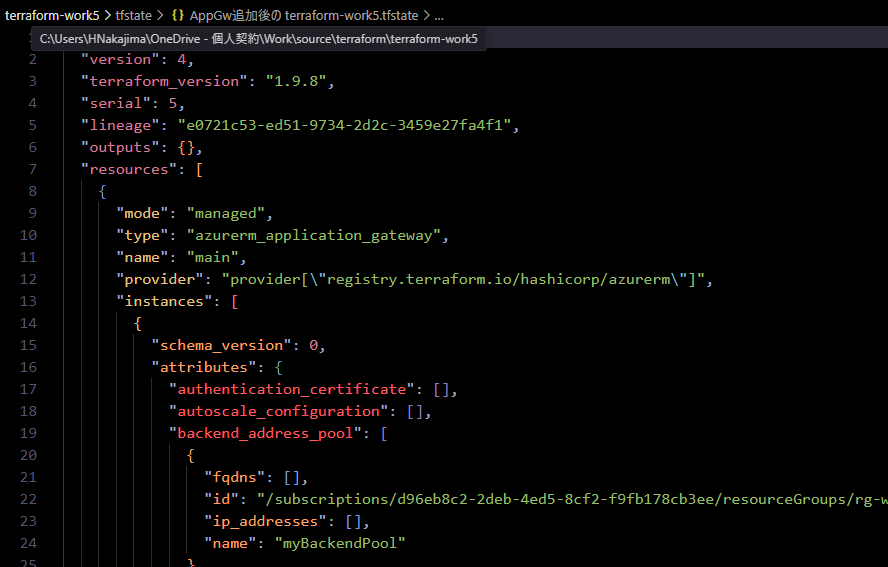

---
#### Appendix: Destroy

11. `terraform destroy` を実行する
    * Public IP と NSG、リソースグループが残存した。
    ```PowerShell
    PS C:\Users\HNakajima\OneDrive - 個人契約\Work\source\terraform\terraform-work5> terraform destroy                               
    azurerm_subnet.terraform_work3_subnet: Refreshing state... [id=/subscriptions/xxxxxxxx-xxxx-xxxx-xxxx-xxxxxxxxxxxx/resourceGroups/rg-win-vm-iis-llama/providers/Microsoft.Network/virtualNetworks/win-vm-iis-llama-vnet/subnets/win-vm-iis-llama-subnet]
    azurerm_public_ip.terraform_work5_public_ip: Refreshing state... [id=/subscriptions/xxxxxxxx-xxxx-xxxx-xxxx-xxxxxxxxxxxx/resourceGroups/rg-win-vm-iis-llama/providers/Microsoft.Network/publicIPAddresses/win-vm-iis-llama-public-ip]
    azurerm_virtual_machine_extension.web_server_install: Refreshing state... [id=/subscriptions/xxxxxxxx-xxxx-xxxx-xxxx-xxxxxxxxxxxx/resourceGroups/rg-win-vm-iis-llama/providers/Microsoft.Compute/virtualMachines/win-vm-iis-vm/extensions/win-vm-iis-llama-wsi]
    azurerm_resource_group.rg: Refreshing state... [id=/subscriptions/xxxxxxxx-xxxx-xxxx-xxxx-xxxxxxxxxxxx/resourceGroups/rg-win-vm-iis-llama]
    azurerm_network_interface.terraform_work5_nic: Refreshing state... [id=/subscriptions/xxxxxxxx-xxxx-xxxx-xxxx-xxxxxxxxxxxx/resourceGroups/rg-win-vm-iis-llama/providers/Microsoft.Network/networkInterfaces/win-vm-iis-llama-nic]
    azurerm_virtual_network.terraform_work5_network: Refreshing state... [id=/subscriptions/xxxxxxxx-xxxx-xxxx-xxxx-xxxxxxxxxxxx/resourceGroups/rg-win-vm-iis-llama/providers/Microsoft.Network/virtualNetworks/win-vm-iis-llama-vnet]
    azurerm_network_security_group.terraform_work5_nsg: Refreshing state... [id=/subscriptions/xxxxxxxx-xxxx-xxxx-xxxx-xxxxxxxxxxxx/resourceGroups/rg-win-vm-iis-llama/providers/Microsoft.Network/networkSecurityGroups/win-vm-iis-llama-nsg]
    azurerm_windows_virtual_machine.main: Refreshing state... [id=/subscriptions/xxxxxxxx-xxxx-xxxx-xxxx-xxxxxxxxxxxx/resourceGroups/rg-win-vm-iis-llama/providers/Microsoft.Compute/virtualMachines/win-vm-iis-vm]
    azurerm_storage_account.terraform_work5_storage_account: Refreshing state... [id=/subscriptions/xxxxxxxx-xxxx-xxxx-xxxx-xxxxxxxxxxxx/resourceGroups/rg-win-vm-iis-llama/providers/Microsoft.Storage/storageAccounts/diag3abb2f58b75025ad]
    azurerm_public_ip.pip: Refreshing state... [id=/subscriptions/xxxxxxxx-xxxx-xxxx-xxxx-xxxxxxxxxxxx/resourceGroups/rg-win-vm-iis-llama/providers/Microsoft.Network/publicIPAddresses/myAGPublicIPAddress]
    azurerm_subnet.frontend: Refreshing state... [id=/subscriptions/xxxxxxxx-xxxx-xxxx-xxxx-xxxxxxxxxxxx/resourceGroups/rg-win-vm-iis-llama/providers/Microsoft.Network/virtualNetworks/win-vm-iis-llama-vnet/subnets/myAGSubnet]
    azurerm_application_gateway.main: Refreshing state... [id=/subscriptions/xxxxxxxx-xxxx-xxxx-xxxx-xxxxxxxxxxxx/resourceGroups/rg-win-vm-iis-llama/providers/Microsoft.Network/applicationGateways/myAppGateway]
    azurerm_network_interface_application_gateway_backend_address_pool_association.nic-assoc: Refreshing state... [id=/subscriptions/xxxxxxxx-xxxx-xxxx-xxxx-xxxxxxxxxxxx/resourceGroups/rg-win-vm-iis-llama/providers/Microsoft.Network/networkInterfaces/win-vm-iis-llama-nic/ipConfigurations/
    terraform_work3_nic_configuration|/subscriptions/xxxxxxxx-xxxx-xxxx-xxxx-xxxxxxxxxxxx/resourceGroups/rg-win-vm-iis-llama/providers/Microsoft.Network/applicationGateways/myAppGateway/backendAddressPools/myBackendPool]                                                                     
    Terraform used the selected providers to generate the following execution plan. Resource actions are indicated with the following symbols:
    - destroy

    Terraform will perform the following actions:

    # azurerm_application_gateway.main will be destroyed
    - resource "azurerm_application_gateway" "main" {
        - enable_http2                      = false -> null
        - fips_enabled                      = false -> null
    
    ～略～
    
    azurerm_resource_group.rg: Still destroying... [id=/subscriptions/xxxxxxxx-xxxx-4ed5-8cf2-...3ee/resourceGroups/rg-win-vm-iis-llama, 8m40s elapsed]
    azurerm_resource_group.rg: Still destroying... [id=/subscriptions/xxxxxxxx-xxxx-4ed5-8cf2-...3ee/resourceGroups/rg-win-vm-iis-llama, 8m50s elapsed]
    azurerm_resource_group.rg: Still destroying... [id=/subscriptions/xxxxxxxx-xxxx-4ed5-8cf2-...3ee/resourceGroups/rg-win-vm-iis-llama, 9m0s elapsed]
    azurerm_resource_group.rg: Still destroying... [id=/subscriptions/xxxxxxxx-xxxx-4ed5-8cf2-...3ee/resourceGroups/rg-win-vm-iis-llama, 9m10s elapsed]
    azurerm_resource_group.rg: Still destroying... [id=/subscriptions/xxxxxxxx-xxxx-4ed5-8cf2-...3ee/resourceGroups/rg-win-vm-iis-llama, 9m20s elapsed]
    azurerm_resource_group.rg: Still destroying... [id=/subscriptions/xxxxxxxx-xxxx-4ed5-8cf2-...3ee/resourceGroups/rg-win-vm-iis-llama, 9m30s elapsed]
    azurerm_resource_group.rg: Still destroying... [id=/subscriptions/xxxxxxxx-xxxx-4ed5-8cf2-...3ee/resourceGroups/rg-win-vm-iis-llama, 9m40s elapsed]
    azurerm_resource_group.rg: Still destroying... [id=/subscriptions/xxxxxxxx-xxxx-4ed5-8cf2-...3ee/resourceGroups/rg-win-vm-iis-llama, 9m50s elapsed]
    ╷
    │ Error: deleting Subnet (Subscription: "xxxxxxxx-xxxx-xxxx-xxxx-xxxxxxxxxxxx"
    │ Resource Group Name: "rg-win-vm-iis-llama"
    │ Virtual Network Name: "win-vm-iis-llama-vnet"
    │ Subnet Name: "win-vm-iis-llama-subnet"): performing Delete: unexpected status 400 (400 Bad Request) with error: InUseSubnetCannotBeDeleted: Subnet win-vm-iis-llama-subnet is in use by /subscriptions/xxxxxxxx-xxxx-xxxx-xxxx-xxxxxxxxxxxx/resourceGroups/RG-WIN-VM-IIS-LLAMA/providers/Mi
    crosoft.Network/networkInterfaces/WIN-VM-IIS-LLAMA-NIC/ipConfigurations/TERRAFORM_WORK3_NIC_CONFIGURATION and cannot be deleted. In order to delete the subnet, delete all the resources within the subnet. See aka.ms/deletesubnet.                                                         │
    │
    ╵
    ╷
    │ Error: deleting Network Security Group (Subscription: "xxxxxxxx-xxxx-xxxx-xxxx-xxxxxxxxxxxx"
    │ Resource Group Name: "rg-win-vm-iis-llama"
    │ Network Security Group Name: "win-vm-iis-llama-nsg"): performing Delete: unexpected status 400 (400 Bad Request) with error: InUseNetworkSecurityGroupCannotBeDeleted: Network security group /subscriptions/xxxxxxxx-xxxx-xxxx-xxxx-xxxxxxxxxxxx/resourceGroups/rg-win-vm-iis-llama/provid
    ers/Microsoft.Network/networkSecurityGroups/win-vm-iis-llama-nsg cannot be deleted because it is in use by the following resources: /subscriptions/xxxxxxxx-xxxx-xxxx-xxxx-xxxxxxxxxxxx/resourceGroups/rg-win-vm-iis-llama/providers/Microsoft.Network/networkInterfaces/win-vm-iis-llama-nic. In order to delete the Network security group, remove the association with the resource(s). To learn how to do this, see aka.ms/deletensg.                                                                                                                                                 │
    │
    ╵
    ╷
    │ Error: deleting Resource Group "rg-win-vm-iis-llama": the Resource Group still contains Resources.
    │
    │ Terraform is configured to check for Resources within the Resource Group when deleting the Resource Group - and
    │ raise an error if nested Resources still exist to avoid unintentionally deleting these Resources.
    │
    │ Terraform has detected that the following Resources still exist within the Resource Group:
    │
    │ * `/subscriptions/xxxxxxxx-xxxx-xxxx-xxxx-xxxxxxxxxxxx/resourceGroups/rg-win-vm-iis-llama/providers/Microsoft.Network/networkSecurityGroups/win-vm-iis-llama-nsg`
    │ * `/subscriptions/xxxxxxxx-xxxx-xxxx-xxxx-xxxxxxxxxxxx/resourceGroups/rg-win-vm-iis-llama/providers/Microsoft.Network/publicIPAddresses/win-vm-iis-llama-public-ip`
    │
    │ This feature is intended to avoid the unintentional destruction of nested Resources provisioned through some
    │ other means (for example, an ARM Template Deployment) - as such you must either remove these Resources, or
    │ disable this behaviour using the feature flag `prevent_deletion_if_contains_resources` within the `features`
    │ block when configuring the Provider, for example:
    │
    │ provider "azurerm" {
    │   features {
    │     resource_group {
    │       prevent_deletion_if_contains_resources = false
    │     }
    │   }
    │ }
    │
    │ When that feature flag is set, Terraform will skip checking for any Resources within the Resource Group and
    │ delete this using the Azure API directly (which will clear up any nested resources).
    │
    │ More information on the `features` block can be found in the documentation:
    │ https://registry.terraform.io/providers/hashicorp/azurerm/latest/docs/guides/features-block
    │
    │
    │
    ╵
    ╷
    │ Error: deleting Extension (Subscription: "xxxxxxxx-xxxx-xxxx-xxxx-xxxxxxxxxxxx"
    │ Resource Group Name: "rg-win-vm-iis-llama"
    │ Virtual Machine Name: "win-vm-iis-vm"
    │ Extension Name: "win-vm-iis-llama-wsi"): performing Delete: unexpected status 409 (409 Conflict) with error: OperationNotAllowed: Cannot modify extensions in the VM when the VM is not running.
    │
    │
    ╵
    ╷
    │ Error: deleting Public I P Address (Subscription: "xxxxxxxx-xxxx-xxxx-xxxx-xxxxxxxxxxxx"
    │ Resource Group Name: "rg-win-vm-iis-llama"
    │ Public I P Addresses Name: "win-vm-iis-llama-public-ip"): performing Delete: unexpected status 400 (400 Bad Request) with error: PublicIPAddressCannotBeDeleted: Public IP address /subscriptions/xxxxxxxx-xxxx-xxxx-xxxx-xxxxxxxxxxxx/resourceGroups/rg-win-vm-iis-llama/providers/Microso
    ft.Network/publicIPAddresses/win-vm-iis-llama-public-ip can not be deleted since it is still allocated to resource /subscriptions/xxxxxxxx-xxxx-xxxx-xxxx-xxxxxxxxxxxx/resourceGroups/rg-win-vm-iis-llama/providers/Microsoft.Network/networkInterfaces/win-vm-iis-llama-nic/ipConfigurations/terraform_work3_nic_configuration. In order to delete the public IP, disassociate/detach the Public IP address from the resource.  To learn how to do this, see aka.ms/deletepublicip.                                                                                                      │
    │
    ╵
    Releasing state lock. This may take a few moments...
    ```

    * 再度 `terraform destroy` するとリソースグループ含め削除された。
    ```PowerShell
    PS C:\Users\HNakajima\OneDrive - 個人契約\Work\source\terraform\terraform-work5> terraform destroy
    azurerm_resource_group.rg: Refreshing state... [id=/subscriptions/xxxxxxxx-xxxx-xxxx-xxxx-xxxxxxxxxxxx/resourceGroups/rg-win-vm-iis-llama]
    azurerm_subnet.terraform_work3_subnet: Refreshing state... [id=/subscriptions/xxxxxxxx-xxxx-xxxx-xxxx-xxxxxxxxxxxx/resourceGroups/rg-win-vm-iis-llama/providers/Microsoft.Network/virtualNetworks/win-vm-iis-llama-vnet/subnets/win-vm-iis-llama-subnet]
    azurerm_virtual_machine_extension.web_server_install: Refreshing state... [id=/subscriptions/xxxxxxxx-xxxx-xxxx-xxxx-xxxxxxxxxxxx/resourceGroups/rg-win-vm-iis-llama/providers/Microsoft.Compute/virtualMachines/win-vm-iis-vm/extensions/win-vm-iis-llama-wsi]
    azurerm_public_ip.terraform_work5_public_ip: Refreshing state... [id=/subscriptions/xxxxxxxx-xxxx-xxxx-xxxx-xxxxxxxxxxxx/resourceGroups/rg-win-vm-iis-llama/providers/Microsoft.Network/publicIPAddresses/win-vm-iis-llama-public-ip]
    azurerm_network_security_group.terraform_work5_nsg: Refreshing state... [id=/subscriptions/xxxxxxxx-xxxx-xxxx-xxxx-xxxxxxxxxxxx/resourceGroups/rg-win-vm-iis-llama/providers/Microsoft.Network/networkSecurityGroups/win-vm-iis-llama-nsg]

    Terraform used the selected providers to generate the following execution plan. Resource actions are indicated with the following symbols:
    - destroy

    Terraform will perform the following actions:

    # azurerm_network_security_group.terraform_work5_nsg will be destroyed
    - resource "azurerm_network_security_group" "terraform_work5_nsg" {
        - id                  = "/subscriptions/xxxxxxxx-xxxx-xxxx-xxxx-xxxxxxxxxxxx/resourceGroups/rg-win-vm-iis-llama/providers/Microsoft.Network/networkSecurityGroups/win-vm-iis-llama-nsg" -> null
        - location            = "japanwest" -> null
        - name                = "win-vm-iis-llama-nsg" -> null
    
    ～略～
    
    Plan: 0 to add, 0 to change, 3 to destroy.

    Do you really want to destroy all resources?
    Terraform will destroy all your managed infrastructure, as shown above.
    There is no undo. Only 'yes' will be accepted to confirm.

    Enter a value: yes

    azurerm_resource_group.rg: Destroying... [id=/subscriptions/xxxxxxxx-xxxx-xxxx-xxxx-xxxxxxxxxxxx/resourceGroups/rg-win-vm-iis-llama]
    azurerm_public_ip.terraform_work5_public_ip: Destroying... [id=/subscriptions/xxxxxxxx-xxxx-xxxx-xxxx-xxxxxxxxxxxx/resourceGroups/rg-win-vm-iis-llama/providers/Microsoft.Network/publicIPAddresses/win-vm-iis-llama-public-ip]
    azurerm_network_security_group.terraform_work5_nsg: Destroying... [id=/subscriptions/xxxxxxxx-xxxx-xxxx-xxxx-xxxxxxxxxxxx/resourceGroups/rg-win-vm-iis-llama/providers/Microsoft.Network/networkSecurityGroups/win-vm-iis-llama-nsg]
    azurerm_network_security_group.terraform_work5_nsg: Still destroying... [id=/subscriptions/xxxxxxxx-xxxx-4ed5-8cf2-...orkSecurityGroups/win-vm-iis-llama-nsg, 10s elapsed]
    azurerm_public_ip.terraform_work5_public_ip: Still destroying... [id=/subscriptions/xxxxxxxx-xxxx-4ed5-8cf2-...IPAddresses/win-vm-iis-llama-public-ip, 10s elapsed]
    azurerm_resource_group.rg: Still destroying... [id=/subscriptions/xxxxxxxx-xxxx-4ed5-8cf2-...3ee/resourceGroups/rg-win-vm-iis-llama, 10s elapsed]
    azurerm_network_security_group.terraform_work5_nsg: Destruction complete after 11s
    azurerm_public_ip.terraform_work5_public_ip: Destruction complete after 12s
    azurerm_resource_group.rg: Still destroying... [id=/subscriptions/xxxxxxxx-xxxx-4ed5-8cf2-...3ee/resourceGroups/rg-win-vm-iis-llama, 20s elapsed]
    azurerm_resource_group.rg: Still destroying... [id=/subscriptions/xxxxxxxx-xxxx-4ed5-8cf2-...3ee/resourceGroups/rg-win-vm-iis-llama, 30s elapsed]
    azurerm_resource_group.rg: Still destroying... [id=/subscriptions/xxxxxxxx-xxxx-4ed5-8cf2-...3ee/resourceGroups/rg-win-vm-iis-llama, 40s elapsed]
    azurerm_resource_group.rg: Still destroying... [id=/subscriptions/xxxxxxxx-xxxx-4ed5-8cf2-...3ee/resourceGroups/rg-win-vm-iis-llama, 50s elapsed]
    azurerm_resource_group.rg: Destruction complete after 50s

    Destroy complete! Resources: 3 destroyed.
    ```
---
