# 概要

##### 既に構築済みのリソースを Terraform で管理するためには、tf/tfstate ファイルを生成する必要がある

1. terraform import を使用する
2. terraform import block を使用する
3. aztfexport を使用する

work6 では「3. aztfexport を使用する」を検証します。

* ルートのフォルダ・ファイル構成

```text
terraform-work6
 ∟ aztfexportfiles - aztfexport を実行した作業ディレクトリ
  ∟ .terrtaform - init 時に作成される Provider がダウンロードされるフォルダ
  ∟ .terraform.lock.hcl - init 時に作成される、Provider と .tf ファイルの依存関係等が記録されたファイル ⇒ [Dependency Lock File](https://developer.hashicorp.com/terraform/language/files/dependency-lock)
  ∟ aztfexportResourceMapping.json - CSP のリソース ID と .tf ファイルのリソース名がマッピングされている Json ファイル
  ∟ aztfexportSkippedResources.txt - スキップされたリソースが記載されているファイル
  ∟ main.tf - 「main.tf.AppGw追加前」に Application Gateway を追記した tf ファイル
  ∟ main.tf.AppGw追加前 - aztfexport で生成された、resource ブロックが記述されている tf ファイル
  ∟ provider.tf - aztfexport で生成された、provider ブロックが記述されている tf ファイル
  ∟ terraform.tf - aztfexport で生成された、terraform ブロックが記述されている tf ファイル
  ∟ terraform.tfstate - aztfexport で生成された tfstate ファイル (後にリモートバックエンドに移行)
 ∟ image - readme の画像ファイルを格納するフォルダ
 ∟ tfstate - リモートバックエンドからダウンロードした tfstate ファイル
 ∟ work6-readme.html - Markdown を HTML 化したファイル
 ∟ README.md - この Markdown ファイル
```

---

3. aztfexport を使用する
    * Microsoft が提供する Terraform 移行ツール。

    [Azure Export for Terraform の概要](https://learn.microsoft.com/ja-jp/azure/developer/terraform/azure-export-for-terraform/export-terraform-overview)

      > * Azure 上の Terraform への移行を簡略化します。
      >   * Azure Export for Terraform を使用すると、単一のコマンドで Azure リソースを Terraform に移行できます。
      > * 単一のコマンドで、ユーザー指定のリソース セットを Terraform HCL コードと状態にエクスポートします。
      > * 公開されているすべてのプロパティを使用して、既存のインフラストラクチャを検査します。
      > * 計画/適用ワークフローに従って、Terraform 以外のインフラストラクチャを Terraform に統合します。
   
* 参考URL
  * [Azure Export for Terraform で Azure リソースの管理に Terraform を導入する](https://azure.github.io/jpazpaas/2024/04/09/arm-Azure-Export-for-Terraform.html)
  * [Azure Export for Terraform で既存の Azure 環境を Terraform にエクスポートする](https://zenn.dev/microsoft/articles/20240412-aztfexp)
  * [Azure Export for Terraformで既存リソースを楽々IaC化](https://zenn.dev/yuta28/articles/azure-export-terraform)

---

## 実行方法・結果

1. Azure Export for Terraform のダウンロード
   * [Azure/aztfexport](https://github.com/Azure/aztfexport/releases)
   * 2024/12時点で v0.15.0

   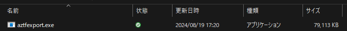

2. work3 で作成したリソースグループを aztfexport でエクスポートする

   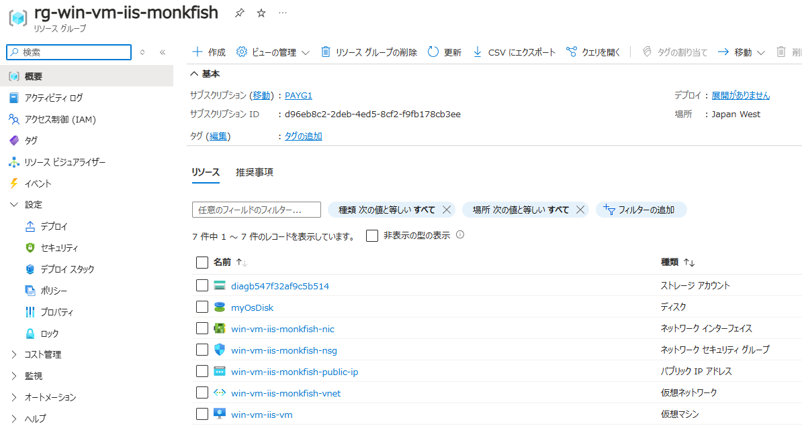

   1) `aztfexport resource-group rg-win-vm-iis-monkfish`
      * ファイルやフォルダがあると以下のダイアログが表示される ("N" であれば新しいファイルが生成された)。

      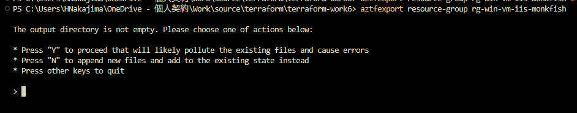

      * 空のディレクトリを用意し、実行した。

      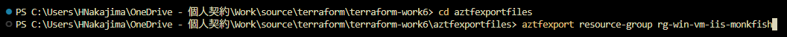

      * CUI が表示される。

      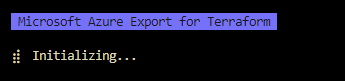

      * リソースグループ内のリソース一覧が表示される。

      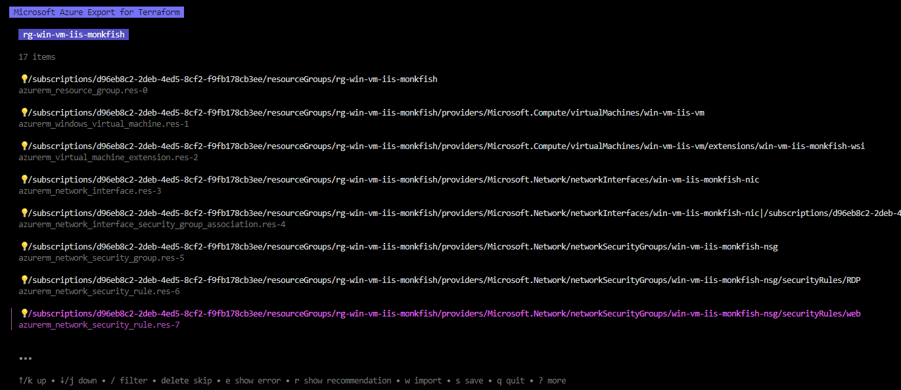

      * フィルターや取り込まないようスキップすることが可能。

      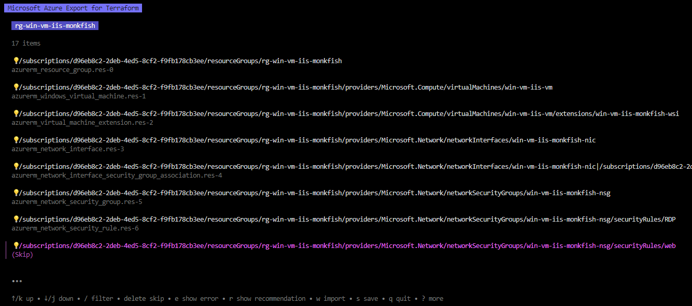

      * w でインポート開始する。

      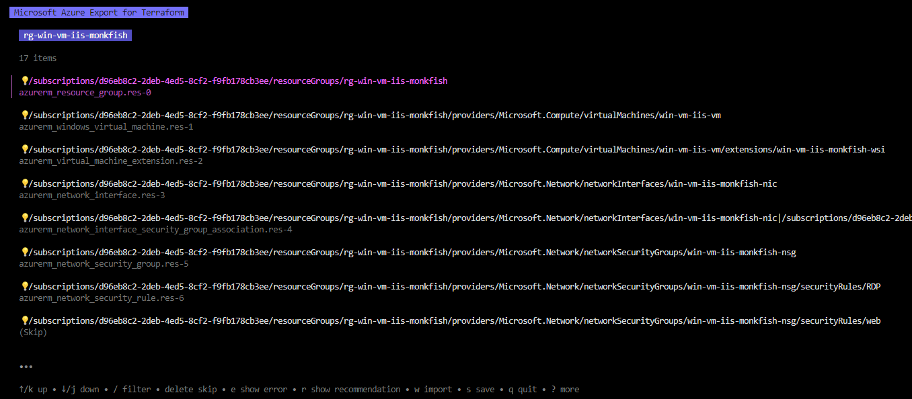

      * 数秒で完了した。

      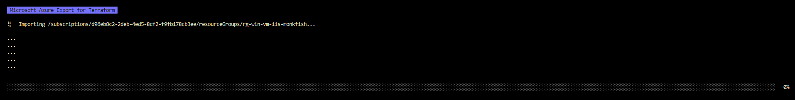

      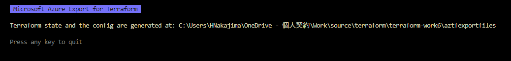

      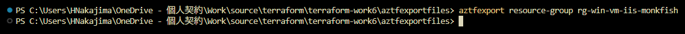

      * 以下のファイルが生成された。

      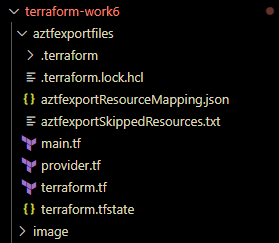

      * ローカルに tfstate が生成される。(backend を設定していないためリモートバックエンドは生成されない)。

      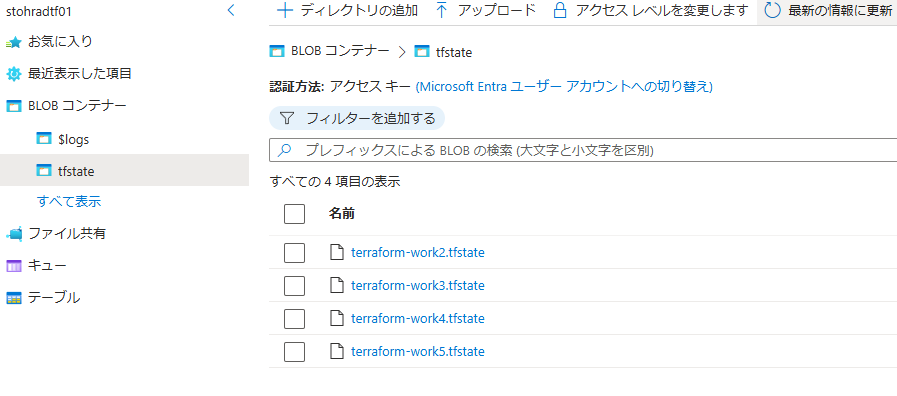

      * `terraform.tf`
        ```js
        terraform {
          backend "local" {}

          required_providers {
            azurerm = {
              source = "hashicorp/azurerm"
              version = "3.99.0"

            }
          }
        }
        ```
      * provider.tf
        ```js
        provider "azurerm" {
          features {
          }
          skip_provider_registration = true
          subscription_id            = "xxxxxxxx-xxxx-xxxx-xxxx-xxxxxxxxxxxx"
          environment                = "public"
          use_msi                    = false
          use_cli                    = true
          use_oidc                   = false
        }
        ```
      * main.tf
        ```js
        resource "azurerm_resource_group" "res-0" {
          location = "japanwest"
          name     = "rg-win-vm-iis-monkfish"
        }
        resource "azurerm_windows_virtual_machine" "res-1" {
          admin_password        = "ignored-as-imported"
          admin_username        = "azureuser"
          location              = "japanwest"
          name                  = "win-vm-iis-vm"
          network_interface_ids = ["/subscriptions/xxxxxxxx-xxxx-xxxx-xxxx-xxxxxxxxxxxx/resourceGroups/rg-win-vm-iis-monkfish/providers/Microsoft.Network/networkInterfaces/win-vm-iis-monkfish-nic"]
          resource_group_name   = "rg-win-vm-iis-monkfish"
          size                  = "Standard_DS1_v2"
          boot_diagnostics {
            storage_account_uri = "https://diagb547f32af9c5b514.blob.core.windows.net/"
          }
          os_disk {
            caching              = "ReadWrite"
            storage_account_type = "Premium_LRS"
          }
          source_image_reference {
            offer     = "WindowsServer"
            publisher = "MicrosoftWindowsServer"
            sku       = "2022-datacenter-azure-edition"
            version   = "latest"
          }
          depends_on = [
            azurerm_network_interface.res-3,
          ]
        }
        resource "azurerm_virtual_machine_extension" "res-2" {
          auto_upgrade_minor_version = true
          name                       = "win-vm-iis-monkfish-wsi"
          publisher                  = "Microsoft.Compute"
          settings = jsonencode({
            commandToExecute = "powershell -ExecutionPolicy Unrestricted Install-WindowsFeature -Name Web-Server -IncludeAllSubFeature -IncludeManagementTools"
          })
          type                 = "CustomScriptExtension"
          type_handler_version = "1.8"
          virtual_machine_id   = "/subscriptions/xxxxxxxx-xxxx-xxxx-xxxx-xxxxxxxxxxxx/resourceGroups/rg-win-vm-iis-monkfish/providers/Microsoft.Compute/virtualMachines/win-vm-iis-vm"
          depends_on = [
            azurerm_windows_virtual_machine.res-1,
          ]
        }
        resource "azurerm_network_interface" "res-3" {
          location            = "japanwest"
          name                = "win-vm-iis-monkfish-nic"
          resource_group_name = "rg-win-vm-iis-monkfish"
          ip_configuration {
            name                          = "terraform_work3_nic_configuration"
            private_ip_address_allocation = "Dynamic"
            public_ip_address_id          = "/subscriptions/xxxxxxxx-xxxx-xxxx-xxxx-xxxxxxxxxxxx/resourceGroups/rg-win-vm-iis-monkfish/providers/Microsoft.Network/publicIPAddresses/win-vm-iis-monkfish-public-ip"
            subnet_id                     = "/subscriptions/xxxxxxxx-xxxx-xxxx-xxxx-xxxxxxxxxxxx/resourceGroups/rg-win-vm-iis-monkfish/providers/Microsoft.Network/virtualNetworks/win-vm-iis-monkfish-vnet/subnets/win-vm-iis-monkfish-subnet"
          }
          depends_on = [
            azurerm_public_ip.res-8,
            azurerm_subnet.res-10,
          ]
        }
        resource "azurerm_network_interface_security_group_association" "res-4" {
          network_interface_id      = "/subscriptions/xxxxxxxx-xxxx-xxxx-xxxx-xxxxxxxxxxxx/resourceGroups/rg-win-vm-iis-monkfish/providers/Microsoft.Network/networkInterfaces/win-vm-iis-monkfish-nic"
          network_security_group_id = "/subscriptions/xxxxxxxx-xxxx-xxxx-xxxx-xxxxxxxxxxxx/resourceGroups/rg-win-vm-iis-monkfish/providers/Microsoft.Network/networkSecurityGroups/win-vm-iis-monkfish-nsg"
          depends_on = [
            azurerm_network_interface.res-3,
            azurerm_network_security_group.res-5,
          ]
        }
        resource "azurerm_network_security_group" "res-5" {
          location            = "japanwest"
          name                = "win-vm-iis-monkfish-nsg"
          resource_group_name = "rg-win-vm-iis-monkfish"
          depends_on = [
            azurerm_resource_group.res-0,
          ]
        }
        resource "azurerm_network_security_rule" "res-6" {
          access                      = "Allow"
          destination_address_prefix  = "*"
          destination_port_range      = "3389"
          direction                   = "Inbound"
          name                        = "RDP"
          network_security_group_name = "win-vm-iis-monkfish-nsg"
          priority                    = 1000
          protocol                    = "*"
          resource_group_name         = "rg-win-vm-iis-monkfish"
          source_address_prefix       = "120.75.97.239"
          source_port_range           = "*"
          depends_on = [
            azurerm_network_security_group.res-5,
          ]
        }
        resource "azurerm_public_ip" "res-8" {
          allocation_method   = "Static"
          location            = "japanwest"
          name                = "win-vm-iis-monkfish-public-ip"
          resource_group_name = "rg-win-vm-iis-monkfish"
          sku                 = "Standard"
          depends_on = [
            azurerm_resource_group.res-0,
          ]
        }
        resource "azurerm_virtual_network" "res-9" {
          address_space       = ["10.0.0.0/16"]
          location            = "japanwest"
          name                = "win-vm-iis-monkfish-vnet"
          resource_group_name = "rg-win-vm-iis-monkfish"
          depends_on = [
            azurerm_resource_group.res-0,
          ]
        }
        resource "azurerm_subnet" "res-10" {
          address_prefixes     = ["10.0.1.0/24"]
          name                 = "win-vm-iis-monkfish-subnet"
          resource_group_name  = "rg-win-vm-iis-monkfish"
          virtual_network_name = "win-vm-iis-monkfish-vnet"
          depends_on = [
            azurerm_virtual_network.res-9,
          ]
        }
        resource "azurerm_storage_account" "res-11" {
          account_replication_type         = "LRS"
          account_tier                     = "Standard"
          cross_tenant_replication_enabled = false
          location                         = "japanwest"
          name                             = "diagb547f32af9c5b514"
          resource_group_name              = "rg-win-vm-iis-monkfish"
          depends_on = [
            azurerm_resource_group.res-0,
          ]
        }
        resource "azurerm_storage_container" "res-13" {
          name                 = "bootdiagnostics-winvmiisv-c939e3cb-3cad-43b8-8881-0bbf0a9abfa2"
          storage_account_name = "diagb547f32af9c5b514"
        }
        ```
      * aztfexportResourceMapping.json
        ```json
        {
          "/subscriptions/xxxxxxxx-xxxx-xxxx-xxxx-xxxxxxxxxxxx/resourceGroups/rg-win-vm-iis-monkfish": {
            "resource_id": "/subscriptions/xxxxxxxx-xxxx-xxxx-xxxx-xxxxxxxxxxxx/resourceGroups/rg-win-vm-iis-monkfish",
            "resource_type": "azurerm_resource_group",
            "resource_name": "res-0"
          },
          "/subscriptions/xxxxxxxx-xxxx-xxxx-xxxx-xxxxxxxxxxxx/resourceGroups/rg-win-vm-iis-monkfish/providers/Microsoft.Compute/virtualMachines/win-vm-iis-vm": {
            "resource_id": "/subscriptions/xxxxxxxx-xxxx-xxxx-xxxx-xxxxxxxxxxxx/resourceGroups/rg-win-vm-iis-monkfish/providers/Microsoft.Compute/virtualMachines/win-vm-iis-vm",
            "resource_type": "azurerm_windows_virtual_machine",
            "resource_name": "res-1"
          },
          "/subscriptions/xxxxxxxx-xxxx-xxxx-xxxx-xxxxxxxxxxxx/resourceGroups/rg-win-vm-iis-monkfish/providers/Microsoft.Compute/virtualMachines/win-vm-iis-vm/extensions/win-vm-iis-monkfish-wsi": {
            "resource_id": "/subscriptions/xxxxxxxx-xxxx-xxxx-xxxx-xxxxxxxxxxxx/resourceGroups/rg-win-vm-iis-monkfish/providers/Microsoft.Compute/virtualMachines/win-vm-iis-vm/extensions/win-vm-iis-monkfish-wsi",
            "resource_type": "azurerm_virtual_machine_extension",
            "resource_name": "res-2"
          },
          "/subscriptions/xxxxxxxx-xxxx-xxxx-xxxx-xxxxxxxxxxxx/resourceGroups/rg-win-vm-iis-monkfish/providers/Microsoft.Network/networkInterfaces/win-vm-iis-monkfish-nic": {
            "resource_id": "/subscriptions/xxxxxxxx-xxxx-xxxx-xxxx-xxxxxxxxxxxx/resourceGroups/rg-win-vm-iis-monkfish/providers/Microsoft.Network/networkInterfaces/win-vm-iis-monkfish-nic",
            "resource_type": "azurerm_network_interface",
            "resource_name": "res-3"
          },
          "/subscriptions/xxxxxxxx-xxxx-xxxx-xxxx-xxxxxxxxxxxx/resourceGroups/rg-win-vm-iis-monkfish/providers/Microsoft.Network/networkInterfaces/win-vm-iis-monkfish-nic/networkSecurityGroups/L3N1YnNjcmlwdGlvbnMvZDk2ZWI4YzItMmRlYi00ZWQ1LThjZjItZjlmYjE3OGNiM2VlL3Jlc291cmNlR3JvdXBzL3JnLXdpbi12bS1paXMtbW9ua2Zpc2gvcHJvdmlkZXJzL01pY3Jvc29mdC5OZXR3b3JrL25ldHdvcmtTZWN1cml0eUdyb3Vwcy93aW4tdm0taWlzLW1vbmtmaXNoLW5zZw==": {
            "resource_id": "/subscriptions/xxxxxxxx-xxxx-xxxx-xxxx-xxxxxxxxxxxx/resourceGroups/rg-win-vm-iis-monkfish/providers/Microsoft.Network/networkInterfaces/win-vm-iis-monkfish-nic|/subscriptions/xxxxxxxx-xxxx-xxxx-xxxx-xxxxxxxxxxxx/resourceGroups/rg-win-vm-iis-monkfish/providers/Microsoft.Network/networkSecurityGroups/win-vm-iis-monkfish-nsg",
            "resource_type": "azurerm_network_interface_security_group_association",
            "resource_name": "res-4"
          },
          "/subscriptions/xxxxxxxx-xxxx-xxxx-xxxx-xxxxxxxxxxxx/resourceGroups/rg-win-vm-iis-monkfish/providers/Microsoft.Network/networkSecurityGroups/win-vm-iis-monkfish-nsg": {
            "resource_id": "/subscriptions/xxxxxxxx-xxxx-xxxx-xxxx-xxxxxxxxxxxx/resourceGroups/rg-win-vm-iis-monkfish/providers/Microsoft.Network/networkSecurityGroups/win-vm-iis-monkfish-nsg",
            "resource_type": "azurerm_network_security_group",
            "resource_name": "res-5"
          },
          "/subscriptions/xxxxxxxx-xxxx-xxxx-xxxx-xxxxxxxxxxxx/resourceGroups/rg-win-vm-iis-monkfish/providers/Microsoft.Network/networkSecurityGroups/win-vm-iis-monkfish-nsg/securityRules/RDP": {
            "resource_id": "/subscriptions/xxxxxxxx-xxxx-xxxx-xxxx-xxxxxxxxxxxx/resourceGroups/rg-win-vm-iis-monkfish/providers/Microsoft.Network/networkSecurityGroups/win-vm-iis-monkfish-nsg/securityRules/RDP",
            "resource_type": "azurerm_network_security_rule",
            "resource_name": "res-6"
          },
          "/subscriptions/xxxxxxxx-xxxx-xxxx-xxxx-xxxxxxxxxxxx/resourceGroups/rg-win-vm-iis-monkfish/providers/Microsoft.Network/publicIPAddresses/win-vm-iis-monkfish-public-ip": {
            "resource_id": "/subscriptions/xxxxxxxx-xxxx-xxxx-xxxx-xxxxxxxxxxxx/resourceGroups/rg-win-vm-iis-monkfish/providers/Microsoft.Network/publicIPAddresses/win-vm-iis-monkfish-public-ip",
            "resource_type": "azurerm_public_ip",
            "resource_name": "res-8"
          },
          "/subscriptions/xxxxxxxx-xxxx-xxxx-xxxx-xxxxxxxxxxxx/resourceGroups/rg-win-vm-iis-monkfish/providers/Microsoft.Network/virtualNetworks/win-vm-iis-monkfish-vnet": {
            "resource_id": "/subscriptions/xxxxxxxx-xxxx-xxxx-xxxx-xxxxxxxxxxxx/resourceGroups/rg-win-vm-iis-monkfish/providers/Microsoft.Network/virtualNetworks/win-vm-iis-monkfish-vnet",
            "resource_type": "azurerm_virtual_network",
            "resource_name": "res-9"
          },
          "/subscriptions/xxxxxxxx-xxxx-xxxx-xxxx-xxxxxxxxxxxx/resourceGroups/rg-win-vm-iis-monkfish/providers/Microsoft.Network/virtualNetworks/win-vm-iis-monkfish-vnet/subnets/win-vm-iis-monkfish-subnet": {
            "resource_id": "/subscriptions/xxxxxxxx-xxxx-xxxx-xxxx-xxxxxxxxxxxx/resourceGroups/rg-win-vm-iis-monkfish/providers/Microsoft.Network/virtualNetworks/win-vm-iis-monkfish-vnet/subnets/win-vm-iis-monkfish-subnet",
            "resource_type": "azurerm_subnet",
            "resource_name": "res-10"
          },
          "/subscriptions/xxxxxxxx-xxxx-xxxx-xxxx-xxxxxxxxxxxx/resourceGroups/rg-win-vm-iis-monkfish/providers/Microsoft.Storage/storageAccounts/diagb547f32af9c5b514": {
            "resource_id": "/subscriptions/xxxxxxxx-xxxx-xxxx-xxxx-xxxxxxxxxxxx/resourceGroups/rg-win-vm-iis-monkfish/providers/Microsoft.Storage/storageAccounts/diagb547f32af9c5b514",
            "resource_type": "azurerm_storage_account",
            "resource_name": "res-11"
          },
          "/subscriptions/xxxxxxxx-xxxx-xxxx-xxxx-xxxxxxxxxxxx/resourceGroups/rg-win-vm-iis-monkfish/providers/Microsoft.Storage/storageAccounts/diagb547f32af9c5b514/blobServices/default/containers/bootdiagnostics-winvmiisv-c939e3cb-3cad-43b8-8881-0bbf0a9abfa2": {
            "resource_id": "https://diagb547f32af9c5b514.blob.core.windows.net/bootdiagnostics-winvmiisv-c939e3cb-3cad-43b8-8881-0bbf0a9abfa2",
            "resource_type": "azurerm_storage_container",
            "resource_name": "res-13"
          }
        }
        ```
      * aztfexportSkippedResources.txt
        ```
        Following resources are marked to be skipped:

        - /subscriptions/xxxxxxxx-xxxx-xxxx-xxxx-xxxxxxxxxxxx/resourceGroups/rg-win-vm-iis-monkfish/providers/Microsoft.Network/networkSecurityGroups/win-vm-iis-monkfish-nsg/securityRules/web
        - /subscriptions/xxxxxxxx-xxxx-xxxx-xxxx-xxxxxxxxxxxx/resourceGroups/rg-win-vm-iis-monkfish/providers/Microsoft.Storage/storageAccounts/diagb547f32af9c5b514/blobServices/default
        - /subscriptions/xxxxxxxx-xxxx-xxxx-xxxx-xxxxxxxxxxxx/resourceGroups/rg-win-vm-iis-monkfish/providers/Microsoft.Storage/storageAccounts/diagb547f32af9c5b514/fileServices/default
        - /subscriptions/xxxxxxxx-xxxx-xxxx-xxxx-xxxxxxxxxxxx/resourceGroups/rg-win-vm-iis-monkfish/providers/Microsoft.Storage/storageAccounts/diagb547f32af9c5b514/queueServices/default
        - /subscriptions/xxxxxxxx-xxxx-xxxx-xxxx-xxxxxxxxxxxx/resourceGroups/rg-win-vm-iis-monkfish/providers/Microsoft.Storage/storageAccounts/diagb547f32af9c5b514/tableServices/default
        ```
      * terraform.tfstate

      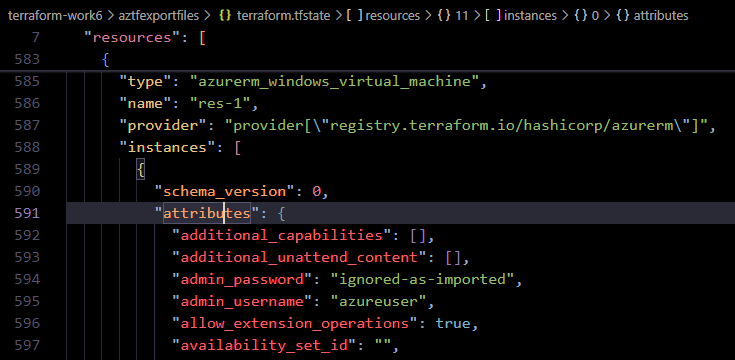

 
3. `terraform init / terraform plan` してみる
   * VM パスワードの要件のみエラーとなった。

   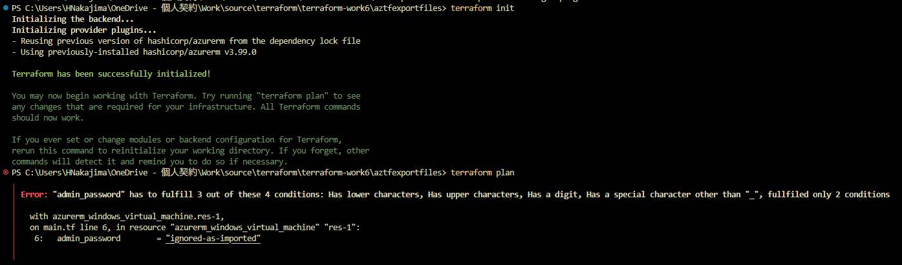

   * パスワードをダミーに修正する。

   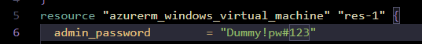

   * リモートバックエンドに修正する。

   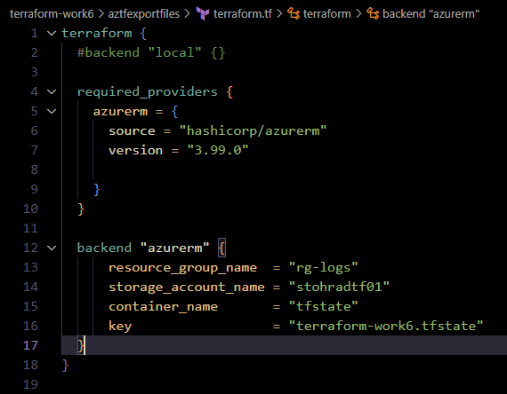

4. 再度 `terraform init / terraform plan` してみる
   * Backend が変わった旨エラーとなっている。

   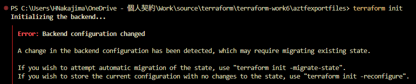

      ```PowerShell
        PS C:\Users\HNakajima\OneDrive - 個人契約\Work\source\terraform\terraform-work6\aztfexportfiles> terraform init
        Initializing the backend...
        ╷
        │ Error: Backend configuration changed
        │ 
        │ A change in the backend configuration has been detected, which may require migrating existing state.
        │ 
        │ If you wish to attempt automatic migration of the state, use "terraform init -migrate-state".
        │ If you wish to store the current configuration with no changes to the state, use "terraform init -reconfigure".
        ╵
      ```
      * 参考URL
        * migrate-state は既存のステートを移行する場合、reconfigure は新しいバックエンドに更新する場合に使用する (要確認)。

      [Command: init - Backend Initialization](https://developer.hashicorp.com/terraform/cli/commands/init#backend-initialization)

      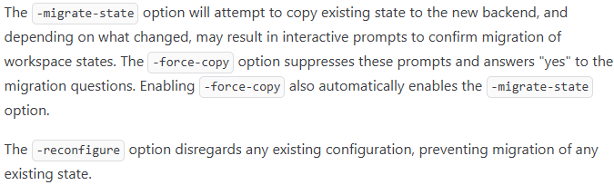

      [【Terraform】Backend の切り替え方法とは？](https://qiita.com/empty948/items/9564858aa4783ffa9cf7)

      [tfstateをローカルからs3に持っていく方法を模索する](https://zenn.dev/not75743/articles/7a68064286c95f)

      [Terraformの仕組み調査](https://zenn.dev/takamin55/scraps/eeb4f5f54fefa4#comment-23586cb99589f5)

5. 既存のステートをリモートに持っていきたいので `terraform init -migrate-state` を実行する

   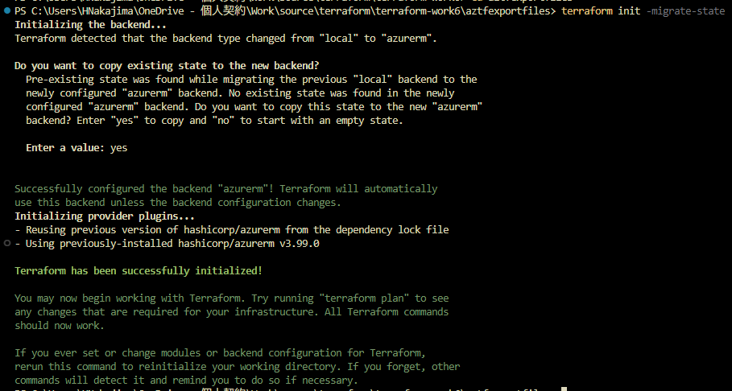

   ```PowerShell
    PS C:\Users\HNakajima\OneDrive - 個人契約\Work\source\terraform\terraform-work6\aztfexportfiles> terraform init -migrate-state
    Initializing the backend...
    Terraform detected that the backend type changed from "local" to "azurerm".

    Do you want to copy existing state to the new backend?
      Pre-existing state was found while migrating the previous "local" backend to the
      newly configured "azurerm" backend. No existing state was found in the newly
      configured "azurerm" backend. Do you want to copy this state to the new "azurerm"
      backend? Enter "yes" to copy and "no" to start with an empty state.

      Enter a value: yes

    Successfully configured the backend "azurerm"! Terraform will automatically
    use this backend unless the backend configuration changes.
    Initializing provider plugins...
    - Reusing previous version of hashicorp/azurerm from the dependency lock file
   ```
   * リモートバックエンドに移行された。

   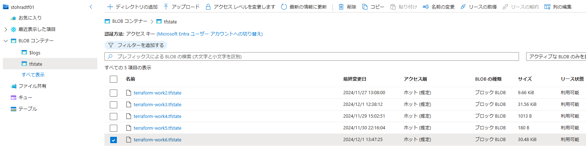

     * aztfexport コマンドの引数に設定することでリモートバックエンドにエクスポート可能。

      [高度なシナリオでの Azure Export for Terraform の使用 - インライン エクスペリエンス](https://learn.microsoft.com/ja-jp/azure/developer/terraform/azure-export-for-terraform/export-advanced-scenarios#inline-experience)

      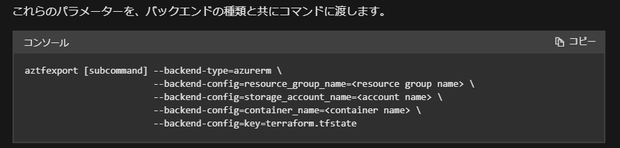

6. `terraform plan` を実行する
    * 何もエラーは発生しなかった。

    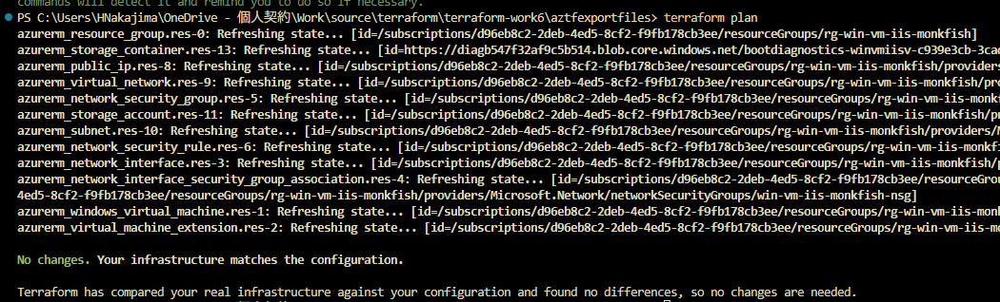

      ```
      PS C:\Users\HNakajima\OneDrive - 個人契約\Work\source\terraform\terraform-work6\aztfexportfiles> terraform plan    
      azurerm_resource_group.res-0: Refreshing state... [id=/subscriptions/xxxxxxxx-xxxx-xxxx-xxxx-xxxxxxxxxxxx/resourceGroups/rg-win-vm-iis-monkfish]
      azurerm_storage_container.res-13: Refreshing state... [id=https://diagb547f32af9c5b514.blob.core.windows.net/bootdiagnostics-winvmiisv-c939e3cb-3cad-43b8-8881-0bbf0a9abfa2]
      azurerm_public_ip.res-8: Refreshing state... [id=/subscriptions/xxxxxxxx-xxxx-xxxx-xxxx-xxxxxxxxxxxx/resourceGroups/rg-win-vm-iis-monkfish/providers/Microsoft.Network/publicIPAddresses/win-vm-iis-monkfish-public-ip]
      azurerm_virtual_network.res-9: Refreshing state... [id=/subscriptions/xxxxxxxx-xxxx-xxxx-xxxx-xxxxxxxxxxxx/resourceGroups/rg-win-vm-iis-monkfish/providers/Microsoft.Network/virtualNetworks/win-vm-iis-monkfish-vnet]
      azurerm_network_security_group.res-5: Refreshing state... [id=/subscriptions/xxxxxxxx-xxxx-xxxx-xxxx-xxxxxxxxxxxx/resourceGroups/rg-win-vm-iis-monkfish/providers/Microsoft.Network/networkSecurityGroups/win-vm-iis-monkfish-nsg]
      azurerm_storage_account.res-11: Refreshing state... [id=/subscriptions/xxxxxxxx-xxxx-xxxx-xxxx-xxxxxxxxxxxx/resourceGroups/rg-win-vm-iis-monkfish/providers/Microsoft.Storage/storageAccounts/diagb547f32af9c5b514]
      azurerm_subnet.res-10: Refreshing state... [id=/subscriptions/xxxxxxxx-xxxx-xxxx-xxxx-xxxxxxxxxxxx/resourceGroups/rg-win-vm-iis-monkfish/providers/Microsoft.Network/virtualNetworks/win-vm-iis-monkfish-vnet/subnets/win-vm-iis-monkfish-subnet]
      azurerm_network_security_rule.res-6: Refreshing state... [id=/subscriptions/xxxxxxxx-xxxx-xxxx-xxxx-xxxxxxxxxxxx/resourceGroups/rg-win-vm-iis-monkfish/providers/Microsoft.Network/networkSecurityGroups/win-vm-iis-monkfish-nsg/securityRules/RDP]
      azurerm_network_interface.res-3: Refreshing state... [id=/subscriptions/xxxxxxxx-xxxx-xxxx-xxxx-xxxxxxxxxxxx/resourceGroups/rg-win-vm-iis-monkfish/providers/Microsoft.Network/networkInterfaces/win-vm-iis-monkfish-nic]
      azurerm_network_interface_security_group_association.res-4: Refreshing state... [id=/subscriptions/xxxxxxxx-xxxx-xxxx-xxxx-xxxxxxxxxxxx/resourceGroups/rg-win-vm-iis-monkfish/providers/Microsoft.Network/networkInterfaces/win-vm-iis-monkfish-nic|/subscriptions/xxxxxxxx-xxxx-
      4ed5-8cf2-f9fb178cb3ee/resourceGroups/rg-win-vm-iis-monkfish/providers/Microsoft.Network/networkSecurityGroups/win-vm-iis-monkfish-nsg]                                                                                                                                          azurerm_windows_virtual_machine.res-1: Refreshing state... [id=/subscriptions/xxxxxxxx-xxxx-xxxx-xxxx-xxxxxxxxxxxx/resourceGroups/rg-win-vm-iis-monkfish/providers/Microsoft.Compute/virtualMachines/win-vm-iis-vm]
      azurerm_virtual_machine_extension.res-2: Refreshing state... [id=/subscriptions/xxxxxxxx-xxxx-xxxx-xxxx-xxxxxxxxxxxx/resourceGroups/rg-win-vm-iis-monkfish/providers/Microsoft.Compute/virtualMachines/win-vm-iis-vm/extensions/win-vm-iis-monkfish-wsi]

      No changes. Your infrastructure matches the configuration.

      Terraform has compared your real infrastructure against your configuration and found no differences, so no changes are needed.
      ```

---
#### Appendix: 他リソース追加

7. 生成した tf ファイルに Application Gateway を追記し、既存リソースとともに Terraform で管理可能とする

    [クイックスタート: Azure Application Gateway で Web トラフィックを転送する - Terraform](https://learn.microsoft.com/ja-jp/azure/application-gateway/quick-create-terraform)

    ```js
    # ####################################################################
    # Application Gateway を追加
    # ####################################################################
    variable "backend_address_pool_name" {
        default = "myBackendPool"
    }

    variable "frontend_port_name" {
        default = "myFrontendPort"
    }

    variable "frontend_ip_configuration_name" {
        default = "myAGIPConfig"
    }

    variable "http_setting_name" {
        default = "myHTTPsetting"
    }

    variable "listener_name" {
        default = "myListener"
    }

    variable "request_routing_rule_name" {
        default = "myRoutingRule"
    }

    resource "azurerm_subnet" "frontend" {
      name                 = "myAGSubnet"
      resource_group_name  = azurerm_resource_group.res-0.name
      virtual_network_name = azurerm_virtual_network.res-9.name
      address_prefixes     = ["10.0.10.0/24"]
    }

    resource "azurerm_public_ip" "pip" {
      name                = "myAGPublicIPAddress"
      resource_group_name = azurerm_resource_group.res-0.name
      location            = azurerm_resource_group.res-0.location
      allocation_method   = "Static"
      sku                 = "Standard"
    }

    resource "azurerm_application_gateway" "main" {
      name                = "myAppGateway"
      resource_group_name = azurerm_resource_group.res-0.name
      location            = azurerm_resource_group.res-0.location

      sku {
        name     = "Standard_v2"
        tier     = "Standard_v2"
        capacity = 2
      }

      gateway_ip_configuration {
        name      = "my-gateway-ip-configuration"
        subnet_id = azurerm_subnet.frontend.id
      }

      frontend_port {
        name = var.frontend_port_name
        port = 80
      }

      frontend_ip_configuration {
        name                 = var.frontend_ip_configuration_name
        public_ip_address_id = azurerm_public_ip.pip.id
      }

      backend_address_pool {
        name = var.backend_address_pool_name
      }

      backend_http_settings {
        name                  = var.http_setting_name
        cookie_based_affinity = "Disabled"
        port                  = 80
        protocol              = "Http"
        request_timeout       = 60
      }

      http_listener {
        name                           = var.listener_name
        frontend_ip_configuration_name = var.frontend_ip_configuration_name
        frontend_port_name             = var.frontend_port_name
        protocol                       = "Http"
      }

      request_routing_rule {
        name                       = var.request_routing_rule_name
        rule_type                  = "Basic"
        http_listener_name         = var.listener_name
        backend_address_pool_name  = var.backend_address_pool_name
        backend_http_settings_name = var.http_setting_name
        priority                   = 1
      }
    }

    resource "azurerm_network_interface_application_gateway_backend_address_pool_association" "nic-assoc" {
      network_interface_id    = azurerm_network_interface.res-3.id
      ip_configuration_name   = "terraform_work3_nic_configuration"
      backend_address_pool_id = one(azurerm_application_gateway.main.backend_address_pool).id
    }
    ```

8. `terraform plan / terraform apply` する
    * `terraform plan` する。

    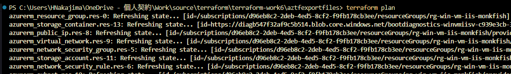

      ```PowerShell
      PS C:\Users\HNakajima\OneDrive - 個人契約\Work\source\terraform\terraform-work6\aztfexportfiles> terraform plan
      azurerm_resource_group.res-0: Refreshing state... [id=/subscriptions/xxxxxxxx-xxxx-xxxx-xxxx-xxxxxxxxxxxx/resourceGroups/rg-win-vm-iis-monkfish]
      azurerm_storage_container.res-13: Refreshing state... [id=https://diagb547f32af9c5b514.blob.core.windows.net/bootdiagnostics-winvmiisv-c939e3cb-3cad-43b8-8881-0bbf0a9abfa2]
      azurerm_public_ip.res-8: Refreshing state... [id=/subscriptions/xxxxxxxx-xxxx-xxxx-xxxx-xxxxxxxxxxxx/resourceGroups/rg-win-vm-iis-monkfish/providers/Microsoft.Network/publicIPAddresses/win-vm-iis-monkfish-public-ip]
      azurerm_virtual_network.res-9: Refreshing state... [id=/subscriptions/xxxxxxxx-xxxx-xxxx-xxxx-xxxxxxxxxxxx/resourceGroups/rg-win-vm-iis-monkfish/providers/Microsoft.Network/virtualNetworks/win-vm-iis-monkfish-vnet]
      azurerm_network_security_group.res-5: Refreshing state... [id=/subscriptions/xxxxxxxx-xxxx-xxxx-xxxx-xxxxxxxxxxxx/resourceGroups/rg-win-vm-iis-monkfish/providers/Microsoft.Network/networkSecurityGroups/win-vm-iis-monkfish-nsg]
      azurerm_storage_account.res-11: Refreshing state... [id=/subscriptions/xxxxxxxx-xxxx-xxxx-xxxx-xxxxxxxxxxxx/resourceGroups/rg-win-vm-iis-monkfish/providers/Microsoft.Storage/storageAccounts/diagb547f32af9c5b514]
      azurerm_network_security_rule.res-6: Refreshing state... [id=/subscriptions/xxxxxxxx-xxxx-xxxx-xxxx-xxxxxxxxxxxx/resourceGroups/rg-win-vm-iis-monkfish/providers/Microsoft.Network/networkSecurityGroups/win-vm-iis-monkfish-nsg/securityRules/RDP]
      azurerm_subnet.res-10: Refreshing state... [id=/subscriptions/xxxxxxxx-xxxx-xxxx-xxxx-xxxxxxxxxxxx/resourceGroups/rg-win-vm-iis-monkfish/providers/Microsoft.Network/virtualNetworks/win-vm-iis-monkfish-vnet/subnets/win-vm-iis-monkfish-subnet]
      azurerm_network_interface.res-3: Refreshing state... [id=/subscriptions/xxxxxxxx-xxxx-xxxx-xxxx-xxxxxxxxxxxx/resourceGroups/rg-win-vm-iis-monkfish/providers/Microsoft.Network/networkInterfaces/win-vm-iis-monkfish-nic]
      azurerm_network_interface_security_group_association.res-4: Refreshing state... [id=/subscriptions/xxxxxxxx-xxxx-xxxx-xxxx-xxxxxxxxxxxx/resourceGroups/rg-win-vm-iis-monkfish/providers/Microsoft.Network/networkInterfaces/win-vm-iis-monkfish-nic|/subscriptions/xxxxxxxx-xxxx-
      4ed5-8cf2-f9fb178cb3ee/resourceGroups/rg-win-vm-iis-monkfish/providers/Microsoft.Network/networkSecurityGroups/win-vm-iis-monkfish-nsg]                                                                                                                                          azurerm_windows_virtual_machine.res-1: Refreshing state... [id=/subscriptions/xxxxxxxx-xxxx-xxxx-xxxx-xxxxxxxxxxxx/resourceGroups/rg-win-vm-iis-monkfish/providers/Microsoft.Compute/virtualMachines/win-vm-iis-vm]
      azurerm_virtual_machine_extension.res-2: Refreshing state... [id=/subscriptions/xxxxxxxx-xxxx-xxxx-xxxx-xxxxxxxxxxxx/resourceGroups/rg-win-vm-iis-monkfish/providers/Microsoft.Compute/virtualMachines/win-vm-iis-vm/extensions/win-vm-iis-monkfish-wsi]

      Terraform used the selected providers to generate the following execution plan. Resource actions are indicated with the following symbols:
        + create

      Terraform will perform the following actions:

        # azurerm_application_gateway.main will be created
        + resource "azurerm_application_gateway" "main" {
            + id                          = (known after apply)
            + location                    = "japanwest"
            + name                        = "myAppGateway"
            + private_endpoint_connection = (known after apply)
            + resource_group_name         = "rg-win-vm-iis-monkfish"

            + backend_address_pool {
                + fqdns        = []
                + id           = (known after apply)
                + ip_addresses = []
                + name         = "myBackendPool"
              }

            + backend_http_settings {
                + cookie_based_affinity               = "Disabled"
                + id                                  = (known after apply)
                + name                                = "myHTTPsetting"
                + pick_host_name_from_backend_address = false
                + port                                = 80
                + probe_id                            = (known after apply)
                + protocol                            = "Http"
                + request_timeout                     = 60
                + trusted_root_certificate_names      = []
                  # (4 unchanged attributes hidden)
              }

            + frontend_ip_configuration {
                + id                            = (known after apply)
                + name                          = "myAGIPConfig"
                + private_ip_address            = (known after apply)
                + private_ip_address_allocation = "Dynamic"
                + private_link_configuration_id = (known after apply)
                + public_ip_address_id          = (known after apply)
              }

            + frontend_port {
                + id   = (known after apply)
                + name = "myFrontendPort"
                + port = 80
              }

            + gateway_ip_configuration {
                + id        = (known after apply)
                + name      = "my-gateway-ip-configuration"
                + subnet_id = (known after apply)
              }

            + http_listener {
                + frontend_ip_configuration_id   = (known after apply)
                + frontend_ip_configuration_name = "myAGIPConfig"
                + frontend_port_id               = (known after apply)
                + frontend_port_name             = "myFrontendPort"
                + host_names                     = []
                + id                             = (known after apply)
                + name                           = "myListener"
                + protocol                       = "Http"
                + ssl_certificate_id             = (known after apply)
                + ssl_profile_id                 = (known after apply)
                  # (4 unchanged attributes hidden)
              }

            + request_routing_rule {
                + backend_address_pool_id     = (known after apply)
                + backend_address_pool_name   = "myBackendPool"
                + backend_http_settings_id    = (known after apply)
                + backend_http_settings_name  = "myHTTPsetting"
                + http_listener_id            = (known after apply)
                + http_listener_name          = "myListener"
                + id                          = (known after apply)
                + name                        = "myRoutingRule"
                + priority                    = 1
                + redirect_configuration_id   = (known after apply)
                + rewrite_rule_set_id         = (known after apply)
                + rule_type                   = "Basic"
                + url_path_map_id             = (known after apply)
                  # (3 unchanged attributes hidden)
              }

            + sku {
                + capacity = 2
                + name     = "Standard_v2"
                + tier     = "Standard_v2"
              }

            + ssl_policy (known after apply)
          }

        # azurerm_network_interface_application_gateway_backend_address_pool_association.nic-assoc will be created
        + resource "azurerm_network_interface_application_gateway_backend_address_pool_association" "nic-assoc" {
            + backend_address_pool_id = (known after apply)
            + id                      = (known after apply)
            + ip_configuration_name   = "terraform_work3_nic_configuration"
            + network_interface_id    = "/subscriptions/xxxxxxxx-xxxx-xxxx-xxxx-xxxxxxxxxxxx/resourceGroups/rg-win-vm-iis-monkfish/providers/Microsoft.Network/networkInterfaces/win-vm-iis-monkfish-nic"
          }

        # azurerm_public_ip.pip will be created
        + resource "azurerm_public_ip" "pip" {
            + allocation_method       = "Static"
            + ddos_protection_mode    = "VirtualNetworkInherited"
            + fqdn                    = (known after apply)
            + id                      = (known after apply)
            + idle_timeout_in_minutes = 4
            + ip_address              = (known after apply)
            + ip_version              = "IPv4"
            + location                = "japanwest"
            + name                    = "myAGPublicIPAddress"
            + resource_group_name     = "rg-win-vm-iis-monkfish"
            + sku                     = "Standard"
            + sku_tier                = "Regional"
          }

        # azurerm_subnet.frontend will be created
        + resource "azurerm_subnet" "frontend" {
            + address_prefixes                               = [
                + "10.0.10.0/24",
              ]
            + enforce_private_link_endpoint_network_policies = (known after apply)
            + enforce_private_link_service_network_policies  = (known after apply)
            + id                                             = (known after apply)
            + name                                           = "myAGSubnet"
            + private_endpoint_network_policies_enabled      = (known after apply)
            + private_link_service_network_policies_enabled  = (known after apply)
            + resource_group_name                            = "rg-win-vm-iis-monkfish"
            + virtual_network_name                           = "win-vm-iis-monkfish-vnet"
          }

      Plan: 4 to add, 0 to change, 0 to destroy.
      ──────────────────────────────────────────────────────────

      Note: You didn't use the -out option to save this plan, so Terraform can't guarantee to take exactly these actions if you run "terraform apply" now.
      ```
    * `terraform apply` する。

    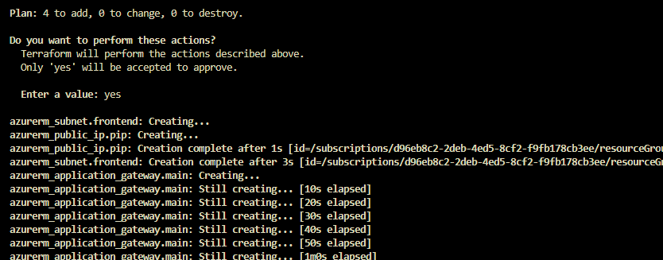

    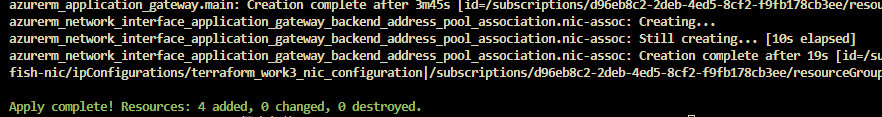

9.  リソースが追加された
    * Application Gateway用サブネット、Application Gateway、Public IP。

    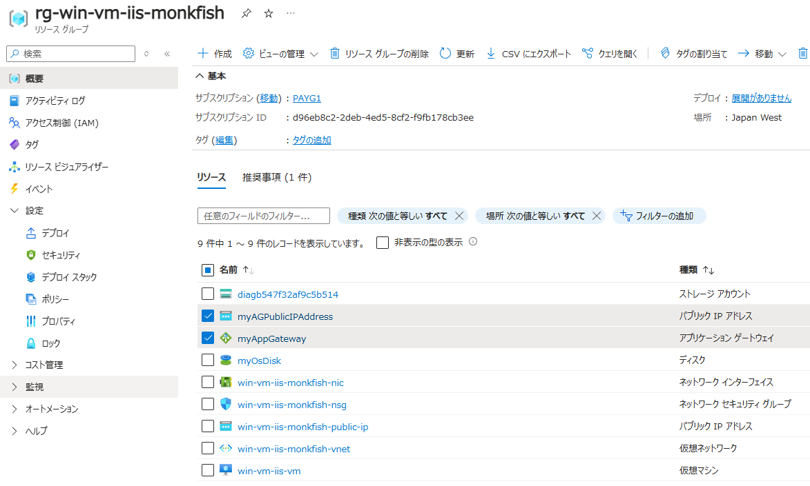

    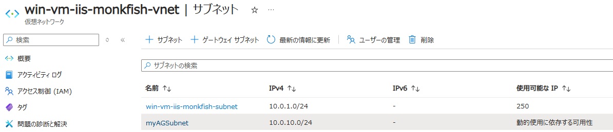

    * Application Gateway の Public IP で Web ページにもアクセス可能。

    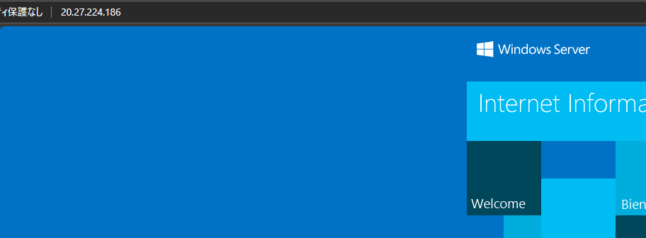

10. tfstate ファイルも更新されている
    * Application Gateway 等が追加された

    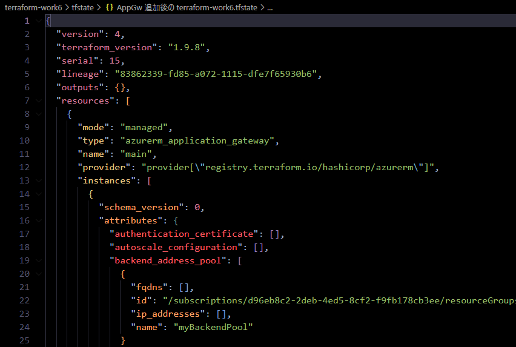

---
#### Appendix: Destroy

11. `terraform destroy` 実行する。
    * 特に問題なく完了した。

    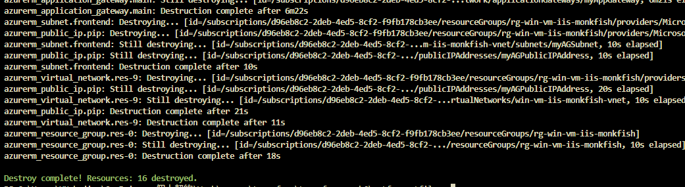

      ```PowerShell
      PS C:\Users\HNakajima\OneDrive - 個人契約\Work\source\terraform\terraform-work6\aztfexportfiles> terraform destroy
      azurerm_resource_group.res-0: Refreshing state... [id=/subscriptions/xxxxxxxx-xxxx-xxxx-xxxx-xxxxxxxxxxxx/resourceGroups/rg-win-vm-iis-monkfish]
      azurerm_storage_container.res-13: Refreshing state... [id=https://diagb547f32af9c5b514.blob.core.windows.net/bootdiagnostics-winvmiisv-c939e3cb-3cad-43b8-8881-0bbf0a9abfa2]
      azurerm_public_ip.pip: Refreshing state... [id=/subscriptions/xxxxxxxx-xxxx-xxxx-xxxx-xxxxxxxxxxxx/resourceGroups/rg-win-vm-iis-monkfish/providers/Microsoft.Network/publicIPAddresses/myAGPublicIPAddress]
      azurerm_virtual_network.res-9: Refreshing state... [id=/subscriptions/xxxxxxxx-xxxx-xxxx-xxxx-xxxxxxxxxxxx/resourceGroups/rg-win-vm-iis-monkfish/providers/Microsoft.Network/virtualNetworks/win-vm-iis-monkfish-vnet]
      azurerm_public_ip.res-8: Refreshing state... [id=/subscriptions/xxxxxxxx-xxxx-xxxx-xxxx-xxxxxxxxxxxx/resourceGroups/rg-win-vm-iis-monkfish/providers/Microsoft.Network/publicIPAddresses/win-vm-iis-monkfish-public-ip]
      azurerm_network_security_group.res-5: Refreshing state... [id=/subscriptions/xxxxxxxx-xxxx-xxxx-xxxx-xxxxxxxxxxxx/resourceGroups/rg-win-vm-iis-monkfish/providers/Microsoft.Network/networkSecurityGroups/win-vm-iis-monkfish-nsg]
      azurerm_storage_account.res-11: Refreshing state... [id=/subscriptions/xxxxxxxx-xxxx-xxxx-xxxx-xxxxxxxxxxxx/resourceGroups/rg-win-vm-iis-monkfish/providers/Microsoft.Storage/storageAccounts/diagb547f32af9c5b514]
      azurerm_subnet.res-10: Refreshing state... [id=/subscriptions/xxxxxxxx-xxxx-xxxx-xxxx-xxxxxxxxxxxx/resourceGroups/rg-win-vm-iis-monkfish/providers/Microsoft.Network/virtualNetworks/win-vm-iis-monkfish-vnet/subnets/win-vm-iis-monkfish-subnet]
      azurerm_subnet.frontend: Refreshing state... [id=/subscriptions/xxxxxxxx-xxxx-xxxx-xxxx-xxxxxxxxxxxx/resourceGroups/rg-win-vm-iis-monkfish/providers/Microsoft.Network/virtualNetworks/win-vm-iis-monkfish-vnet/subnets/myAGSubnet]
      azurerm_network_security_rule.res-6: Refreshing state... [id=/subscriptions/xxxxxxxx-xxxx-xxxx-xxxx-xxxxxxxxxxxx/resourceGroups/rg-win-vm-iis-monkfish/providers/Microsoft.Network/networkSecurityGroups/win-vm-iis-monkfish-nsg/securityRules/RDP]
      azurerm_network_interface.res-3: Refreshing state... [id=/subscriptions/xxxxxxxx-xxxx-xxxx-xxxx-xxxxxxxxxxxx/resourceGroups/rg-win-vm-iis-monkfish/providers/Microsoft.Network/networkInterfaces/win-vm-iis-monkfish-nic]
      azurerm_application_gateway.main: Refreshing state... [id=/subscriptions/xxxxxxxx-xxxx-xxxx-xxxx-xxxxxxxxxxxx/resourceGroups/rg-win-vm-iis-monkfish/providers/Microsoft.Network/applicationGateways/myAppGateway]
      azurerm_network_interface_security_group_association.res-4: Refreshing state... [id=/subscriptions/xxxxxxxx-xxxx-xxxx-xxxx-xxxxxxxxxxxx/resourceGroups/rg-win-vm-iis-monkfish/providers/Microsoft.Network/networkInterfaces/win-vm-iis-monkfish-nic|/subscriptions/xxxxxxxx-xxxx-xxxx-xxxx-xxxxxxxxxxxx/resourceGroups/
      rg-win-vm-iis-monkfish/providers/Microsoft.Network/networkSecurityGroups/win-vm-iis-monkfish-nsg]                                                                                                                                                                                                                      azurerm_network_interface_application_gateway_backend_address_pool_association.nic-assoc: Refreshing state... [id=/subscriptions/xxxxxxxx-xxxx-xxxx-xxxx-xxxxxxxxxxxx/resourceGroups/rg-win-vm-iis-monkfish/providers/Microsoft.Network/networkInterfaces/win-vm-iis-monkfish-nic/ipConfigurations/terraform_work3_nic_
      configuration|/subscriptions/xxxxxxxx-xxxx-xxxx-xxxx-xxxxxxxxxxxx/resourceGroups/rg-win-vm-iis-monkfish/providers/Microsoft.Network/applicationGateways/myAppGateway/backendAddressPools/myBackendPool]                                                                                                                azurerm_windows_virtual_machine.res-1: Refreshing state... [id=/subscriptions/xxxxxxxx-xxxx-xxxx-xxxx-xxxxxxxxxxxx/resourceGroups/rg-win-vm-iis-monkfish/providers/Microsoft.Compute/virtualMachines/win-vm-iis-vm]
      azurerm_virtual_machine_extension.res-2: Refreshing state... [id=/subscriptions/xxxxxxxx-xxxx-xxxx-xxxx-xxxxxxxxxxxx/resourceGroups/rg-win-vm-iis-monkfish/providers/Microsoft.Compute/virtualMachines/win-vm-iis-vm/extensions/win-vm-iis-monkfish-wsi]

      Terraform used the selected providers to generate the following execution plan. Resource actions are indicated with the following symbols:
        - destroy

      Terraform will perform the following actions:

        # azurerm_application_gateway.main will be destroyed
        - resource "azurerm_application_gateway" "main" {

      ～略～
              }
          }

      Plan: 0 to add, 0 to change, 16 to destroy.

      Do you really want to destroy all resources?
        Terraform will destroy all your managed infrastructure, as shown above.
        There is no undo. Only 'yes' will be accepted to confirm.

        Enter a value: yes

      azurerm_network_interface_security_group_association.res-4: Destroying... [id=/subscriptions/xxxxxxxx-xxxx-xxxx-xxxx-xxxxxxxxxxxx/resourceGroups/rg-win-vm-iis-monkfish/providers/Microsoft.Network/networkInterfaces/win-vm-iis-monkfish-nic|/subscriptions/xxxxxxxx-xxxx-xxxx-xxxx-xxxxxxxxxxxx/resourceGroups/rg-win
      -vm-iis-monkfish/providers/Microsoft.Network/networkSecurityGroups/win-vm-iis-monkfish-nsg]                                                                                                                                                                                                                            azurerm_network_security_rule.res-6: Destroying... [id=/subscriptions/xxxxxxxx-xxxx-xxxx-xxxx-xxxxxxxxxxxx/resourceGroups/rg-win-vm-iis-monkfish/providers/Microsoft.Network/networkSecurityGroups/win-vm-iis-monkfish-nsg/securityRules/RDP]
      azurerm_storage_container.res-13: Destroying... [id=https://diagb547f32af9c5b514.blob.core.windows.net/bootdiagnostics-winvmiisv-c939e3cb-3cad-43b8-8881-0bbf0a9abfa2]
      azurerm_network_interface_application_gateway_backend_address_pool_association.nic-assoc: Destroying... [id=/subscriptions/xxxxxxxx-xxxx-xxxx-xxxx-xxxxxxxxxxxx/resourceGroups/rg-win-vm-iis-monkfish/providers/Microsoft.Network/networkInterfaces/win-vm-iis-monkfish-nic/ipConfigurations/terraform_work3_nic_config
      uration|/subscriptions/xxxxxxxx-xxxx-xxxx-xxxx-xxxxxxxxxxxx/resourceGroups/rg-win-vm-iis-monkfish/providers/Microsoft.Network/applicationGateways/myAppGateway/backendAddressPools/myBackendPool]                                                                                  
      
      ～略～
      
      azurerm_public_ip.res-8: Destroying... [id=/subscriptions/xxxxxxxx-xxxx-xxxx-xxxx-xxxxxxxxxxxx/resourceGroups/rg-win-vm-iis-monkfish/providers/Microsoft.Network/publicIPAddresses/win-vm-iis-monkfish-public-ip]
      azurerm_application_gateway.main: Still destroying... [id=/subscriptions/xxxxxxxx-xxxx-4ed5-8cf2-...twork/applicationGateways/myAppGateway, 1m20s elapsed]
      azurerm_public_ip.res-8: Still destroying... [id=/subscriptions/xxxxxxxx-xxxx-4ed5-8cf2-...ddresses/win-vm-iis-monkfish-public-ip, 10s elapsed]
      azurerm_subnet.res-10: Still destroying... [id=/subscriptions/xxxxxxxx-xxxx-4ed5-8cf2-...net/subnets/win-vm-iis-monkfish-subnet, 10s elapsed]
      azurerm_subnet.res-10: Destruction complete after 10s
      azurerm_public_ip.res-8: Destruction complete after 10s
      azurerm_application_gateway.main: Still destroying... [id=/subscriptions/xxxxxxxx-xxxx-4ed5-8cf2-...twork/applicationGateways/myAppGateway, 1m30s elapsed]
      azurerm_application_gateway.main: Still destroying... [id=/subscriptions/
 
      ～略～
      
      azurerm_application_gateway.main: Still destroying... [id=/subscriptions/xxxxxxxx-xxxx-4ed5-8cf2-...twork/applicationGateways/myAppGateway, 6m21s elapsed]
      azurerm_application_gateway.main: Destruction complete after 6m22s
      azurerm_subnet.frontend: Destroying... [id=/subscriptions/xxxxxxxx-xxxx-xxxx-xxxx-xxxxxxxxxxxx/resourceGroups/rg-win-vm-iis-monkfish/providers/Microsoft.Network/virtualNetworks/win-vm-iis-monkfish-vnet/subnets/myAGSubnet]
      azurerm_public_ip.pip: Destroying... [id=/subscriptions/xxxxxxxx-xxxx-xxxx-xxxx-xxxxxxxxxxxx/resourceGroups/rg-win-vm-iis-monkfish/providers/Microsoft.Network/publicIPAddresses/myAGPublicIPAddress]
      azurerm_subnet.frontend: Still destroying... [id=/subscriptions/xxxxxxxx-xxxx-4ed5-8cf2-...m-iis-monkfish-vnet/subnets/myAGSubnet, 10s elapsed]
      azurerm_public_ip.pip: Still destroying... [id=/subscriptions/xxxxxxxx-xxxx-4ed5-8cf2-.../publicIPAddresses/myAGPublicIPAddress, 10s elapsed]
      azurerm_subnet.frontend: Destruction complete after 10s
      azurerm_virtual_network.res-9: Destroying... [id=/subscriptions/xxxxxxxx-xxxx-xxxx-xxxx-xxxxxxxxxxxx/resourceGroups/rg-win-vm-iis-monkfish/providers/Microsoft.Network/virtualNetworks/win-vm-iis-monkfish-vnet]
      azurerm_public_ip.pip: Still destroying... [id=/subscriptions/xxxxxxxx-xxxx-4ed5-8cf2-.../publicIPAddresses/myAGPublicIPAddress, 20s elapsed]
      azurerm_virtual_network.res-9: Still destroying... [id=/subscriptions/xxxxxxxx-xxxx-4ed5-8cf2-...rtualNetworks/win-vm-iis-monkfish-vnet, 10s elapsed]
      azurerm_public_ip.pip: Destruction complete after 21s
      azurerm_virtual_network.res-9: Destruction complete after 11s
      azurerm_resource_group.res-0: Destroying... [id=/subscriptions/xxxxxxxx-xxxx-xxxx-xxxx-xxxxxxxxxxxx/resourceGroups/rg-win-vm-iis-monkfish]
      azurerm_resource_group.res-0: Still destroying... [id=/subscriptions/xxxxxxxx-xxxx-4ed5-8cf2-.../resourceGroups/rg-win-vm-iis-monkfish, 10s elapsed]
      azurerm_resource_group.res-0: Destruction complete after 18s

      Destroy complete! Resources: 16 destroyed.
      ```
 
    * tfstate ファイルは destroy しても残る (リソースはないが Terraform 定義だけ記述されている)。

    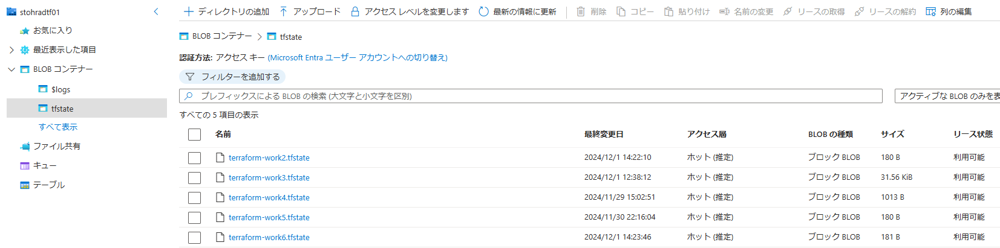

    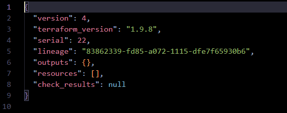

---
# 所感

* import
  * 実用に耐えないと思われる。
  * import block があるためそちらを使う。
* import block
  * 任意のリソース分生成されるのは良い場面があると想定される (大量リソースなど)。
  * リソースの変数名が指定できて良い。
  * 各リソースのプロパティが大量に出力されるため、必須／不要の編集に工数がかかる。
  * 変数化し別ファイルにするためには工数がかかる。
* aztfexport
  * Azure 公式が用意しているのは安心感がある。
  * tf ファイルを用意等せず、コマンド 1 行で各ファイル毎に分割して生成されるのは import block と比較しても遥かに便利。
    * CUI でフィルターできる、取り込まないよう選択できるのも便利。
  * 出力されるプロパティが最小限に見える。編集の時間も削減できそう。
  * リソースの変数名が指定できなかった点や変数化し別ファイル化にするには工数がかかる。
* いずれも Experimental である、ver 1.0 に満たないなど正式提供されていないため、更新をチェックしつつ使用するなど注意が必要。

#### 検証で試していないこと
* linter や各種構文、テスト、ディレクトリ構成については考慮が必要。

  [terraform-linters / tflint](https://github.com/terraform-linters/tflint/releases)

  [Terraformで複数のサブネットを作りmapにまとめる](https://qiita.com/hikaru_motomiya/items/83ea6b56c6790d3e1a7d)

  [Terraform コードのテスト](https://learn.microsoft.com/ja-jp/azure/developer/terraform/best-practices-testing-overview)

  [Terraform プロジェクトの効果的なディレクトリ構成パターン](https://techblog.forgevision.com/entry/Terraform/directory)

  [【tfsec】Terraformの静的セキュリティスキャンを行ってみよう！](https://dev.classmethod.jp/articles/tfsec-overview-scanning/)
