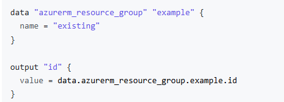
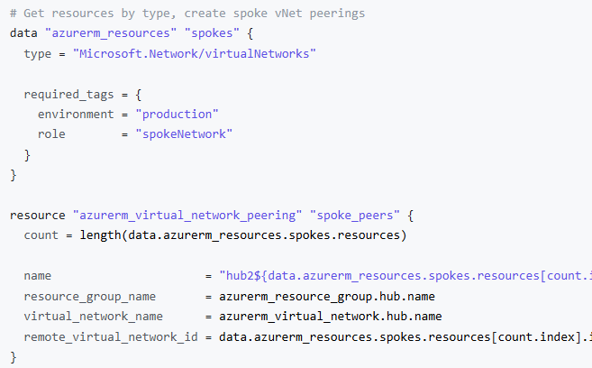
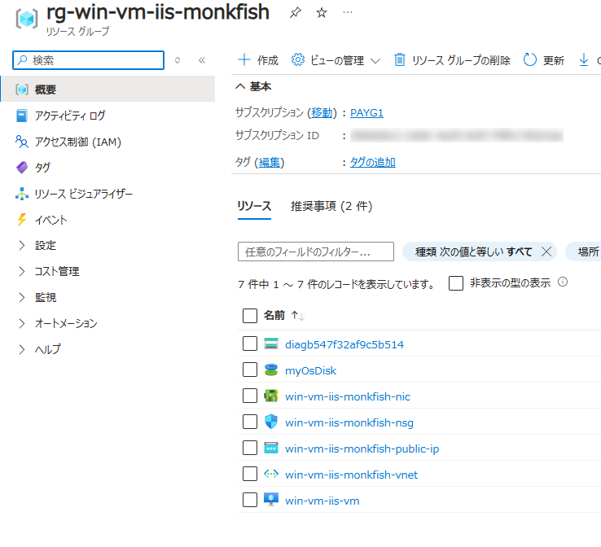
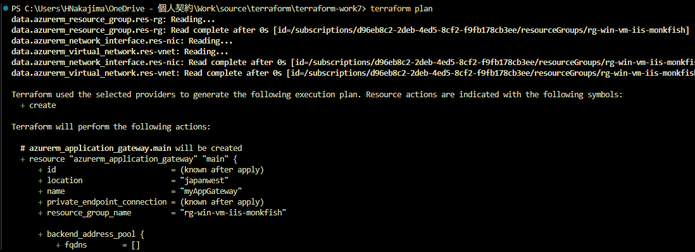
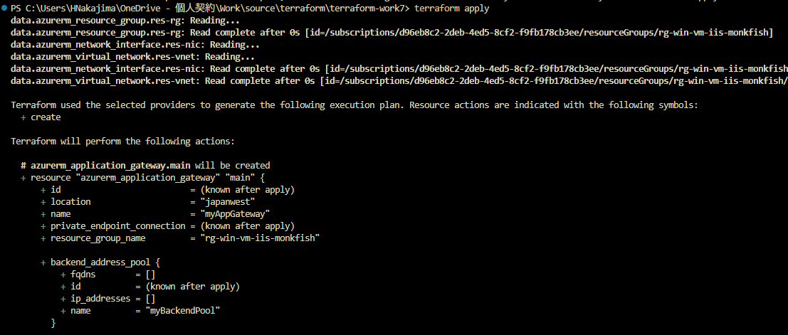
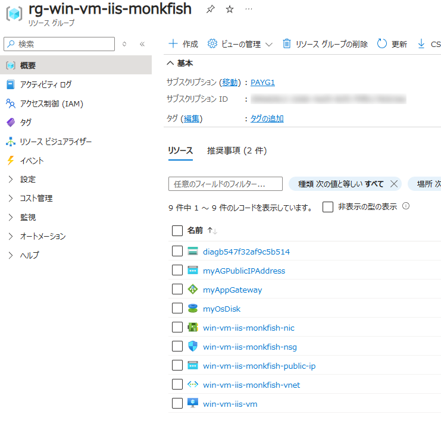
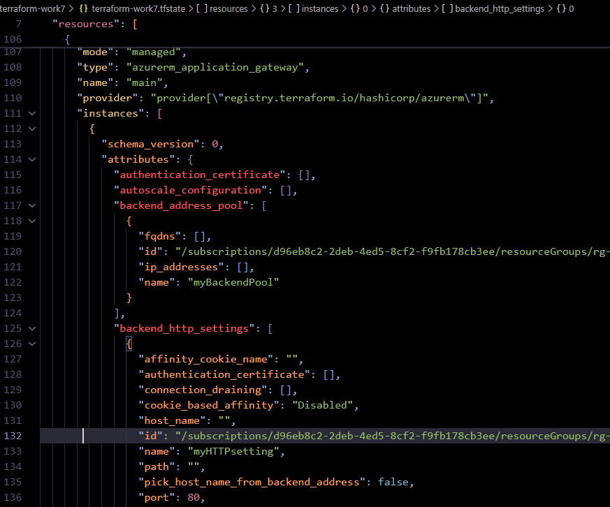

# 概要

##### 既に構築済みのリソースを Terraform で管理するためには、tf/tfstate ファイルを生成する必要がある
↓
##### 既に構築済みのリソースは Terraform で管理しない。Data Sources で参照し、新規リソースの追加を行う。

1. Data Sources を使用する
2. terraform remote state を使用する (構築済みリソースが Terraform で作成されていた場合、その state を参照する)

work7 では「1. Data Sources を使用する」を検証します。

* ルートのフォルダ・ファイル構成
  * terraform-work7
    ∟ .terrtaform - init 時に作成される Provider がダウンロードされるフォルダ
    ∟ .terraform.lock.hcl - init 時に作成される、Provider と .tf ファイルの依存関係等が記録されたファイル ⇒ [Dependency Lock File](https://developer.hashicorp.com/terraform/language/files/dependency-lock)
    ∟ image - readme の画像ファイルを格納するフォルダ
    ∟ main.tf - リソースを記述した tf ファイル
    ∟ provider.tf - プロバイダーを記述した tf ファイル
    ∟ tfstate - リモートバックエンドからダウンロードした tfstate ファイル
    ∟ work7-readme.html - Markdown を HTML 化したファイル
    ∟ work7-readme.md - この Markdown ファイル

---

## 実行方法・結果

1. Data Sources を使用する
   [Data Source: azurerm_resource_group](https://registry.terraform.io/providers/hashicorp/azurerm/latest/docs/data-sources/resource_group)
   
   [Data Source: azurerm_resources](https://registry.terraform.io/providers/hashicorp/azurerm/latest/docs/data-sources/resources)
   
   
* 既存リソースを data block にて定義し参照する
  * 既存リソースの tfstate ファイルを生成する必要がない。
  * 既存リソースが管理できないリソースであって設定が一部変わったとしても、ほぼ関係ない (と思われる)。
    * 既存リソースの tfstate を保持管理していないので terraform apply でコケない (と思われる)。
  * 新規リソースの追加に必要な既存リソースの参照を data block にて行う。
* 後は通常通り新規リソースの定義を行い、`terraform plan`、`terraform apply`する

---

1.  work3 で作成したリソースグループに Application Gateway を追加する
    
2.  main.tf に既存リソースの data block を用意する (必要な参照のみ、一意になるように指定する)
    ```js
    data "azurerm_resource_group" "res-rg" {
        name = "rg-win-vm-iis-monkfish"
    }

    data "azurerm_virtual_network" "res-vnet" {
        resource_group_name = data.azurerm_resource_group.res-rg.name
        name = "win-vm-iis-monkfish-vnet"
    } 

    data "azurerm_network_interface" "res-nic" {
        resource_group_name = data.azurerm_resource_group.res-rg.name
        name = "win-vm-iis-monkfish-nic"
    }
    ```

3. main.tf に新規リソースの記述を行う (既存リソースは data block で参照する)
    ```js
    # ####################################################################
    # Application Gateway を追加
    # ####################################################################
    variable "backend_address_pool_name" {
        default = "myBackendPool"
    }

    variable "frontend_port_name" {
        default = "myFrontendPort"
    }

    variable "frontend_ip_configuration_name" {
        default = "myAGIPConfig"
    }

    variable "http_setting_name" {
        default = "myHTTPsetting"
    }

    variable "listener_name" {
        default = "myListener"
    }

    variable "request_routing_rule_name" {
        default = "myRoutingRule"
    }

    resource "azurerm_subnet" "frontend" {
        name                 = "myAGSubnet"
        resource_group_name  = data.azurerm_resource_group.res-rg.name
        virtual_network_name = data.azurerm_virtual_network.res-vnet.name
        address_prefixes     = ["10.0.10.0/24"]
    }

    resource "azurerm_public_ip" "pip" {
        name                = "myAGPublicIPAddress"
        resource_group_name = data.azurerm_resource_group.res-rg.name
        location            = data.azurerm_resource_group.res-rg.location
        allocation_method   = "Static"
        sku                 = "Standard"
    }

    resource "azurerm_application_gateway" "main" {
        name                = "myAppGateway"
        resource_group_name = data.azurerm_resource_group.res-rg.name
        location            = data.azurerm_resource_group.res-rg.location

        sku {
            name     = "Standard_v2"
            tier     = "Standard_v2"
            capacity = 2
        }

        gateway_ip_configuration {
            name      = "my-gateway-ip-configuration"
            subnet_id = azurerm_subnet.frontend.id
        }

        frontend_port {
            name = var.frontend_port_name
            port = 80
        }

        frontend_ip_configuration {
            name                 = var.frontend_ip_configuration_name
            public_ip_address_id = azurerm_public_ip.pip.id
        }

        backend_address_pool {
            name = var.backend_address_pool_name
        }

        backend_http_settings {
            name                  = var.http_setting_name
            cookie_based_affinity = "Disabled"
            port                  = 80
            protocol              = "Http"
            request_timeout       = 60
        }

        http_listener {
            name                           = var.listener_name
            frontend_ip_configuration_name = var.frontend_ip_configuration_name
            frontend_port_name             = var.frontend_port_name
            protocol                       = "Http"
        }

        request_routing_rule {
            name                       = var.request_routing_rule_name
            rule_type                  = "Basic"
            http_listener_name         = var.listener_name
            backend_address_pool_name  = var.backend_address_pool_name
            backend_http_settings_name = var.http_setting_name
            priority                   = 1
        }
    }

    resource "azurerm_network_interface_application_gateway_backend_address_pool_association" "nic-assoc" {
        network_interface_id    = data.azurerm_network_interface.res-nic.id
        ip_configuration_name   = "terraform_work3_nic_configuration"
        backend_address_pool_id = one(azurerm_application_gateway.main.backend_address_pool).id
    }
    ```

4. `terraform plan` を実行する
   
5. `terraform apply` を実行する
   
6. リソースが作成された
   
7. tfstate を確認する
   

---

# 所感
* Data Sources
  * 管理できないリソースの tfstate は作成してもハマるだけと思われる
  * よって Data Sources を利用することが望ましいと思われる

